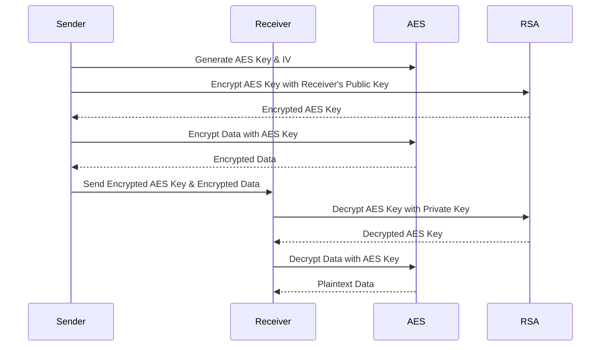

# LB3

## Symmetric vs. Asymmetric

### Symmetric

- **Pros:**
- **Cons:**

### Asymmetric

- **Pros:**
- **Cons:**

### Hybrid (RSA-AES)

## Diffie-Hellman

1. Public params (prime)
2. Choose secret
3. Calculate
A=g^a % p
B=g^b % p
