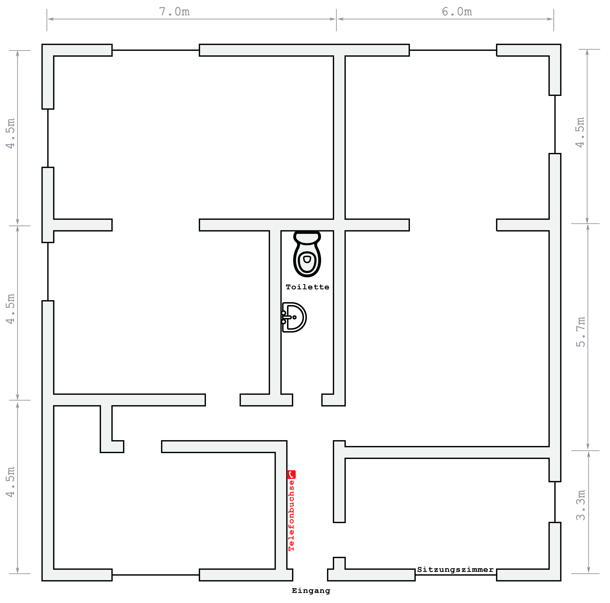

# ePortfolio Melvin Kampus - 07-06-2024

## Anforderungen für Einrichtung eines Netwerks für Arista GmbH 
### Management-Summary
Anforderungen: 

- Projekt vorstellen/beschreiben
- Lösungsatz in wenigen Sätzen skizzieren.
### Logisches Layout
Anforderungen:

- Logischer Aufbau des Netzwerks
- Netzwerkplan -> Draw.io
- Alle Geräte inklusive IP-Adressen (statisch)
### Verkabelungsplan
Anforderungen:

- Physische Topologie und Aufbau des Netzwerks
- Verkabelungsplan
- Ästhetik
- Sichbare Kabel sollten nicht in benutzten Räumen (zb. Sitzungsräumen) sein, sondern in Nebenräumen/Wenig genutzten Räumen.
- Anhand von Gebäudeumriss eine sinnvolle Verkabelung erstellen.
- Kabellängen vermessen -> Materialkauf
- Für Verständlichkeit und Übersicht -> Farben nutzen.

Weiter: [Verkabelungsplanbeschreibung](#verkabelungsplanbeschreibung)

### Stückliste
Anforderungen:

- Aufstellung aller HW/SW-Positionen
- Mengen- und Preisangaben. -> Basis für Rechnungsstellung. -> Excel

|Pos|Anz.|Bezeichnung|Eigenschaften|Lieferant|Artikelnr.|CHF/Stkm|CHF Summe|
| :-: | :-: | :-: | :-: | :-: | :-: | :-: | :-: |
|0|1|Beispiel|Dient als Beispiel|Beispiel AG|123|1'000.-|1'000.-|
|||||||||
||||||||Total. |

### Kostenzusammenstellung Material und Arbeitsaufwand
Anforderungen:

- Kosten der zu beschaffenden HW, SW gemäss Stückliste, sowie die Dienstleistungskosten.
- Arbeitsaufwand: Kosten für Elektriker, Betriebsinformatiker, Test und Inbetriebsnahme Systemdokumentation, Benutzerinstruktionen, Support während Einführungsphase, Projektleiter etc.
- Arbeitsstunden für jeweilige Tätigkeit

#### Bsp.
- Ein Arbeitstag entsprich 8 Stunden.
- Projektengineer, Projektleiter: ca. 230.-/Stunde
- ICT-Systemtechniker: ca. 130.-/Stunde
- Logistiker, Betriebsinformatiker: ca. 110.-/Stunde
- Elektriker: ca. 100.-/Stunde
- Hilfskraft: ca. 80.-/Stunde
### Jährliche Betriebskosten
Anforderungen:

- Jährlich wiederkehrende Kosten z.b. Internetprovider etc.

## Verkabelungsplanbeschreibung

### Technikraum (mit Telefonbuchse):
- **Router** (Router1): Direkt neben der Telefonbuchse.
- **Switch** (Switch1, 24-Port): In der Nähe des Routers.
- **RJ45-Steckdoes**: Für den Router an der Wand montiert. 
### Verkabelung zu den Büros:
- **Hauptkabelkanal:**
  - Startet vom Technikraum und verläuft entlang der Decke.
  - Verzweigt sich zu den Büros und Räumen.
### Büro 1 (Geschäftsleitung):
- **PC1:**
  - Ethernet-Kabel zu RJ45-Steckdose hinter dem Schreibtisch des Geschäftsleiter.
  - Patchkabel von RJ45-Steckdose zu *PC1*.
### Büro 2 (Sekretariat und HR):
- **PC2 und PC3:**
  - Ethernet-Kabel zu zwei RJ45-Steckdosen hinter den Schreibtischen.
  - Patchkabel von RJ45-Steckdosen zu *PC2* und *PC3*.
### Büro 3 (Buchhaltung):
- **PC4 bis PC7:**
  - Ethernet-Kabel zu vier RJ45-Steckdosen hinter den Schreibtischen.
  - Patchkabel von RJ45-Steckdosen zu *PC4 bis PC7*.
### Büro 4 (Juristische Abteilung):
- **PC8 bis PC10:**
  - Ethernet-Kabel zu drei RJ45-Steckdosen hinter den Schreibtischen.
  - Patchkabel von RJ45-Steckdosen zu *PC8 bis PC10*.
### Druckerraum:
  - **Drucker1 bis Drucker4:**
    - Ethernet-Kabel zu vier RJ45-Steckdosen hinter den Drucker.
    - Patchkabel von RJ45-Steckdosen zu *Drucker1 bis Drucker4*.
### Sitzungszimmer:
- **RJ45-Steckdose:**
  - Ethernet-Kabel zu RJ45-Steckdosen in der Nähe des Konferenztisches.
  - Patchkabel von RJ45-Steckdose zu Notebooks oder anderen Geräten.