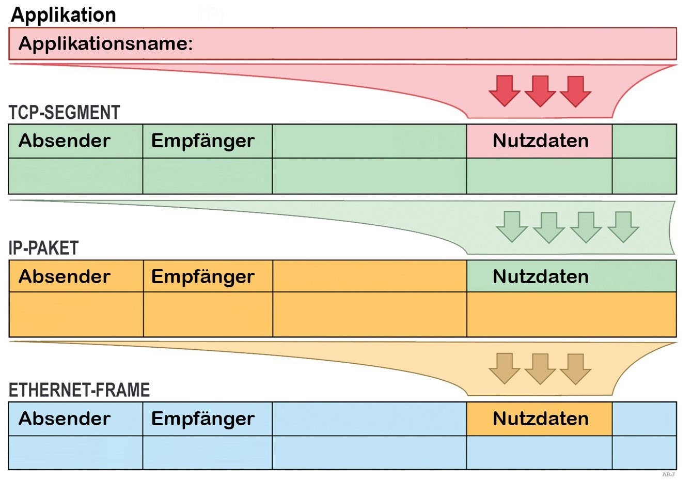

# ePortfolio Melvin Kampus - 31-05-2024

## Netzwerkadressierung fiktive Prüfung

**Aufgabe 1.**
Beurteilen Sie die folgende IP-Adress: *192.168.54.238/8*

**Antwort:**
Die IP-Adresse ist eher ungewöhlich, denn die Subnetzmasken 192.168.x.x wird normalerweise in privaten Netwerken verwndet mit einer Subnetzmaske von /16 *(255.255.0.0)* oder /24 *(255.255.255.0)*. Die IP-Adresse 192.168.54.238/8 hat jedoch die Subnetzmaske /8 *(255.0.0.0)*. Dies bedeutet, das Netz in dem sich diese IP befindet ist sehr gross mit vielen möglichen Hosts *(0.168.54.238, ist der Hostteil der Adresse)*.

**Aufgabe 2.**
Die IP-Adresse, die Sie bei Ihrem Kunden-PC antreffen lautet: *169.254.1.34*. Der Benutzer beklagt, dass er das Internet nicht erreicht Fehlerbeschrieb und Korrektur?

**Antwort:**

Die IP-Adresse *169.254.1.34* gehört zum APIPA (Automatic Private IP Adressing)-Bereich. Diese IP-Adressen werden automatisch von einem Windows-PC zugewiesen, wenn der *DHCP*-Server nicht erreicht werden kann. Das bedeutet, dass der PC keine gültige IP-Adresse vom *DHCP*-Server erhalten hat und daher nicht mit dem Internet oder anderen Netzwerken kommunizieren kann.

- **Fehlerbeschreibung:**
Der PC kann keine Verbindung zmu DHCP-Server herstellen, wodurch keine gültige IP-Adresse zugewiesen werden kann.

- **Korrektur:**
Ich muss sicher stellen, dass der DHCP-Server im Netzwerk funktioniert und überprüfen ob die Netzwerkkabel, Verbindungen und die Netzwerkeinstellungen des PCs richtig eingesteckt/konfiguriert sind. Ich versuche die Netzwerkeinstellungen auf dem PC zu erneuern, indem ich den Befehl ```ipconfig /release``` gefolgt von ```ipconfig /renew``` ausführe.

**Aufgabe 3.**
Der Kunde hat die Netzwerkeinstellungen selber bzw. von Hand eingetragen. Sie lauten: 
    - IP-Adress: *172.31.255.23/24*
    - Standardgateway: *172.31.254.1/24*
    - DNS1: *8.8.8.8*
    - DNS2: *156.34.5.123*

Wie beurteilen Sie die Situation?

**Antwort:**
Bei der manuellen Netzwerkeinstellung gibt es einen wesentlichen Fehler. Die IP-Adresse *172.31.255.23/24* und das Standardagateway *172.32.254.1/24* befinden sich zwar im selben Netzwerk *(Subnetz)*, aber die IP-Adresse des Standardgateways sollte normalerweise im selben Subnetzbereich wie die IP-Adresse des Hosts liegen, also *172.31.255.x*.

- **Beurteilung:**
    - Die Netzmaske ist korrekt eingestell.
    - Die IP-Adresse und das Gateway sind im gleichen Subnetz, jedoch könnte es Kommuniktaionsprobleme aufgrund der ungewöhnlichen Adressierung geben.
    - *DNS*-Server sind korrekt konfiguriert und sollten keine Probleme verursachen.
    - Die Standardgateway-Adress sollte auf eine Adresse im selben Subnetz, wie die IP-Adresse des Hosts gesetzt werden, Beispielsweise: *172.31.255.1*.


**Aufgabe 4.**
Sie rufen mit einem Firefoc-Webbrowser die [TBZ-Webseite](https://www.tbz.ch/) auf. Ergänzen Sie Applikationsname, Absender- und Empfängeradressen:



Diese Windows-Befehle können Ihnen weiterhelfen: **(cmd als Admin ausführen!)**

|       Command        |   Description   |
|----------------------|-----------------|
| ```ipconfig /all```  | Für eigne IP- und MAC-Adresse, Router                |
| ```nslookup <URL>``` | Ziel IP-Adresse des Webservers                |
| ```netstat -abno```  | Abgehende, browserseitige Portnummber. Kurz vor diesem Befehl Webseitenrefresh mit ```Ctrl + F5```                |
| ```arp -a```         | Router-MAC-Adresse                |
| *Wikipedia*          | Um herauszufinden, auf welchem Port ein https-Webserver standardmässig konfiguriert ist.                |
| *Wireshark*          | Mit Wireshark wäre alles auf einen Schlag einsehbar.                |

**Antwort**
- *Applikationsname:* Opera Webbrowser   
- *Absender IP-Adresse:* 10.62.110.225 (Preferred) | *Mac-Adresse:* 40-A3-CC-08-D7-C0
- *Browser Portnr.:* 443
- *Empfänger IP-Adresse:* 10.62.98.9 
- *Router MAC-Adresse:* 00-06-e3-ff-fd-90 *(Default Gateway: 10.62.104.1)*
- *Standard HTTP-Port:* 80
- *Standard HTTPS-Port:* 443 

## ipconfig /all 

```bash
PS C:\WINDOWS\system23> ipconfig /all

Windows IP Configuration

   Windows IP Configuration

   Host Name . . . . . . . . . . . . : Der Name des Computers im Netzwerk

   Primary Dns Suffix  . . . . . . . : Der primäre DNS-Suffix des Computers

   Node Type . . . . . . . . . . . . : Der Knoten-Typ bestimmt, wie der Computer den Namen im Netzwerk auflöst (z.B. Hybrid, Broadcast, Peer-to-Peer, Mixed)

   IP Routing Enabled. . . . . . . . : Gibt an, ob IP-Routing auf dem Computer aktiviert ist (Ja/Nein)

   WINS Proxy Enabled. . . . . . . . : Gibt an, ob WINS-Proxy aktiviert ist (Ja/Nein)

   DNS Suffix Search List. . . . . . : Liste der DNS-Suffixe, die zur Namensauflösung durchsucht werden

Wireless LAN adapter LAN-Verbindung* 1:

   Media State . . . . . . . . . . . : Gibt den Verbindungszustand an (Media disconnected bedeutet, dass keine Verbindung besteht)

   Connection-specific DNS Suffix  . : DNS-Suffix, das speziell für diese Verbindung gilt

   Description . . . . . . . . . . . : Beschreibung des Netzwerkadapters

   Physical Address. . . . . . . . . : Physische (MAC) Adresse des Adapters

   DHCP Enabled. . . . . . . . . . . : Gibt an, ob der Adapter seine IP-Adresse von einem DHCP-Server bezieht (Ja/Nein)

   Autoconfiguration Enabled . . . . : Gibt an, ob der Adapter automatisch konfiguriert werden kann (Ja/Nein)

Wireless LAN adapter LAN-Verbindung* 2:

   Media State . . . . . . . . . . . : Gibt den Verbindungszustand an (Media disconnected)

   Connection-specific DNS Suffix  . : DNS-Suffix, das speziell für diese Verbindung gilt

   Description . . . . . . . . . . . : Beschreibung des Netzwerkadapters

   Physical Address. . . . . . . . . : Physische (MAC) Adresse des Adapters

   DHCP Enabled. . . . . . . . . . . : Gibt an, ob der Adapter seine IP-Adresse von einem DHCP-Server bezieht (Ja/Nein)

   Autoconfiguration Enabled . . . . : Gibt an, ob der Adapter automatisch konfiguriert werden kann (Ja/Nein)

Ethernet adapter VMware Network Adapter VMnet1:

   Connection-specific DNS Suffix  . : DNS-Suffix, das speziell für diese Verbindung gilt

   Description . . . . . . . . . . . : Beschreibung des Netzwerkadapters

   Physical Address. . . . . . . . . : Physische (MAC) Adresse des Adapters

   DHCP Enabled. . . . . . . . . . . : Gibt an, ob der Adapter seine IP-Adresse von einem DHCP-Server bezieht (Ja/Nein)

   Autoconfiguration Enabled . . . . : Gibt an, ob der Adapter automatisch konfiguriert werden kann (Ja/Nein)

   IPv4 Address. . . . . . . . . . . : Die IP-Adresse des Adapters (Bevorzugt)

   Subnet Mask . . . . . . . . . . . : Die Subnetzmaske für das Netzwerk

   Default Gateway . . . . . . . . . : Die Standard-Gateway-Adresse für das Netzwerk

   NetBIOS over Tcpip. . . . . . . . : Gibt an, ob NetBIOS über TCP/IP aktiviert ist (Ja/Nein)

Ethernet adapter VMware Network Adapter VMnet8:

   Connection-specific DNS Suffix  . : DNS-Suffix, das speziell für diese Verbindung gilt

   Description . . . . . . . . . . . : Beschreibung des Netzwerkadapters

   Physical Address. . . . . . . . . : Physische (MAC) Adresse des Adapters

   DHCP Enabled. . . . . . . . . . . : Gibt an, ob der Adapter seine IP-Adresse von einem DHCP-Server bezieht (Ja/Nein)

   Autoconfiguration Enabled . . . . : Gibt an, ob der Adapter automatisch konfiguriert werden kann (Ja/Nein)

   Link-local IPv6 Address . . . . . : Eine automatisch konfigurierte IPv6-Adresse, die nur im lokalen Netzwerk gültig ist (Bevorzugt)

   IPv4 Address. . . . . . . . . . . : Die IP-Adresse des Adapters (Bevorzugt)

   Subnet Mask . . . . . . . . . . . : Die Subnetzmaske für das Netzwerk

   Default Gateway . . . . . . . . . : Die Standard-Gateway-Adresse für das Netzwerk

   DHCPv6 IAID . . . . . . . . . . . : ID des DHCPv6-Clients

   DHCPv6 Client DUID. . . . . . . . : DUID des DHCPv6-Clients

   NetBIOS over Tcpip. . . . . . . . : Gibt an, ob NetBIOS über TCP/IP aktiviert ist (Ja/Nein)

Ethernet adapter Ethernet 2:

   Media State . . . . . . . . . . . : Gibt den Verbindungszustand an (Media disconnected)

   Connection-specific DNS Suffix  . : DNS-Suffix, das speziell für diese Verbindung gilt

   Description . . . . . . . . . . . : Beschreibung des Netzwerkadapters

   Physical Address. . . . . . . . . : Physische (MAC) Adresse des Adapters

   DHCP Enabled. . . . . . . . . . . : Gibt an, ob der Adapter seine IP-Adresse von einem DHCP-Server bezieht (Ja/Nein)

   Autoconfiguration Enabled . . . . : Gibt an, ob der Adapter automatisch konfiguriert werden kann (Ja/Nein)

Wireless LAN adapter WLAN:

   Connection-specific DNS Suffix  . : DNS-Suffix, das speziell für diese Verbindung gilt

   Description . . . . . . . . . . . : Intel(R) Dual Band Wireless-AC 8265

   Physical Address. . . . . . . . . : Physische (MAC) Adresse des Adapters

   DHCP Enabled. . . . . . . . . . . : Gibt an, ob der Adapter seine IP-Adresse von einem DHCP-Server bezieht (Ja/Nein)

   Autoconfiguration Enabled . . . . : Gibt an, ob der Adapter automatisch konfiguriert werden kann (Ja/Nein)

   Link-local IPv6 Address . . . . . : Eine automatisch konfigurierte IPv6-Adresse, die nur im lokalen Netzwerk gültig ist (Bevorzugt)

   IPv4 Address. . . . . . . . . . . : Die IP-Adresse des Adapters (Bevorzugt)

   Subnet Mask . . . . . . . . . . . : Die Subnetzmaske für das Netzwerk

   Lease Obtained. . . . . . . . . . : Das Datum und die Uhrzeit, zu der die IP-Adresse vom DHCP-Server zugewiesen wurde

   Lease Expires . . . . . . . . . . : Das Datum und die Uhrzeit, zu der die IP-Adresse abläuft

   Default Gateway . . . . . . . . . : Die Standard-Gateway-Adresse für das Netzwerk

   DHCP Server . . . . . . . . . . . : Die Adresse des DHCP-Servers

   DHCPv6 IAID . . . . . . . . . . . : ID des DHCPv6-Clients

   DHCPv6 Client DUID. . . . . . . . : DUID des DHCPv6-Clients

   DNS Servers . . . . . . . . . . . : Adressen der DNS-Server, die zur Namensauflösung verwendet werden

   NetBIOS over Tcpip. . . . . . . . : Gibt an, ob NetBIOS über TCP/IP aktiviert ist (Ja/Nein)

Ethernet adapter Bluetooth-Netzwerkverbindung:

   Media State . . . . . . . . . . . : Gibt den Verbindungszustand an (Media disconnected)

   Connection-specific DNS Suffix  . : DNS-Suffix, das speziell für diese Verbindung gilt

   Description . . . . . . . . . . . : Bluetooth Device (Personal Area Network)

   Physical Address. . . . . . . . . : Physische (MAC) Adresse des Adapters

   DHCP Enabled. . . . . . . . . . . : Gibt an, ob der Adapter seine IP-Adresse von einem DHCP-Server bezieht (Ja/Nein)

   Autoconfiguration Enabled . . . . : Gibt an, ob der Adapter automatisch konfiguriert werden kann (Ja/Nein)

Mobile Broadband adapter Mobilfunk:

   Media State . . . . . . . . . . . : Gibt den Verbindungszustand an (Media disconnected)

   Connection-specific DNS Suffix  . : DNS-Suffix, das speziell für diese Verbindung gilt

   Description . . . . . . . . . . . : Generic Mobile Broadband Adapter

   Physical Address. . . . . . . . . : Physische (MAC) Adresse des Adapters

   DHCP Enabled. . . . . . . . . . . : Gibt an, ob der Adapter seine IP-Adresse von einem DHCP-Server bezieht (Ja/Nein)

```