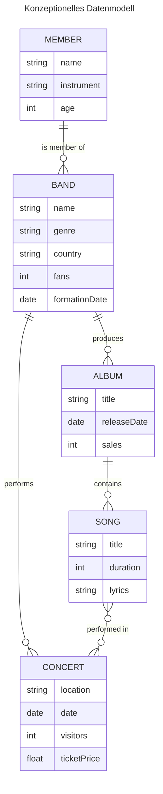

# MongoDB 02: Datenmodellierung

## A. Konzeptionelles Datenmodell

### Mermaid Markdown Diagramm

### Bild des Diagramms

### Erklärung der Entitäten

- **BAND**
  - **Beschreibung:** Repräsentiert eine Musikgruppe.
  - **Attribute:**
- **ALBUM**
  - **Beschreibung:** Veröffentlichung einer Band.
  - **Attribute:**
- **SONG**
  - **Beschreibung:** Repräsentiert eine Musikgruppe.
  - **Attribute:**
- **MEMBER**
  - **Beschreibung:** Repräsentiert eine Musikgruppe.
  - **Attribute:**
- **CONCERT**
  - **Beschreibung:** Repräsentiert eine Musikgruppe.
  - **Attribute:**

...

## B. Logisches Modell für MongoDB

### Bild des logischen Modells

### Original Datei

- [Here](./model.drawio)

### Erklärung des Modells

...

## C. Anwendung des Schemas in MongoDB

