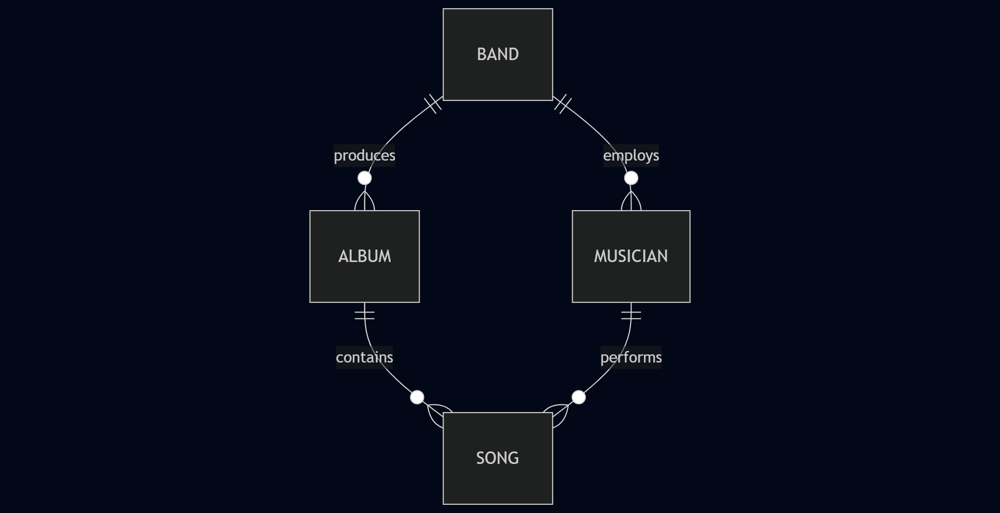
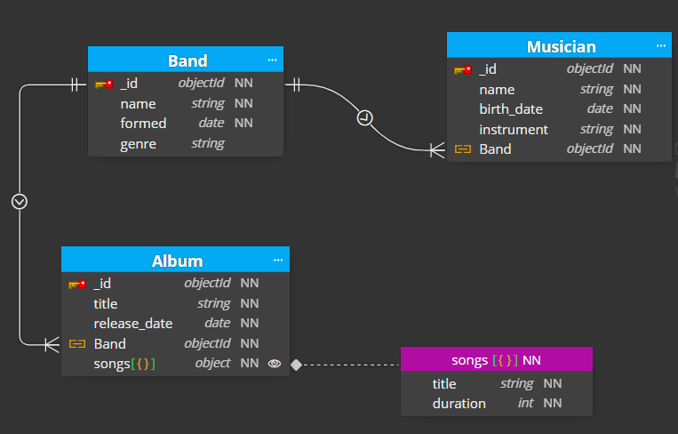
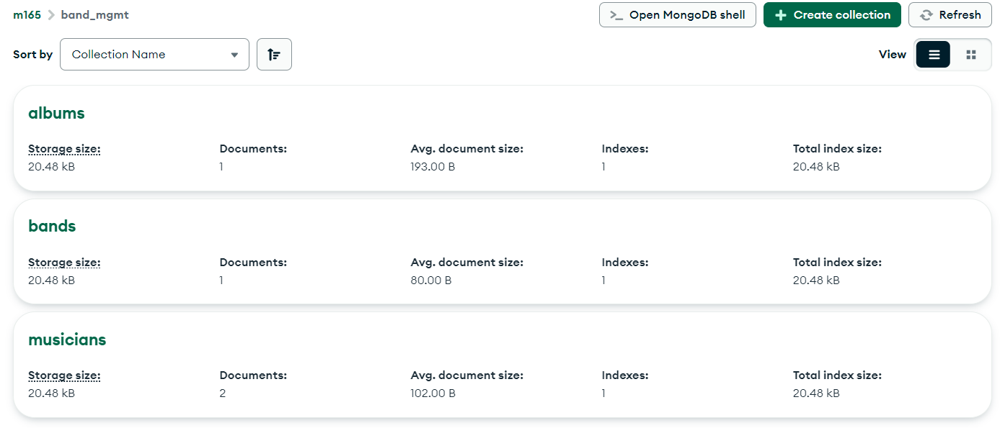

# MongoDB 02: Data Modelling

## A. Conceptual Data Model

### Diagram

### Explanation: Conceptual Data Model

**Entities:**

- **BAND**: Represents a musical group.
- **MUSICIAN**: Represents a member of a band.
- **ALBUM**: Represents a music album.
- **SONG**: Represents a song.

**Relationships:**

- **BAND** employs **MUSICIAN**: A band can have multiple musicians.
- **BAND** produces **ALBUM**: A band can produce multiple albums.
- **ALBUM** contains **SONG**: An album can contain multiple songs.
- **MUSICIAN** performs **SONG**: A musician can perform multiple songs.
- **SONG** is performed by **MUSICIAN**: A song can be performed by multiple musicians.

## B. Logical Data Model

### Diagram: Logical Data Model

**Original File:** [Logical Data Model](../../../x-res/m/02/logical-model.dmm)

### Explanation: Logical Data Model

- **BAND**:
 	- `id`: Unique identifier.
 	- `name`: Name of the band.
 	- `formed`: Date the band was formed.
 	- `genre`: Genre of the band.
- **MUSICIAN**:
 	- `id`: Unique identifier.
 	- `name`: Name of the musician.
 	- `birth_date`: Date of birth of the musician.
 	- `instrument`: Instrument played by the musician.
- **ALBUM**:
 	- `id`: Unique identifier.
 	- `title`: Title of the album.
 	- `release_date`: Release date of the album.
 	- `band_id`: Foreign key referencing the band.
- **SONG**:
 	- `id`: Unique identifier.
 	- `title`: Title of the song.
 	- `duration`: Duration of the song in seconds.
 	- `album_id`: Foreign key referencing the album.

**Relationships**:

- **BAND** employs **MUSICIAN**: 1:N relationship.
- **BAND** produces **ALBUM**: 1:N relationship.
- **ALBUM** contains **SONG**: 1:N relationship.
- **MUSICIAN** performs **SONG**: N:M relationship.

## C. Physical Data Model

- [Script for creating the database](./db-init.js)

### Screenshot

