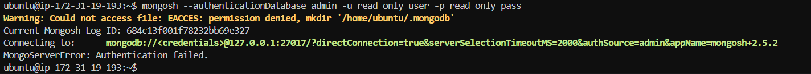
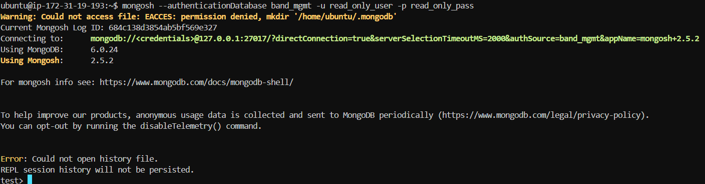
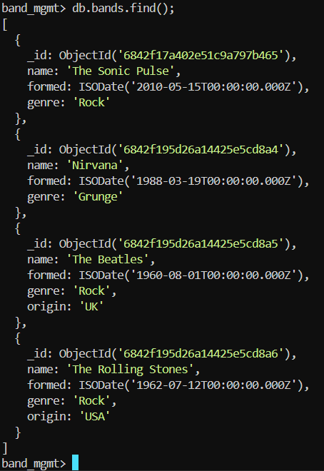
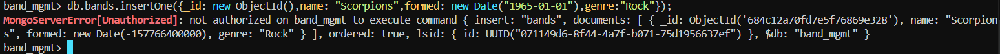
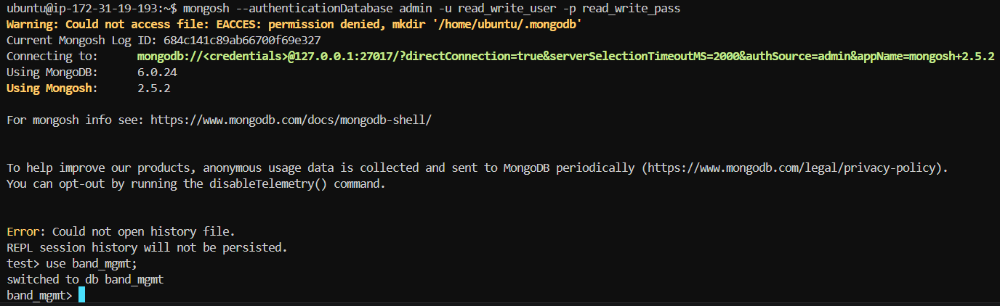
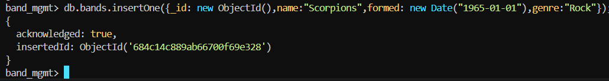
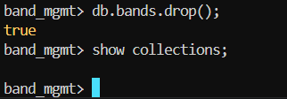
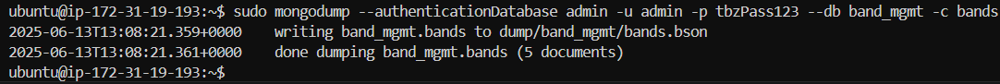
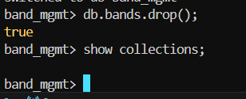
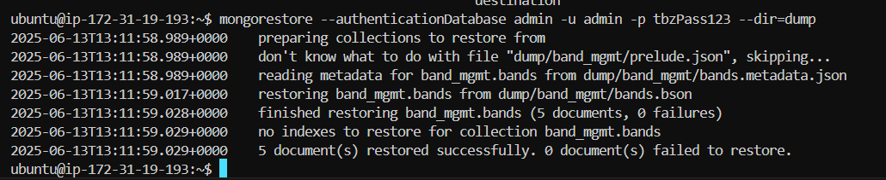

# MongoDB 05: Administration of MongoDB

## A. Rights and Roles

- **Screenshot of error at connection with wrong authentication source:**

	

- [User Creation Script (Shell)](create-user.sh)
- [User Creation Script (Mongosh)](create-user.mongosh.txt)

- **Readonly User Login:**
    
- **Readonly User Read:**
    
- **Readonly User Write:**
    
- **Read and Write User Login:**
    
- **Read and Write User Read:**
    
- **Read and Write User Write:**
    

## B. Backup and Restore

### Variant 1

- **Proof of deletion:**
    
- **Proof of restoration:**
    
- **Commands:**

    ```sh
    # 1. Creation of Snapshot
    aws ec2 create-snapshot --volume-id <VOLUME_ID> --description "m165 KN05 - Snapshot"

    # 2. Deletion of Collection (In mongosh)
    use band_mgmt;
    db.bands.drop();

    # 3. Restoration through Snapshot
    aws ec2 restore-snapshot --snapshot-id <SNAPSHOT_ID> --availability-zone <AVAILABILITY_ZONE> --volume-type gp3
    aws ec2 stop-instances --instance-ids <INSTANCE_ID>
    aws ec2 detach-volume --volume-id <VOLUME_ID>
    aws ec2 attach-volume --volume-id <VOLUME_ID> --instance-id <INSTANCE_ID> --device /dev/sda1
    aws ec2 start-instances --instance-ids <INSTANCE_ID>

    # 4. Verification of Restoration (In mongosh)
    use band_mgmt;
    show collections;
    ```

### Variant 2

- **mongodump:**

    

- **Proof of deletion:**

    

- **Proof of restoration:**

    

- **Commands:**

    ```sh
    # 1. Install MongoDB Database Tools and Create Dump
    curl -O https://fastdl.mongodb.org/tools/db/mongodb-database-tools-ubuntu2404-x86_64-100.12.2.deb
    apt install ./mongodb-database-tools-ubuntu2404-x86_64-100.12.2.deb
    mongodump --authenticationDatabase admin -u admin -p <PASSWORD> --db band_mgmt -c bands

    # 2. Deletion of Collection (In mongosh)
    use band_mgmt;
    db.bands.drop();

    # 3. Restoration through Dump
    mongorestore --authenticationDatabase admin -u admin -p <PASSWORD> --dir=dump

    # 4. Verification of Restoration (In mongosh)
    use band_mgmt;
    show collections;
    ```

## C. Scaling

### Difference: Replication vs. Partitioning

| Replication | Partitioning (Sharding) |
|-------------|-------------------------|
| Duplicates Data | Distributes Data horizontally to multiple Servers |
| Provides High Availability | Provides Scalability |
| Primary and Secondary Structure | Shard key-based Data Distribution |
| Easy Restoration | Complex Routing and Balancing |

**Illustration:**

```plaintext
REPLICATION:

+---------+     +----------+
| PRIMARY | --> | SECONDARY|
+---------+     +----------+
                     |
                 +----------+
                 | SECONDARY|
                 +----------+

SHARDING:

+--------+    +--------+    +--------+
| Shard1 |    | Shard2 |    | Shard3 |
+--------+    +--------+    +--------+
     \           |             /
      \         Router        /
       \__________+__________/
                  |
              Application
```

### Recommendation for the Company

**Initial situation:**

Our application stores large amounts of event logs and user interactions (>10 million records/month). So far, everything runs on a single MongoDB server without replication or partitioning.

**Recommendation:**

**Sharding + Replication:**

- **Sharding:** For horizontal scaling of the amount of data.
- **Replication:** For high availability, Backups and Readoptimization.

**Advantages:**

- **High Availability:** Data is available even if one server fails.
- **Neatless Scaling:** New shards can be added as needed.
- **Performance:** Read and write operations can be distributed across multiple servers.

However, if the application is only read-heavy and has few write accesses, replication alone may be sufficient. In this case, a read-replica could improve latency without shard complexity.
