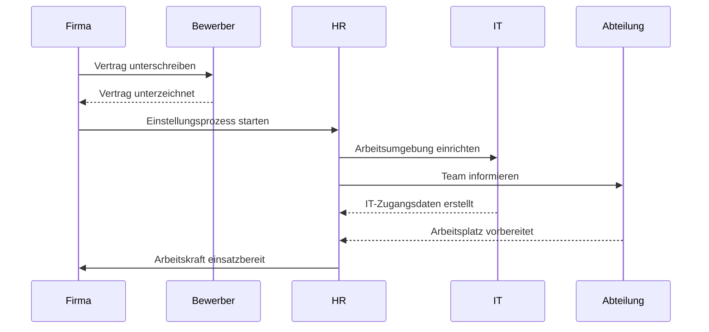
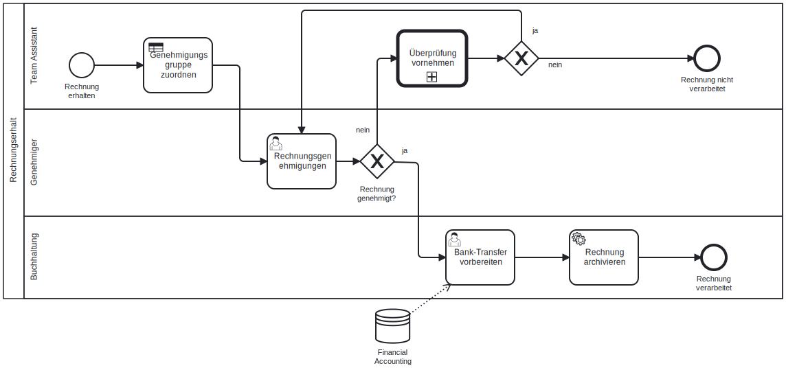

# 21.02.2025

## Geschäftsprozess Aufbau

```yaml
process:
  trigger: 'e.g. timebased'
  goal: 'e.g. Confirmation mail'
  in: 'e.g. Customer data'
  out: 'e.g. Confirmation mail'
```

### Attribute

1. Trigger
2. Ziel
3. Input & Output
4. Aktivitäten  
5.

## Prozesse

- Online-Shop Bestellung
- Versand
- Vertrieb

## Auftrag



## Diagramm


