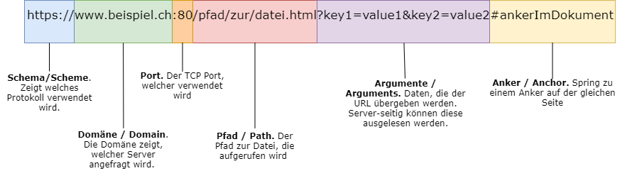
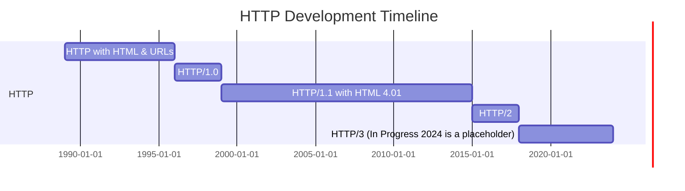

# T3 - HTTP Protocol

## Uniform Resource Locator (URL)

The purpose of a URL is to uniquely adress a ressource. This way clients can request specific documents. 




### Scheme
The scheme defines the *protocol* used to access the resource. Examples: **http**, **https**, **ftp**, **sftp**, **mailto**, etc. The protocol always is followed by **://**. This separates the *protocol* from the *domain*.

Until now our *URL* looks like this: 

```
PROTOCOL://
```


### Domain
The *domain* is just an alias for the IP-adress of its host. So instead of a domain there could also be an IP-adress (e.g. the loopback adress for **localhost**: **127.0.0.1**). The domain is followed by a **:**, if its an IP-adress. This is to separate the *adress* from the *port*. 

Until now our *URL* looks like this:

```
PROTOCOL://DOMAIN 
```

This usually references to the homepage or also called root */* of a Website.


### Port
Usually the *port* is not shown. For *http* the standard port would be *80* and for *https 443*. A webserver can also use another port, often port *8080* os used. In this case the port is strictly required.

Until now our *URL* looks like this: 

```
PROTOCOL://DOMAIN:PORT 
```

 A URL usually is not this way in production, in development its possible though so in development an URL could look like this: **http://127.0.0.1:8080**


### Path

All documents are stored in a file system. With the path you navigate to the required file. HTML-documents have the file-extension *.html* or *.htm*. If der is not filename provided in the path, the webserver automatically provides the *root /* or also known as *index.html*. In dynamic applications, usually the path in the URL does not match the file structure of the server. 

```
PROTOCOL://DOMAIN:PORT/PATH
```
A URL usually is not this way in production, in development its possible though so in development an URL could look like this: **http://127.0.0.1:8080/index.html**

### Arguments

Arguments are a way to transfer data to the server. The server has to be configured to be able to receive this data tough. Is this not the case, the arguments will be ignored. Arguments are always transfered as so called *Key-Value-Pairs*, they get seperated by *&*. The question mark *(?)* marks the start of the arguments.

```
PROTOCOL://DOMAIN:PORT/PATH?KEY=VALUE&KEY2=VALUE2
```
A URL usually is not this way in production, in development its possible though so in development an URL could look like this: **http://127.0.0.1:8080/index.html?name=John&age=30**

### Anchor

The anchor is used to jump to a specific part of a document. It's set with an *a-Tag:*
```html
<a href="#">FooBar</a>
```
It is marked by the hash *(#)*. The anchor is not transfered. In this case the tag is not a link but an anchor. When the anchor is set with the correct URL, the page automatically to this anchor.

```
PROTOCOL://DOMAIN:PORT/PATH?KEY=VALUE&KEY2=VALUE2#ANCHOR
```
A URL usually is not this way in production, in development its possible though so in development an URL could look like this: **http://127.0.0.1:8080/index.html?name=John&age=30#top**

## The story of HTTP

The development of the **H**yper**T**ext **T**ransfer **P**rotol (HTTP), is very close to the development of the **H**yper**T**ext **M**arkup **L**anguage (HTML). While HTTP stands for the protocol, HTML defines the document or the content.



## How does HTTP work?

### TCP Communication
HTTP is built on TCP and uses a client-server communication model with requests and responses. Each request and response sends messages with a header and a body.

### HTTP Communication
While the TCP layer sends general messages, the application layer (HTTP) defines the contents of the messages. The message header (TCP layer) does not correspond to the HTTP header (application layer), but the HTTP header is part of the message header.

The following tables show the components of the requests and responses.

### HTTP Request

| Term | Description |
| --- | --- |
| Request Information | Contains three components: the method, the path, and the protocol used. |
| Request Headers | Various headers transmitted as key-value pairs. |
| Request Body | The content that is transferred to the server. Not every request has content in its body (it can be empty). |

### HTTP Response

| Term | Description |
| --- | --- |
| Response Information | Contains three components: the protocol used, the status code, and the status message. |
| Response Headers | Various headers transmitted as key-value pairs. |
| Response Body | The content that is transferred to the client, usually HTML, JavaScript, and CSS content. |

### Status Code
Each response sends a status code that indicates whether the request was successful and if not, what error occurred. Each status code is sent back with a status message. The most important status codes are:

- 200 OK: The request was successful.
- 404 Not Found: The resource was not found. Possibly a wrong path was provided.
- 500 Internal Server Error: This error can occur with dynamic pages that throw errors.

### Headers
There are many official headers for request and response and also many that officially do not exist but are still used. All unofficial ones start with "X-" (e.g., x-forwarded-for) and are used for proprietary behavior or content.

### Request Methods
HTTP defines a set of request methods, often referred to as verbs, that indicate the desired action to be performed on a given resource. While some methods (GET, POST, PUT, DELETE) are CRUD operations, others (OPTIONS, HEAD) provide metadata. Note that the semantic meaning of a method should match the intended action, even though they can technically be interchanged.

#### CRUD Methods
CRUD stands for CREATE, READ, UPDATE, DELETE. These methods correspond to the four basic operations you can perform on any data.

- **GET:** This method is used to retrieve data from a server. The data is included in the URL, and the request body is empty.

- **POST:** This method sends data to the server, typically using the request body. It's commonly used to create new resources.

- **PUT:** This method is used to update an existing resource or create a new one if it doesn't exist. The data is typically included in the request body.

- **PATCH:** Similar to PUT, this method updates an existing resource. However, unlike PUT which updates the entire resource, PATCH only updates the specified attributes of the resource.

- **DELETE:** As the name suggests, this method is used to delete a specified resource.

#### Other Methods

- **OPTIONS:** This method is used to describe the communication options for the target resource. It provides information about the communication options available for the resource without initiating further action.

- **HEAD:** This method is similar to GET, but it only returns the HTTP headers of the response and not the response body. This is useful when you want to check if a resource is available or to read the metadata without actually downloading the resource.


### Content Types (Content-Type)
We have already learned that the content in the request or response body is transferred. Some content types (also called Mime-Types or Content-Types) are used in requests and others in responses. Some are presented below, others will be discussed in depth when you learn about forms.

### Hypertext Transfer Protocol Secure (HTTPS)
HTTPS is based on HTTP and extends the protocol with a security layer that allows data to be transferred with encryption (TLS and SSL). Currently, the TLS 1.2 and TLS 1.3 procedures are used, which so far have no vulnerabilities.
