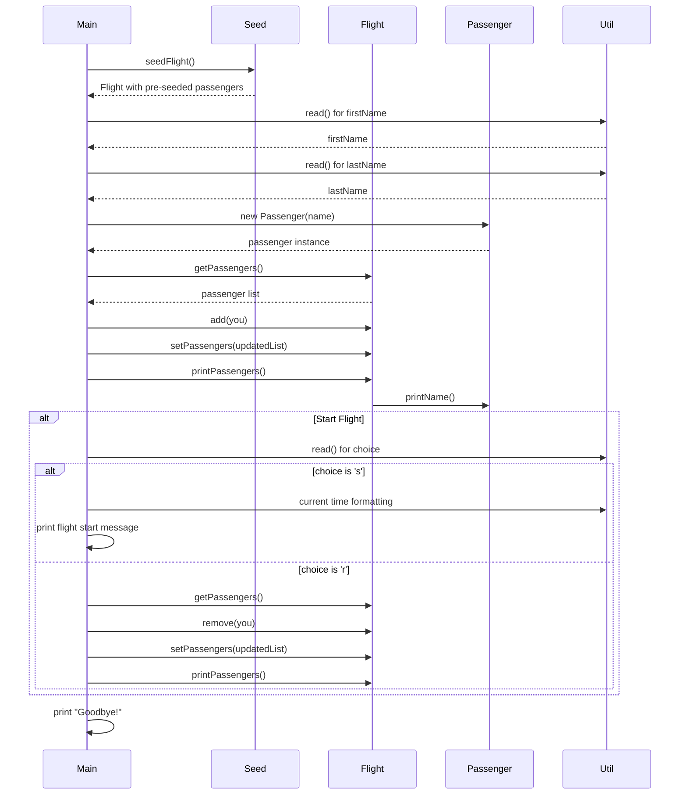

# Sequence diagram #

## Typische Use Case ##

Adding a New Passenger to a Flight.
A user wants to join a pre-seeded flight by entering their first and last name. The program adds them to the passenger list and allows them to start the flight.

## Spezieller Use Case ##

Removing a Passenger from the Flight. 
A user decides they do not want to be on the flight and chooses to remove themselves from the passenger list before the flight starts.
