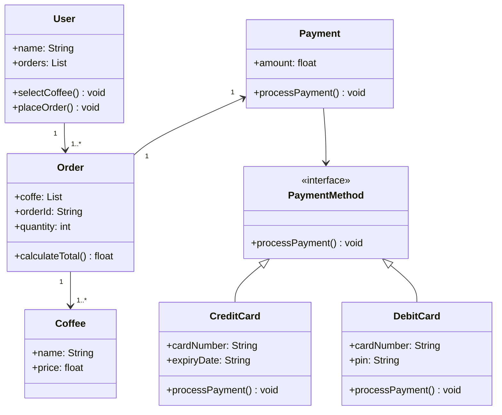

# M3 - Interfaces in UML Klassendiagramm darstellen

```mermaid
classDiagram
    class User {
        +name: String
        +orders: List<String>
        +selectCoffee() void
        +placeOrder() void
    }

    class Order {
        +coffe: List<Coffe>
        +orderId: String
        +quantity: int
        +calculateTotal() float
    }

    class Coffee {
        +name: String
        +price: float
    }

    class Payment {
        +amount: float
        +processPayment() void
    }

    %% Interface example
    class PaymentMethod {
        <<interface>>
        +processPayment() void
    }

    class CreditCard {
        +cardNumber: String
        +expiryDate: String
        +processPayment() void
    }

    class DebitCard {
        +cardNumber: String
        +pin: String
        +processPayment() void
    }

    %% Relationships
    User "1" --> "1..*" Order
    Order "1" --> "1..*" Coffee
    Payment "1" <-- "1" Order
    PaymentMethod <|-- CreditCard
    PaymentMethod <|-- DebitCard
    Payment --> PaymentMethod

```