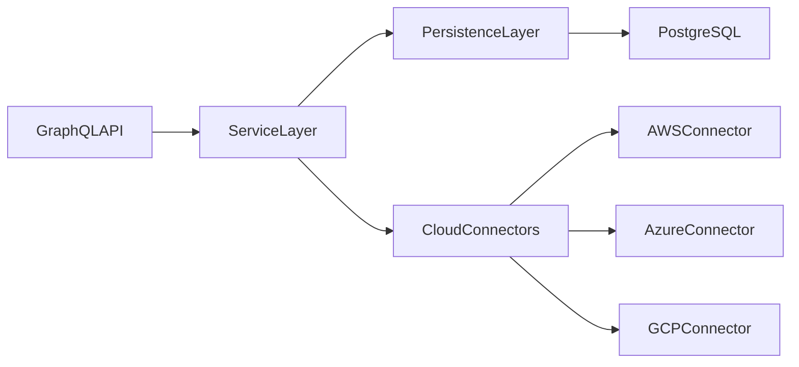
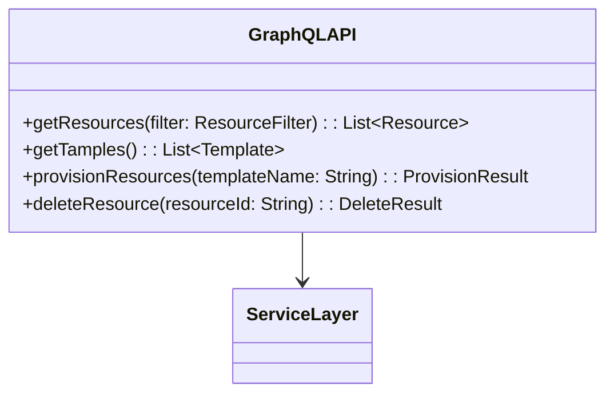
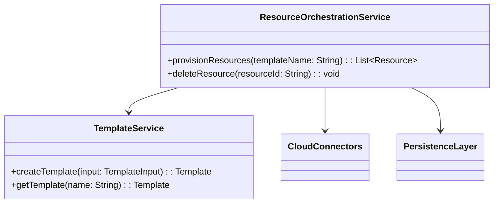
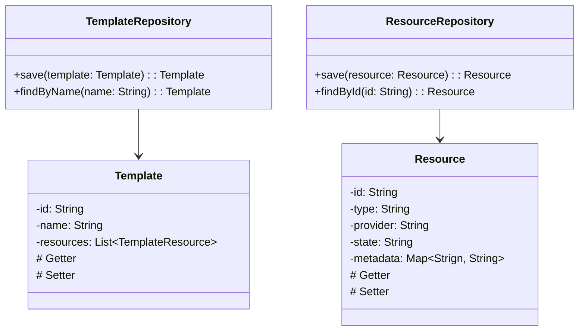
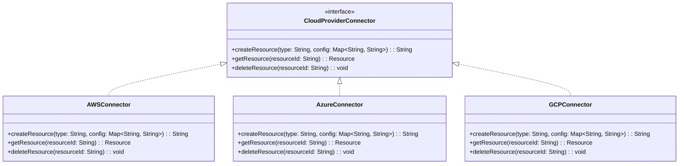
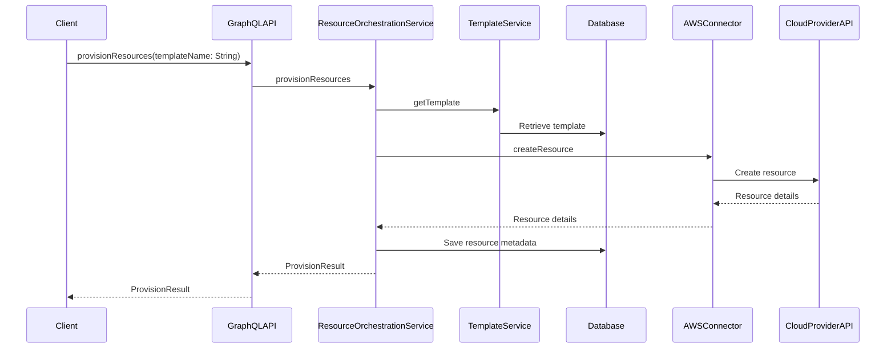

# Cloud Resource Orchestration API - Architecture

## Overview

This document details the architecture of the Cloud Resource Orchestration API, including its overall structure and the specific designs of its individual components. Each section uses a high-level explanation and diagrams for clarity.

## High-Level Architecture

The application follows a layered architecture to ensure modularity, scalability and maintainability. The primary layers are:

**1. Presentation Layer:** Handles GraphQL requests and responses.

**2. Service Layer:** Contains the business logic for orchestrating cloud resources and templates.

**3. Persistence Layer:** Manages data storage and retrieval from the PostgreSQL database.

**4. Integration Layer:** Handles interactions with cloud providers (AWS, Azure, GCP).

## Component Architectures

### GraphQL API Layer

The API layer exposes GraphQL queries and mutations to clients. It uses resolvers to process requests and invoke service methods.

### Service Layer

The Service Layer contains the core business logic for:

  - Validating user requests.
  - Orchestrating operations across cloud providers.
  - Interacting with the persistence layer.

### Persistence Layer

The Persistence Layer uses JPA repositories to manage entities like `Template` and `Resource`. It ensures templates and resource metadata are stored and retrieved efficiently.

### Cloud Connectors

The Cloud Connectors layer abstracts interactions with cloud providers. Each connector implements `CloudProviderConnector` interface to ensure consistent operations.

## Data Flows

### Resources

#### Creating a Resource
#### Retrieving a Resource
#### Editing a Resource
#### Provisioning a Resource

1. The clients sends a GraphQL mutation to provision resources using a specific template.

2. The API layer forwards the request to the `ResourceOrchestrationService`.

3. The service retrieves the template from the database using the `TemplateService`.

4. The service invokes the appropriate `CloudProviderConnector` to create resources.

5. The service persists the resource metadata and returns the details to the client.

#### Deleting a Resource

### Templates

#### Creating a Template
#### Retrieving a Template
#### Editing a Template
#### Provisioning a Template
#### Deleting a Template