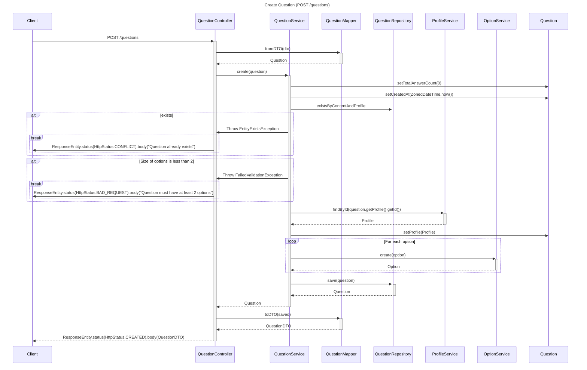

# API

## Design Patterns

### DTO (Data Transfer Object)

The DTO pattern is used in our API to define the data we either expect to receive
from the client or the data we will send to the client.
The advantages:
- The **client** knows what to send as request and what to except as response.
- The **server** knows what to expect to receive as request and what to send as response.
- Sensitive data e.g. a password can be excluded from the response,
  so if a response would be logged, the password would not be included.
- The response can include data from multiple entities, objects or additional data.

### Mapper

The Mapper pattern is used in our API to convert DTOs to entities and vice versa.
The advantages:
- The code is more **readable and **maintainable**.
- Whole **objects** can be passed to the **mapper** but only the necessary data will be used.
- The mapper can be used to convert **multiple objects at once**.
- The mapper can be used to convert **objects to different types**.

## Diagrams

### Pre-Development UML


### Post-Development UML

```mermaid
classDiagram

class Application {
    +main(String[] args): void$
}
class RuntimeException
class JPARepository["JPARepository<T, ID> from java.persistence"]
class ViewController {
    +index(): String
}
class InitController {
    -Seed seed
    +seed(): ResponseEntity~String~
}
class ResponseDTO {
    <<abstract>>
    -UUID id
    
    +getId(): UUID
    +setId(UUID): void
    
    +equals(Object): boolean
    +hashCode(): int
    +canEqual(Object): boolean
}
class Controller {
    +USERS$
    +AUTH$
    +ROLES$
    +PROFILES$
    +QUESTIONS$
    +OPTIONS$
    +ANSWERS$
    
    +DB_INIT$
    +SIGNIN$
    +SIGNUP$
    
    +GET$
    +ID_GET$
    +OPTION_ID_GET$
    +QUESTION_ID_GET$
    +NAME_GET$
    
    +DELETE$
    +PATCH$
    +POST$
}
class Seed {
    -RoleService roleService
    -UserService userService
    
    +seed(): void
}
class CrudService~E I~ {
    <<interface>>
    
    +findAll(): List~E~
    +findById(I id): E
    +delete(I id): void
    +create(E e): E
    +update(E changing, I id): E
}

class GlobalControllerExceptionHandler {
    +handleConversionAndArgumentMismatchExceptions(RuntimeException ex): ResponseEntity~?~
    +handleResponseStatusExceptions(ResponseStatusException ex): ResponseEntity~?~
    +handleValidationExceptions(Exception ex): ResponseEntity~?~
    +handleAccessDeniedExceptions(AccessDeniedException ex): ResponseEntity~?~
    +handleRuntimeExceptions(RuntimeException ex): ResponseEntity~?~
    -JsonMessage(String message)
}
class FailedValidationException {
    -Map~String, List~String~~ errors
    
    +getErrors(): Map~String, List~String~~
    +setErrors(Map~String, List~String~~): void
}

class AuthController {
    -UserService userService
    -AuthenticationManager authenticationManager
    
    +signUp(SignUpRequestDTO dto): ResponseEntity~?~
    +signIn(SignInRequestDTO dto): ResponseEntity~?~
}
class SignUpRequestDTO {
    -String username
    -String email
    -String password
    
    +getUsername(): String
    +setUsername(String): void
    +getEmail(): String
    +setEmail(String): void
    +getPassword(): String
    +setPassword(String): void
    
    +equals(Object): boolean
    +hashCode(): int
    +canEqual(Object): boolean
}
class SignUpResponseDTO {
    -UUID profileId
    -String email
    
    +getProfileId(): UUID
    +setProfileId(UUID): void
    +getEmail(): String
    +setEmail(String): void
    
    +equals(Object): boolean
    +hashCode(): int
    +canEqual(Object): boolean
}
class SignInRequestDTO {
    -String email
    -String password
    
    +getEmail(): String
    +setEmail(String): void
    +getPassword(): String
    +setPassword(String): void
    
    +equals(Object): boolean
    +hashCode(): int
    +canEqual(Object): boolean
}
class SignInResponseDTO {
    -UUID profileId
    -String token
    
    +getProfileId(): UUID
    +setProfileId(UUID): void
    +getToken(): String
    +setToken(String): void
    
    +equals(Object): boolean
    +hashCode(): int
    +canEqual(Object): boolean
}
class SignInMapper {
    +toDTO(String token, User user): SignInResponseDTO$
    +fromDTO(SignInRequestDTO): User$
}
class SignUpMapper {
    +toDTO(User user): SignUpResponseDTO$
    +fromDTO(SignUpRequestDTO dto): User$
}
class Security {
    +String SECRET$
    +String ALGORITHM$
    +long EXPIRATION_TIME$
    +String AUTH_URLS$
    +String[] PUBLIC_URLS$
    +String AUTHORIZATION_HEADER_NAME$
}
class SecurityConfiguration {
    +passwordEncoder(): PasswordEncoder$
    +customFilterChain(HttpSecurity http): SecurityFilterChain
    +corsConfigurationSource(): CorsConfigurationSource
    +authenticationManager(AuthenticationConfiguration authenticationConfiguration): AuthenticationManager
    +customDecoder(): JwtDecoder
}
class JwtGenerator {
    +generateJwtToken(Authentication authentication): String$
    -buildJWTClaimsSet(Authentication authentication): JWTClaimsSet$
}

class UserDetailsServiceImpl {
    -UserRepository userRepository
    +loadUserByUsername(String email): UserDetails
}

class User {
    -UUID id
    -String email
    -String password
    -Set~Profile~ profiles
    -Set~Role~ assignedRoles
    
    +getId(): UUID
    +setId(UUID): void
    +getEmail(): String
    +setEmail(String): void
    +getPassword(): String
    +setPassword(String): void
    +getProfiles(): Set~Profile~
    +setProfiles(Set~Profile~): void
    +getAssignedRoles(): Set~Role~
    +setAssignedRoles(Set~Role~): void
    
    +equals(Object): boolean
    +hashCode(): int
    +canEqual(Object): boolean
}
class UserRequestDTO {
    -String email
    
    +getEmail(): String
    +setEmail(String): void
    
    +equals(Object): boolean
    +hashCode(): int
    +canEqual(Object): boolean
}
class UserResponseDTO {
    -UUID profileId
    -List~UUID~ roleIds
    -String email
}
class UserMapper {
    +toDTO(User user): UserResponseDTO$
    +fromDTO(UserRequestDTO dto): User$
}
class UserRepository {
    <<interface>>
    +findByEmail(String email): Optional~User~
}
class UserService {
    -UserRepository userRepository
    -RoleRepository roleRepository
    -PasswordEncoder passwordEncoder
    
    +findAll(): List~User~        
    +findById(UUID id): User
    +findByEmail(String email): User
    +delete(UUID id): void
    +create(User user): User
    +create(User user, String username): User
    +update(User changing, UUID id): User
    -merge(User changing, User existing): void
}
class UserController {
    -UserService userService
    
    +findAll(): ResponseEntity~?~
    +findById(UUID id): ResponseEntity~?~
    +update(UserRequestDTO dto, UUID id): ResponseEntity~?~
    +delete(UUID id): ResponseEntity~?~
}

class Role["Role implements GrantedAuthority"] {
    -UUID id
    -String name
    -Set~User~ assignedUsers
    
    +getId(): UUID
    +setId(UUID): void
    +getName(): String
    +getAuthority(): String
    +setName(String): void
    +getAssignedUsers(): Set~User~
    +setAssignedUsers(Set~User~): void
    
    +equals(Object): boolean
    +hashCode(): int
    +canEqual(Object): boolean
}
class RoleRequestDTO {
    -String name
    
    +getName(): String
    +setName(String): void
    
    +equals(Object): boolean
    +hashCode(): int
    +canEqual(Object): boolean
}
class RoleResponseDTO {
    -String name
    -List~UUID~ assignedUserIds
    
    +getName(): String
    +setName(String): void
    +getAssignedUserIds(): List~UUID~
    +setAssignedUserIds(List~UUID~): void
    
    +equals(Object): boolean
    +hashCode(): int
    +canEqual(Object): boolean
}
class RoleMapper {
    +toDTO(Role role): RoleResponseDTO$
    +fromDTO(RoleRequestDTO dto): Role$
}
class RoleRepository {
    <<interface>>
    +findByName(String name): Optional~Role~
}
class RoleService {
    -RoleRepository roleRepository
    
    +findAll(): List~Role~
    +findById(UUID id): Role
    +findByName(String name): Role
    +delete(UUID id): void
    +create(Role role): Role
    +update(Role changing, UUID id): Role
    -merge(Role changing, Role existing): void
}
class RoleController {
    -RoleService roleService
    
    +findAll(): ResponseEntity~?~
    +findById(UUID id): ResponseEntity~?~
    +findById(String name): ResponseEntity~?~
    +update(RoleRequestDTO dto, UUID id): ResponseEntity~?~
    +create(RoleRequestDTO dto): ResponseEntity~?~
    +delete(UUID id): ResponseEntity~?~
}

class Profile {
    -UUID id
    -User user
    -String username
    -String profilePicture
    -Set~Question~ questions
    -Set~Answer~ answers
    -ZonedDateTime createdAt
    
    +getId(): UUID
    +setId(UUID): void
    +getUsername(): String
    +setUsername(String): void
    +getProfilePicture(): String
    +setProfilePicture(String): void
    +getUser(): User
    +setUser(User): void
    +getQuestions(): Set~Question~
    +setQuestions(Set~Question~): void
    +getAnswers(): Set~Answer~
    +setAnswers(Set~Answer~): void
    +getCreatedAt(): ZonedDateTime
    +setCreatedAt(ZonedDateTime): void
    
    +equals(Object): boolean
    +hashCode(): int
    +canEqual(Object): boolean
}
class ProfileRequestDTO {
    -String username
    -String profilePicture
    
    +getUsername(): String
    +setUsername(String): void
    +getProfilePicture(): String
    +setProfilePicture(String): void
    
    +equals(Object): boolean
    +hashCode(): int
    +canEqual(Object): boolean
}
class ProfileResponseDTO {
    -String username
    -String profilePicture
    -List~QuestionResponseDTO~ questions
    -List~AnswerResponseDTO~ answers
    
    +getUsername(): String
    +setUsername(String): void
    +getProfilePicture(): String
    +setProfilePicture(String): void
    +getQuestions(): List~QuestionResponseDTO~
    +setQuestions(List~QuestionResponseDTO~): void
    +getAnswers(): List~AnswerResponseDTO~
    +setAnswers(List~AnswerResponseDTO~): void
    
    +equals(Object): boolean
    +hashCode(): int
    +canEqual(Object): boolean
}
class ProfileMapper {
    +toDTO(Profile profile): ProfileResponseDTO$
    +fromDTO(ProfileRequestDTO dto): Profile$
}
class ProfileRepository {
    <<interface>>
}
class ProfileService {
    -ProfileRepository profileRepository
    
    +findAll(): List~Profile~
    +findById(UUID id): Profile
    +delete(UUID id): void
    +create(Profile profile): Profile
    +update(Profile changing, UUID id): Profile
    -merge(Profile changing, Profile existing): void
}
class ProfileController {
    -ProfileService profileService
    
    +findAll(): ResponseEntity~?~
    +findById(UUID id): ResponseEntity~?~
    +update(ProfileRequestDTO dto, UUID id): ResponseEntity~?~
}

class Question {
    -UUID id
    -Profile profile
    -Set~Option~ options
    -String content
    -String description
    -int totalAnswerCount
    -ZonedDateTime createdAt
    
    +getId(): UUID
    +setId(UUID): void
    +getContent(): String
    +setContent(String): void
    +getDescription(): String
    +setDescription(String): void
    +getProfile(): Profile
    +setProfile(Profile): void
    +getOptions(): Set~Option~
    +setOptions(Set~Option~): void
    +getTotalAnswerCount(): int
    +setTotalAnswerCount(int): void
    +getCreatedAt(): ZonedDateTime
    +setCreatedAt(ZonedDateTime): void
    
    +equals(Object): boolean
    +hashCode(): int
    +canEqual(Object): boolean
}
class QuestionRequestDTO {
    -String profileId
    -String content
    -String description
    -List~OptionRequestDTO~ options
    
    +getProfileId(): String
    +setProfileId(String): void
    +getContent(): String
    +setContent(String): void
    +getDescription(): String
    +setDescription(String): void
    +getOptions(): List~OptionRequestDTO~
    +setOptions(List~OptionRequestDTO~): void
    
    +equals(Object): boolean
    +hashCode(): int
    +canEqual(Object): boolean
}
class QuestionResponseDTO {
    -String content
    -String description
    -UUID profileId
    -String username
    -String profilePicture
    -List~OptionResponseDTO~ options
    -int totalAnswerCount
    -ZonedDateTime createdAt
    
    +getContent(): String
    +setContent(String): void
    +getDescription(): String
    +setDescription(String): void
    +getProfileId(): UUID
    +setProfileId(UUID): void
    +getOptions(): List~OptionResponseDTO~
    +setOptions(List~OptionResponseDTO~): void
    +getTotalAnswerCount(): int
    +setTotalAnswerCount(int): void
    +getCreatedAt(): ZonedDateTime
    +setCreatedAt(ZonedDateTime): void
    
    +equals(Object): boolean
    +hashCode(): int
    +canEqual(Object): boolean
}
class QuestionMapper {
    +toDTO(Question question): QuestionResponseDTO$
    +fromDTO(QuestionRequestDTO dto): Question$
}
class QuestionRepository {
    <<interface>>
    existsByContentAndProfileId(String content, UUID profileId): boolean
    getPage(int itemsPerPage, int offset): List~Question~
    findByOptionId(UUID optionId): Optional~Question~
}
class QuestionService {
    -QuestionRepository questionRepository
    -AnswerRepository answerRepository
    -OptionService optionService
    -ProfileService profileService
    -OptionRepository optionRepository
    
    +findAll(): List~Question~
    +findById(UUID id): Question
    +findByOptionId(UUID optionId): Question
    +delete(UUID id): void
    +create(Question question): Question
    +update(Question changing, UUID id): Question
    -merge(Question changing, Question existing): void
}
class QuestionController {
    -QuestionService questionService
    
    +findAll(): ResponseEntity~?~
    +findById(UUID id): ResponseEntity~?~
    +findByOptionId(UUID optionId): ResponseEntity~?~
    +pagination(int itemsPerPage, int currentPage): ResponseEntity~?~
    +create(QuestionRequestDTO dto): ResponseEntity~?~
    +update(QuestionRequestDTO dto, UUID id): ResponseEntity~?~
    +delete(UUID id): ResponseEntity~?~
}

class Option {
    -UUID id
    -Question question
    -Set~Answer~ answers
    -String content
    -int answerCount
    -ZonedDateTime createdAt
    
    +getId(): UUID
    +setId(UUID): void
    +getContent(): String
    +setContent(String): void
    +getQuestion(): Question
    +setQuestion(Question): void
    +getAnswers(): Set~Answer~
    +setAnswers(Set~Answer~): void
    +getAnswerCount(): int
    +setAnswerCount(int): void
    +getCreatedAt(): ZonedDateTime
    +setCreatedAt(ZonedDateTime): void
    
    +equals(Object): boolean
    +hashCode(): int
    +canEqual(Object): boolean
}
class OptionRequestDTO {
    -String content
    
    +getContent(): String
    +setContent(String): void
    
    +equals(Object): boolean
    +hashCode(): int
    +canEqual(Object): boolean
}
class OptionResponseDTO {
    -Set~AnswerResponseDTO~ answers
    -String content
    -int answerCount
    
    +getAnswers(): Set~AnswerResponseDTO~
    +setAnswers(Set~AnswerResponseDTO~): void
    +getContent(): String
    +setContent(String): void
    +getAnswerCount(): int
    +setAnswerCount(int): void
}
class OptionMapper {
    +toDTO(Option option): OptionResponseDTO$
    +fromDTO(OptionRequestDTO dto): Option$
}
class OptionRepository {
   getOptionByQuestionId(UUID questionId): List~Option~
   findQuestionIdById(UUID id): Optinal~UUID~
}
class OptionService {
    -OptionRepository optionRepository
    
    +findAll(): List~Option~
    +findById(UUID id): Option
    +delete(UUID id): void
    +getOptionByQuestionId(UUID questionId): List~Option~
    +create(Option option): Option
    +update(Option changing, UUID id): Option
    -merge(Option changing, Option existing): void
}
class OptionController {
    -OptionService optionService
    
    +findById(UUID id): ResponseEntity~?~
}

class Answer {
    -UUID id
    -Option option
    -Profile profile
    -ZonedDateTime createdAt
    
    +getId(): UUID
    +setId(UUID): void
    +getOption(): Option
    +setOption(Option): void
    +getProfile(): Profile
    +setProfile(Profile): void
    +getCreatedAt(): ZonedDateTime
    +setCreatedAt(ZonedDateTime): void
    
    +equals(Object): boolean
    +hashCode(): int
    +canEqual(Object): boolean
}
class AnswerRequestDTO {
    -String optionId
    -String profileId
    
    +getOptionId(): String
    +setOptionId(String): void
    +getProfileId(): String
    +setProfileId(String): void
    
    +equals(Object): boolean
    +hashCode(): int
    +canEqual(Object): boolean
}
class AnswerResponseDTO {
    -UUID optionId
    -UUID profileId
    -String username
    -String profilePicture
    -ZonedDateTime createdAt
    
    +getOptionId(): String
    +setOptionId(String): void
    +getProfileId(): String
    +setProfileId(String): void
    +getUsername(): String
    +setUsername(String): void
    +getProfilePicture(): String
    +setProfilePicture(String): void
    +getCreatedAt(): ZonedDateTime
    +setCreatedAt(ZonedDateTime): void
    
    +equals(Object): boolean
    +hashCode(): int
    +canEqual(Object): boolean
}
class AnswerMapper {
    +toDTO(Answer answer): AnswerResponseDTO$
    +fromDTO(AnswerRequestDTO dto): Answer$
}
class AnswerRepository {
    <<interface>>
    findByOptionId(UUID optionId): List~Answer~
    findByQuestionId(UUID questionId): List~Answer~
    findByOptionIdAndProfileId(UUID optionId, UUID profileId): Optional~Answer~
    findByQuestionIdAndProfileId(UUID questionId, UUID profileId): Optional~Answer~
    existsByOptionAndProfile(UUID optionId, UUID profileId): boolean
    countByOptionId(UUID optionId): int
    countByQuestionId(UUID questionId): int
}
class AnswerService {
    -AnswerRepository answerRepository
    -OptionRepository optionRepository
    -OptionService optionService
    
    +findAll(): List~Answer~
    +findById(UUID id): Answer
    +findByOptionId(UUID optionId): List~Answer~
    +delete(UUID id): void
    +create(Answer answer): Answer
    +update(Answer changing, UUID id): Answer
    -merge(Answer changing, Answer existing): void
}
class AnswerController {
    -AnswerService answerService
    -QuestionService questionService
    -OptionService optionService
    -ProfileService profileService
    
    +findAll(): ResponseEntity~?~
    +findById(UUID id): ResponseEntity~?~
    +findByOptionId(UUID optionId): ResponseEntity~?~
    +create(AnswerRequestDTO dto): ResponseEntity~?~
    +update(AnswerRequestDTO dto, UUID id): ResponseEntity~?~
    +delete(UUID id): ResponseEntity~?~
}

%% Relations
  User "1" -- "*" Profile
  User "*" -- "*" Role
  Profile "1" -- "*" Question
  Profile "1" -- "*" Answer
  Question "1" -- "*" Option
  Option "1" -- "*" Answer

%% Inheritance
  RuntimeException <|-- FailedValidationException
  JPARepository <|-- UserRepository
  JPARepository <|-- RoleRepository
  JPARepository <|-- ProfileRepository
  JPARepository <|-- QuestionRepository
  JPARepository <|-- OptionRepository
  JPARepository <|-- AnswerRepository
  ResponseDTO <|-- UserResponseDTO
  ResponseDTO <|-- RoleResponseDTO
  ResponseDTO <|-- ProfileResponseDTO
  ResponseDTO <|-- QuestionResponseDTO
  ResponseDTO <|-- OptionResponseDTO
  ResponseDTO <|-- AnswerResponseDTO
  ResponseDTO <|-- SignUpResponseDTO
  ResponseDTO <|-- SignInResponseDTO

%% Implementations
  CrudService~E I~ <|.. UserService
  CrudService~E I~ <|.. RoleService
  CrudService~E I~ <|.. ProfileService
  CrudService~E I~ <|.. QuestionService
  CrudService~E I~ <|.. OptionService
  CrudService~E I~ <|.. AnswerService
  UserDetailsService <|.. UserDetailsServiceImpl

%% Associations
  Application --> ViewController
  Application --> InitController
  Application --> Authentication
  Application --> Users
  Application --> Roles
  Application --> Profiles
  Application --> Questions
  Application --> Options
  Application --> Answers

%% Dependencies
  InitController ..> Seed
  AuthController ..> UserService
  AuthController ..> AuthenticationManager
  UserController ..> UserService
  RoleController ..> RoleService
  ProfileController ..> ProfileService
  QuestionController ..> QuestionService
  OptionController ..> OptionService
  AnswerController ..> AnswerService
  AnswerController ..> QuestionService
  AnswerController ..> OptionService
  AnswerController ..> ProfileService
  AnswerService ..> AnswerRepository
  AnswerService ..> OptionRepository
  AnswerService ..> OptionService
  UserService ..> UserRepository
  UserService ..> RoleRepository
  UserService ..> PasswordEncoder
  UserService ..> ProfileService
  UserDetailsServiceImpl ..> UserRepository
  RoleService ..> RoleRepository
  ProfileService ..> ProfileRepository
  QuestionService ..> QuestionRepository
  QuestionService ..> AnswerRepository
  QuestionService ..> OptionService
  QuestionService ..> ProfileService
  OptionService ..> OptionRepository


```

### Sequence Diagram

