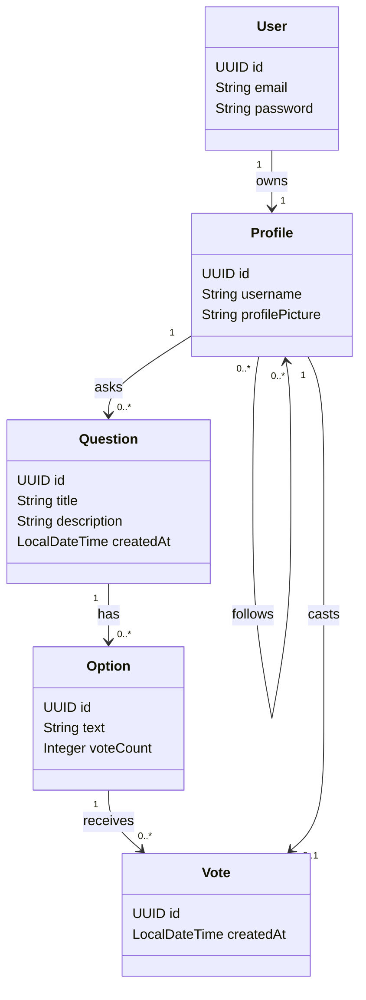
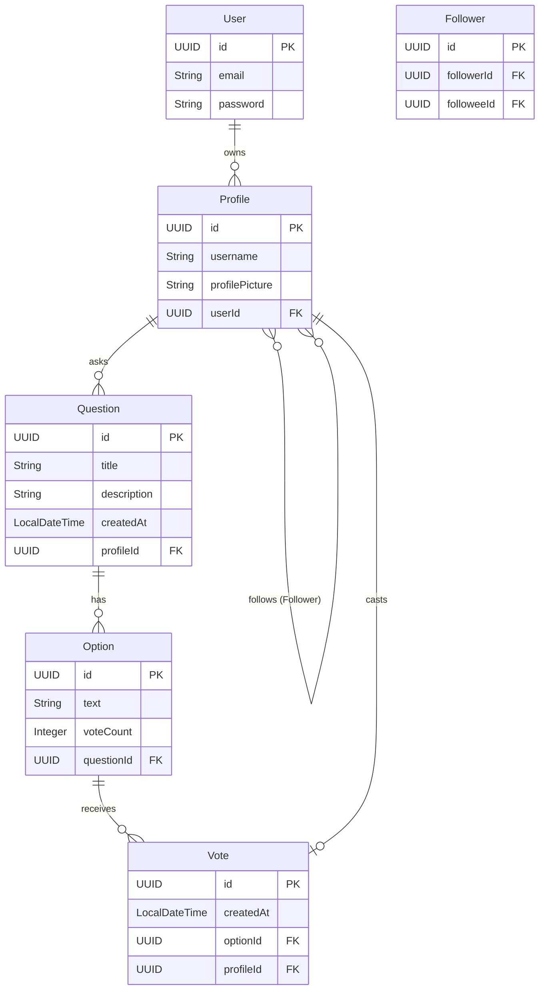

# Voteit-API

## Abstract

An API for a poll/voting 

## Pre-Dev UML

```mermaid
classDiagram

    class User {
        UUID id
        String email
        String password
    }

    class Profile {
        UUID id
        String username
        String profilePicture
    }

    class Question {
        UUID id
        String title
        String description
        LocalDateTime createdAt
    }

    class Option {
        UUID id
        String text
        Integer voteCount
    }

    class Vote {
        UUID id
        LocalDateTime createdAt
    }

    %% Relationships
    User "1" --> "1" Profile : owns
    Profile "1" --> "0..*" Question : asks
    Question "1" --> "0..*" Option : has
    Option "1" --> "0..*" Vote : receives
    Profile "1" --> "0..1" Vote : casts
    Profile "0..*" --> "0..*" Profile : follows

```

## ERD

```mermaid
erDiagram
    User {
        UUID id PK
        String email
        String password
    }

    Profile {
        UUID id PK
        String username
        String profilePicture
        UUID userId FK
    }

    Question {
        UUID id PK
        String title
        String description
        LocalDateTime createdAt
        UUID profileId FK
    }

    Option {
        UUID id PK
        String text
        Integer voteCount
        UUID questionId FK
    }

    Vote {
        UUID id PK
        LocalDateTime createdAt
        UUID optionId FK
        UUID profileId FK
    }

    Follower {
        UUID id PK
        UUID followerId FK
        UUID followeeId FK
    }

    %% Relationships
    User ||--o{ Profile : "owns"
    Profile ||--o{ Question : "asks"
    Question ||--o{ Option : "has"
    Option ||--o{ Vote : "receives"
    Profile ||--o| Vote : "casts"
    Profile }o--o{ Profile : "follows (Follower)"

```