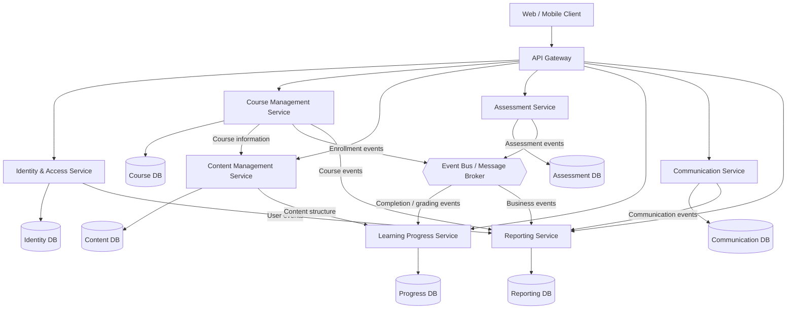

# LMS Monolith - Microservice Decomposition

## 1. Learning Objective

The goal of this exercise is to analyze an existing Learning Management System (LMS) monolith, identify its logically related business capabilities, and derive an appropriate microservice architecture from them.

The decomposition is based on **business domains and bounded contexts**, rather than simply creating one microservice for every feature. Each service should have:

- A clearly defined responsibility.
- Ownership of its own data.
- A well-defined API or event interface.
- Minimal coupling to other services.
- The ability to evolve and scale independently.

---

## 2. Feature Inventory

The LMS description contains the following features.

### User and Access Management

- User registration and authentication.
- Management of learners.
- Management of teachers.
- Management of administrators.
- User roles and permissions.
- Course access control.
- Enrollment in courses.
- Management of participants.

### Course Management

- Create courses.
- Edit courses.
- Organize courses.
- Publish courses.
- Manage course participants.
- Control access to courses.
- Observe learner activity and progress.
- Configure different learning paths.

### Learning Content Management

- Create and manage learning materials.
- Add materials to courses.
- Organize materials into modules.
- Support different material types:
  - Videos.
  - Documents.
  - Quizzes.
  - Assignments.
- Structure learning content into sequential modules.
- Provide learning content to enrolled learners.

### Learning Progress

- Track individual learner progress.
- Track completed assignments.
- Track passed examinations.
- Persist progress over time.
- Display current progress to learners.
- Allow teachers to observe learner progress.

### Assignments and Examinations

- Create assignments.
- Create tests/examinations.
- Associate assessments with course sections.
- Provide assessments to learners.
- Submit answers.
- Automatically evaluate suitable assessments.
- Manually correct free-text answers.
- Store assessment results.
- Display results to learners.
- Track passed examinations.

### Communication

- Send messages.
- Receive messages.
- Discussion forums.
- Ask questions.
- Discuss learning content.
- Teacher announcements.
- Teacher feedback.
- Communication between learners.
- Communication between teachers and learners.

### Reporting and Administration

- Administrative management of users.
- Administrative management of learning processes.
- Generate activity reports.
- Generate learner-progress reports.
- Monitor course effectiveness.
- Analyze learner activity.
- Use reports to identify possible course improvements.

---

# 3. Domain Analysis

The features can be grouped into several business domains.

| Bounded Context | Main Responsibility |
|---|---|
| Identity & Access | Users, roles, authentication and authorization |
| Course Management | Courses, enrollment and course access |
| Content Management | Modules and learning materials |
| Assessment | Assignments, examinations, submissions and grading |
| Learning Progress | Individual learning progress and completion |
| Communication | Messages, forums, announcements and feedback |
| Reporting | Aggregated activity and progress reports |

These contexts are sufficiently different in responsibility and data ownership to justify separation.

For example, **learning progress should not directly own course data**. It can reference a course and learner using identifiers, while the Course Management service remains responsible for course information.

---

# 4. Proposed Microservices

## 4.1 Identity & Access Service

### Responsibilities

The Identity & Access Service manages everything related to user identity and access control.

- User accounts.
- Authentication.
- Authorization.
- Roles.
- Permissions.
- Learner, teacher and administrator identities.
- Access tokens/sessions.
- User account lifecycle.

### Data Ownership

Owns:

- Users.
- Roles.
- Permissions.
- Authentication credentials.
- Identity-related information.

It does **not** own:

- Courses.
- Learning content.
- Grades.
- Learning progress.
- Messages.

### Example API

```text
POST /auth/login
POST /users
GET  /users/{userId}
GET  /users/{userId}/roles
```

---

## 4.2 Course Management Service

### Responsibilities

This service represents the course domain.

- Create courses.
- Update courses.
- Publish courses.
- Manage course metadata.
- Manage enrollment.
- Manage course participants.
- Control course access.
- Configure learning paths.

### Data Ownership

Owns:

- Courses.
- Course metadata.
- Enrollment records.
- Course participation.
- Learning-path configuration.

It references users through `userId` rather than owning user accounts.

### Example API

```text
POST /courses
GET  /courses/{courseId}
PUT  /courses/{courseId}
POST /courses/{courseId}/enrollments
GET  /courses/{courseId}/participants
```

---

## 4.3 Content Management Service

### Responsibilities

The Content Management Service manages the actual learning content inside courses.

- Create modules.
- Organize modules.
- Add learning materials.
- Update learning materials.
- Remove materials.
- Manage videos.
- Manage documents.
- Manage quiz/assignment references.
- Define the structure of course content.

### Data Ownership

Owns:

- Modules.
- Learning-material metadata.
- Content ordering.
- Content structure.
- References to stored files.

The service does not own course enrollment or learner progress.

### Example API

```text
POST /courses/{courseId}/modules
GET  /courses/{courseId}/modules
POST /modules/{moduleId}/materials
PUT  /materials/{materialId}
DELETE /materials/{materialId}
```

---

## 4.4 Assessment Service

### Responsibilities

The Assessment Service manages assignments, tests and examinations.

- Create assessments.
- Associate assessments with course modules.
- Define questions.
- Define possible answers.
- Receive submissions.
- Automatically grade suitable assessments.
- Support manual grading.
- Store assessment results.
- Determine whether an assessment was passed.
- Provide results to learners and teachers.

### Data Ownership

Owns:

- Assessments.
- Questions.
- Answers/submissions.
- Grading rules.
- Grades.
- Assessment results.
- Passing status.

### Example API

```text
POST /assessments
GET  /assessments/{assessmentId}
POST /assessments/{assessmentId}/submissions
POST /submissions/{submissionId}/grade
GET  /assessments/{assessmentId}/results
```

The Assessment Service can publish events such as:

```text
AssessmentCompleted
AssessmentPassed
AssessmentGraded
```

The Learning Progress Service can consume these events.

---

## 4.5 Learning Progress Service

### Responsibilities

This service manages the learner's journey through a course.

- Track course progress.
- Track module completion.
- Track completed assignments.
- Track passed examinations.
- Calculate overall progress.
- Persist progress over time.
- Display progress to learners.
- Provide progress information to teachers.

### Data Ownership

Owns:

- Learner progress.
- Module completion.
- Course completion.
- Progress percentages.
- Completion timestamps.
- Progress-related state.

It references:

```text
userId
courseId
moduleId
assessmentId
```

but does not own the corresponding entities.

### Example API

```text
GET /learners/{userId}/courses/{courseId}/progress
POST /progress/{progressId}/complete
GET /courses/{courseId}/learners/progress
```

---

## 4.6 Communication Service

### Responsibilities

The Communication Service handles communication between participants.

- Direct messages.
- Discussion forums.
- Forum threads.
- Questions.
- Replies.
- Teacher announcements.
- Teacher feedback.
- Notifications related to communication.

### Data Ownership

Owns:

- Messages.
- Conversations.
- Discussion forums.
- Threads.
- Replies.
- Announcements.
- Communication metadata.

It references users and courses through IDs.

### Example API

```text
POST /messages
GET  /conversations/{conversationId}
POST /forums
POST /forums/{forumId}/threads
POST /threads/{threadId}/replies
POST /courses/{courseId}/announcements
```

---

## 4.7 Reporting Service

### Responsibilities

The Reporting Service provides aggregated information for teachers and administrators.

- Activity reports.
- Learner-progress reports.
- Course reports.
- Course effectiveness analysis.
- Aggregated learner statistics.
- Administrative reporting.

### Data Ownership

The Reporting Service should generally **not become the system of record for transactional business data**.

Instead, it maintains read-optimized reporting data derived from events published by other services.

For example:

```text
CourseCreated
LearnerEnrolled
ModuleCompleted
AssessmentPassed
AssessmentGraded
MessageSent
```

These events can be consumed and transformed into reporting projections.

### Example API

```text
GET /reports/courses/{courseId}
GET /reports/learners/{userId}
GET /reports/courses/{courseId}/progress
GET /reports/activity
```

---

# 5. Service Data Ownership

A core principle of the architecture is:

> Every business entity has one authoritative owner.

| Data | Owner |
|---|---|
| Users | Identity & Access |
| Roles | Identity & Access |
| Permissions | Identity & Access |
| Courses | Course Management |
| Enrollments | Course Management |
| Course participants | Course Management |
| Learning modules | Content Management |
| Learning materials | Content Management |
| Assessments | Assessment |
| Questions | Assessment |
| Submissions | Assessment |
| Grades | Assessment |
| Learner progress | Learning Progress |
| Module completion | Learning Progress |
| Messages | Communication |
| Forums | Communication |
| Announcements | Communication |
| Reports/projections | Reporting |

Services should **not share the same database schema**.

Instead, every service owns its own database.

Example:

```text
Identity Service      -> identity_db
Course Service        -> course_db
Content Service       -> content_db
Assessment Service    -> assessment_db
Progress Service      -> progress_db
Communication Service -> communication_db
Reporting Service     -> reporting_db
```

---

# 6. Service Communication

There are two primary communication patterns.

## 6.1 Synchronous Communication

REST or another request/response protocol can be used when an immediate response is required.

Example:

```text
Learner
   |
   v
Course Service
   |
   v
Enrollment information
```

Typical synchronous operations:

- Retrieve course information.
- Check course enrollment.
- Retrieve current progress.
- Retrieve assessment results.
- Send a message.

---

## 6.2 Asynchronous Communication

Events should be used for state changes that other services need to react to.

Example:

```text
Assessment Service
        |
        | AssessmentPassed
        v
Learning Progress Service
        |
        | ProgressUpdated
        v
Reporting Service
```

Potential events:

```text
UserCreated
UserRoleChanged

CourseCreated
CoursePublished
LearnerEnrolled
LearnerRemoved

ModuleCompleted
CourseCompleted

AssessmentSubmitted
AssessmentGraded
AssessmentPassed

MessageSent
AnnouncementPublished
```

A message broker such as RabbitMQ, Apache Kafka or another event-bus implementation could be used.

---

# 7. Architecture Diagram

The following diagram shows the proposed decomposition and the main communication relationships.



---

# 8. Main Collaboration Flows

## 8.1 Learner Enrolls in a Course

```text
Learner
   |
   v
API Gateway
   |
   v
Course Management
   |
   | LearnerEnrolled
   v
Event Bus
   |
   +------> Learning Progress
   |
   +------> Reporting
```

The Course Management Service remains responsible for the enrollment itself.

The Progress Service can initialize a progress record after receiving the enrollment event.

---

## 8.2 Learner Completes an Assessment

```text
Learner
   |
   v
Assessment Service
   |
   | Grade submission
   v
Assessment completed
   |
   | AssessmentPassed
   v
Event Bus
   |
   v
Learning Progress Service
   |
   | ProgressUpdated
   v
Event Bus
   |
   v
Reporting Service
```

This avoids a direct dependency between Assessment and Reporting.

---

## 8.3 Teacher Creates Course Content

```text
Teacher
   |
   v
API Gateway
   |
   v
Course Management
   |
   | courseId
   v
Content Management
   |
   v
Module / Material
```

The Course Management Service owns the course, while the Content Management Service owns the internal content structure.

---

# 9. Why These Boundaries?

The decomposition follows **business capabilities and bounded contexts**.

### Identity & Access

Authentication and authorization are cross-cutting concerns with a distinct lifecycle and security requirements.

### Course Management

Courses and enrollments form a coherent domain. Teachers manage courses and participants, while learners enroll in them.

### Content Management

Learning materials have a different lifecycle from the course itself. Content can be created, reorganized and updated independently.

### Assessment

Tests, submissions and grading have complex business rules and can evolve independently from normal course content.

### Learning Progress

Progress is a learner-centric domain. It combines events from learning activities without owning the underlying course or assessment data.

### Communication

Messages and discussions have completely different access patterns and persistence requirements from learning content.

### Reporting

Reporting is primarily read-oriented and analytical. Separating it prevents expensive reporting queries from negatively affecting transactional services.

---

# 10. API Gateway

An API Gateway can provide a single entry point for clients.

```text
                    +----------------+
                    |   Web / Mobile |
                    +-------+--------+
                            |
                            v
                    +---------------+
                    |  API Gateway  |
                    +-------+-------+
                            |
       +--------------------+--------------------+
       |         |          |         |           |
       v         v          v         v           v
   Identity   Course     Content  Assessment  Progress
                                  |
                                  v
                            Communication
```

The gateway can provide:

- Request routing.
- Authentication-token validation.
- Rate limiting.
- API composition.
- Centralized logging.
- Request correlation.
- Versioning.

The gateway should **not contain core business logic**. Business rules belong to the individual services.

---

# 11. Recommended Communication Strategy

| Interaction | Communication |
|---|---|
| Login | Synchronous REST |
| Retrieve course | Synchronous REST |
| Retrieve course content | Synchronous REST |
| Submit assessment | Synchronous REST |
| Retrieve assessment result | Synchronous REST |
| Send message | Synchronous REST |
| Learner enrolled | Asynchronous event |
| Assessment passed | Asynchronous event |
| Module completed | Asynchronous event |
| Course completed | Asynchronous event |
| Generate reporting projection | Asynchronous event |
| User created | Asynchronous event |

The general rule is:

> Use synchronous communication when the caller needs an immediate answer. Use asynchronous events when another service only needs to react to something that happened.

---

# 12. Advantages of the Proposed Architecture

## Independent Scaling

Different workloads can scale independently.

For example, Reporting may require significant database resources without requiring the Course Management Service to scale.

## Independent Deployment

A change to the Communication Service does not necessarily require redeploying the Assessment Service.

## Clear Ownership

Each service has a clearly defined responsibility and owns its own data.

## Technology Independence

Services can theoretically use different technologies where appropriate.

For example:

```text
Assessment Service -> Java
Content Service    -> Node.js
Reporting Service  -> Python
```

This should only be done when there is a real benefit. A polyglot architecture also increases operational complexity.

## Fault Isolation

A failure in Reporting should not prevent learners from accessing their courses.

Similarly, a temporary communication outage should ideally not prevent a learner from completing an assessment.

---

# 13. Trade-offs

Microservices are not automatically better than a monolith.

The proposed architecture introduces additional complexity:

- Network communication.
- Distributed transactions.
- Service discovery.
- Monitoring.
- Logging.
- Distributed tracing.
- Event management.
- Deployment complexity.
- Database management.
- Eventual consistency.

For a small LMS, a modular monolith could initially be a better architectural choice.

A sensible evolution could therefore be:

```text
Initial system
      |
      v
Modular Monolith
      |
      | Identify stable bounded contexts
      v
Extract selected services
      |
      v
Microservice Architecture
```

The most valuable candidates for early extraction would likely be:

1. Identity & Access.
2. Communication.
3. Reporting.
4. Assessment.

These domains have relatively clear boundaries and/or different scaling and operational requirements.

---

# 14. Final Architecture

The proposed LMS consists of **seven business-oriented microservices**:

```text
+-------------------------+
|    Identity & Access    |
+-------------------------+

+-------------------------+
|   Course Management     |
+-------------------------+

+-------------------------+
|   Content Management    |
+-------------------------+

+-------------------------+
|      Assessment         |
+-------------------------+

+-------------------------+
|   Learning Progress     |
+-------------------------+

+-------------------------+
|    Communication        |
+-------------------------+

+-------------------------+
|       Reporting         |
+-------------------------+
```

They communicate through an API Gateway for synchronous client interactions and an event bus for asynchronous domain events.

The most important architectural principle is **clear business ownership**: courses belong to Course Management, content belongs to Content Management, assessments and grades belong to Assessment, progress belongs to Learning Progress, communication belongs to Communication, and analytical projections belong to Reporting.

This decomposition minimizes coupling while keeping closely related business logic together.
