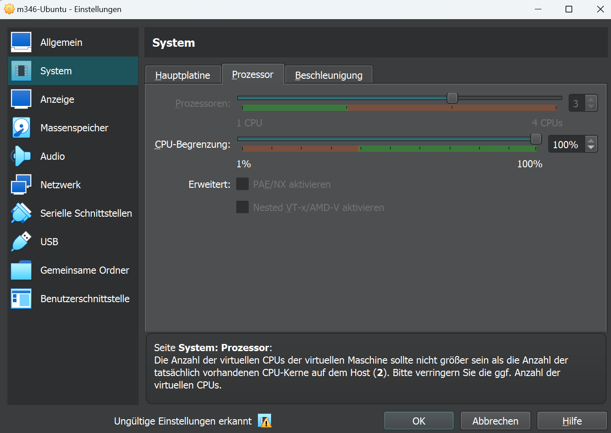

# KN01

## A. Hypervisor Typ 1 und 2 (30%)

### 1. Was ist ein Hypervisor?

Der Hypervisor verwaltet virtuelle Maschinen und teilt Hardware Resource zwischen mehreren Betriebssystemen.

### 2. Was ist der Unterschied zwischen Typ 1 und 2?

- Hypervisor 1 Bare-Metal Hypervisor:
  - Läuft direkt auf der Hardware.
  - Höhere Performance und Effizienz.

- Hypervisor 2: Läuft auf einem Host OS und ist von diesem abhängig.

  - Einfach zum Aufsetzen aber minimal niedrigere Performance

## B. Virtualisierungssoftware (70%)

### 1. Vermutung des Typs

- Typ 2, denn Virtualbox läuft auf meinem Windows 11 System, welches als Host OS dient.

### 2. VM (Virtualbox)

#### 2.1. Logische Prozessoren und RAM auf Host-System

##### CPU des Host-Systems

  

##### RAM des Host-Systems

  

#### 2.2 VM aufsetzen

Wir benutzen Oracles Virtualbox mit einem Ubuntu Linux System.

#### 2.3 VM überladen (CPU)

Fehler Bei 3 Logischen CPU's:


#### 2.4 CPUs der VM

Wir haben nun bloss einen logischen Prozessor benutzt.

Command: ```sh lscpu | grep "CPU(s)"```


#### 2.5 RAM der VM

Command: ```sh free -h```


### 3. Fazit Vermutung

Unsere Vermutung, das wir einen Typ 2 Hypervisor haben, war falsch. Denn wir können auf der VM nicht mehr logische Prozessoren nutzen als das Host-OS hat. Dies liegt daran, dass Typ 1 Hypervisor's direkt die Hardware des Host-OS nutzen.
