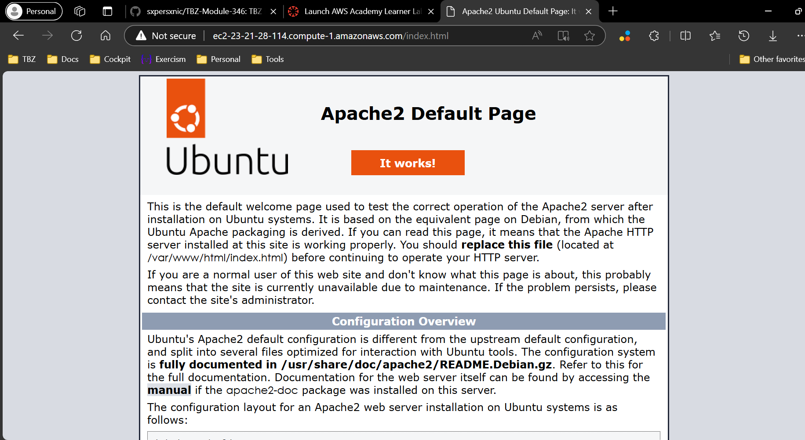
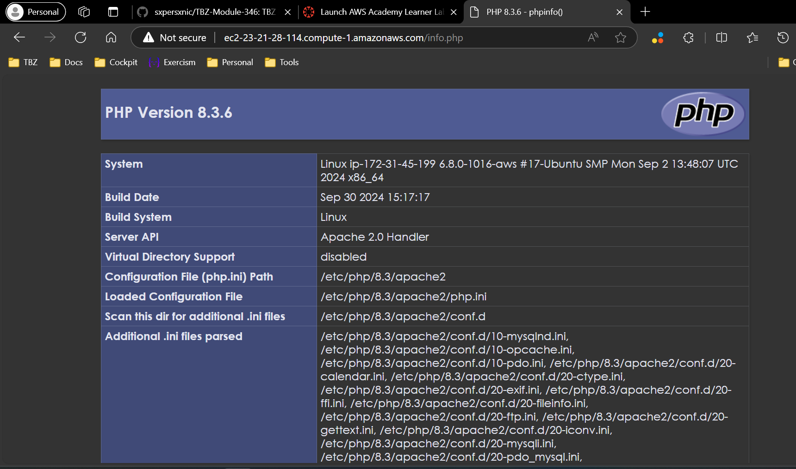
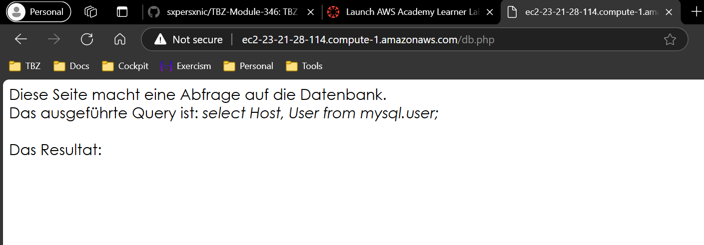
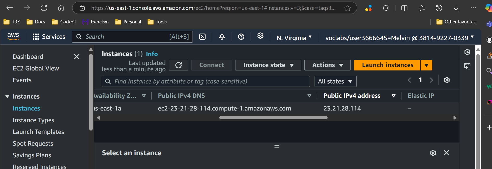
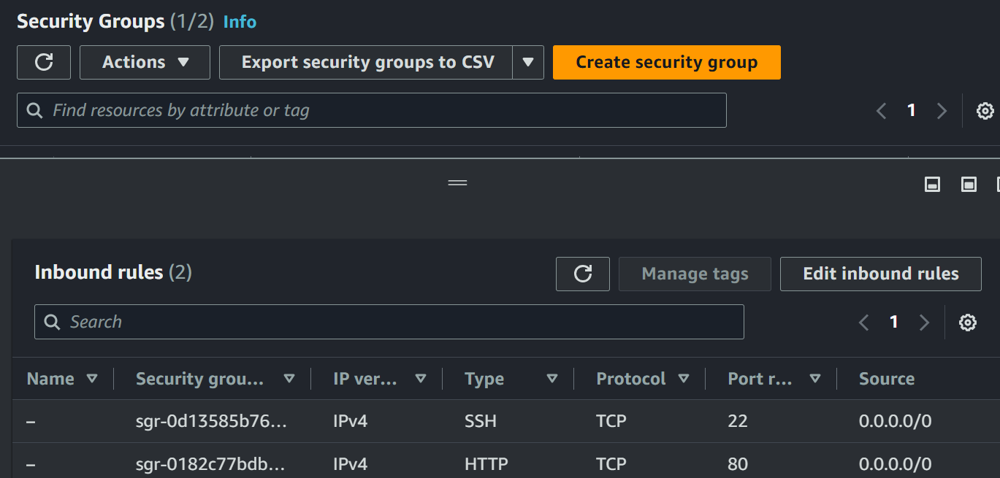
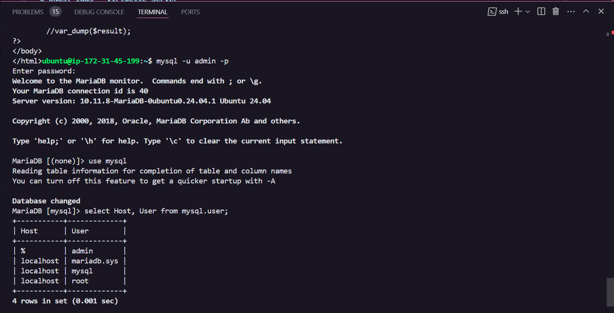

# KN03

## A. Installation Web- & Databaseserver

In AWS EC2 Machine run bash script: [Script](script.sh)

### Webseiten

#### Index.html

#### Info.php

#### Db.php

### EC2

#### Instanz infos

#### Security Group

### MySQL CLI

#### Query

#### Explanation

Die Abfrage liest Kolonen `Host` und `User` der Tabelle `user` aus der Datenbank `mysql` aus.
