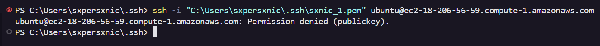
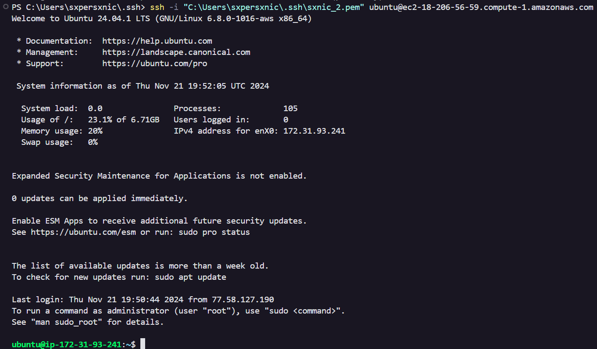
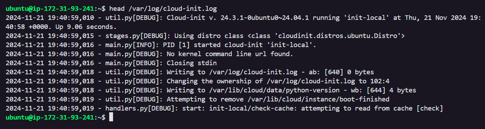

# KN04

## A. Cloud-init

**Dokumenterte YAML-Datei:** [File](./cloud-init/cloud-init.yml)

## B. SSH-Key und Cloud-init

- [Config-File](./cloud-init/aws_2.yml)

- Screenshot "Key pair assigned at launch":

    

- Screenshot SSh-Cmd mit erstem Schlüssel

    

- Screenshot SSh-Cmd mit zweitem Schlüssel

    

- Screenshot Cloud-Init-Log

    

## C. Template

[YML Template](./cloud-init/template.yml)

## D. Installation automatisieren

### Webserver

**cloud-init-web.yml:** [File](./cloud-init/cloud-init-web.yml)

### DB Server

**cloud-init-db.yml:** [File](./cloud-init/cloud-init-db.yml)
