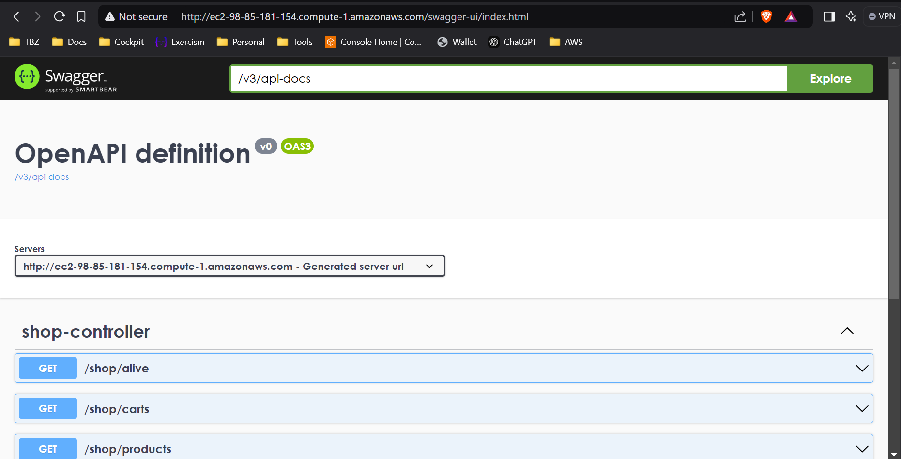
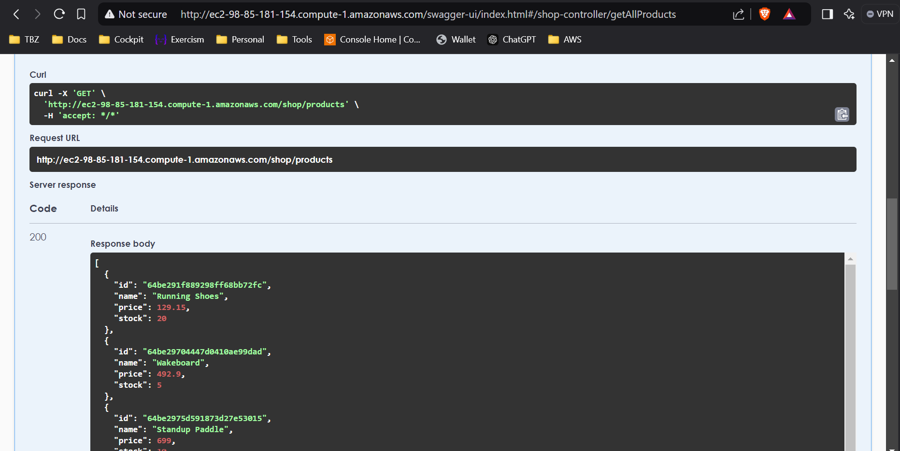
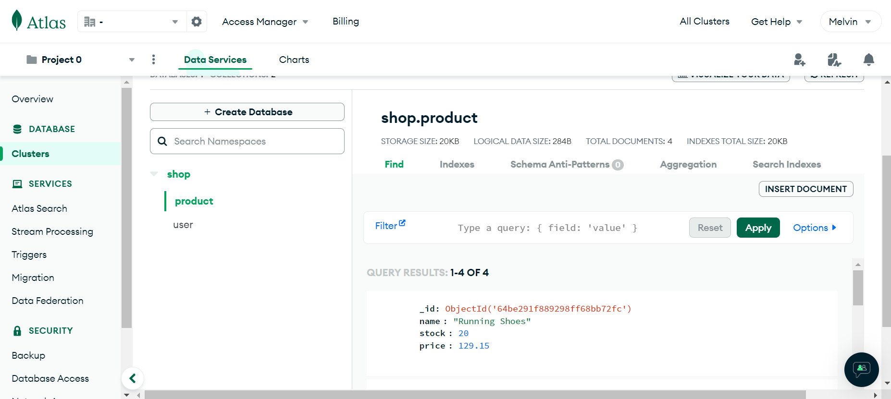
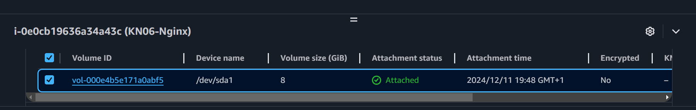
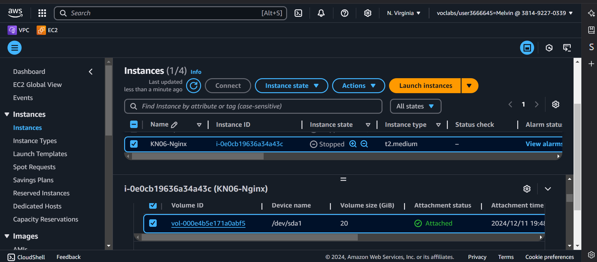
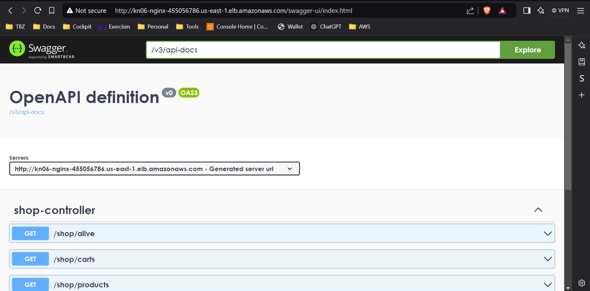

# KN06

## A. Installation App

- **Reverse Proxy:**

    Das Reverse Proxy wird verwendet um Requests über das HTTP-Protokoll
    von Port 80 auf den Port der Java Applikation (5001) umzuleiten.

- **Screenshot Swagger-URL:**
  
  

- **Screenshot Swagger endpoints (Products: Java, GetProducts: .NET):**

  

- **Screenshot MongoDB:**

  

- **Cloud init. Don't do in productive environment:**
  - Nginx configuration is placed in a user directory
  - Passwordless sudo access
  - SSH configuration risks -> `ssh_pwauth: false`
  - Root login enabled -> Risk of unauthorized access

## B. Verticale scaling

- **Instance resources:**
  - **Before:**

    

  - **After:**

    

- **Scaling when running instance?**
  The Disk Volume can be modified. Modifying the instance type is not possible
  while the instance is running tough.

- **Explanation**
  - **Disk Volume:**
    - **Step 1:** Go to EC2 > Elastic Block Store > Volumes
    - **Step 2:** Identify attached resource
    - **Step 3:** Select Volumne > Actions > Modify Volume
  - **Instance Type:**
    - **Step 1:** Stop instance if running.
    - **Step 2:** Select instance > Actions > Instance Settings > Change instance type
    - **Step 3:** Change instance type

## C. Horizontal scaling

- **Explanation DNS:**

  Since Domains are just a human-readable way of visiting server addresses,
  the domains need to be resolved. Thats what we use *DNS* for.
  *DNS* stands for **D**omain **N**aming **S**ystem. Every time we make a request
  to a certain domain, our local *DNS*-Server first checks if the domain is in
  its *DNS*-Cache if it's not, then the server will *search* for the *DNS*-Server
  of the requested Domain.

  So basically *DNS* is like the telephone-book of the internet.

  If we have a domain e.g. *app.tbz-m346.ch*,
  the domain is registered in the hosting *DNS*-Server.
  This means whenever a request is made to *app.tbz-m346.ch*,
  the local *DNS*-Server will *search* for the hosting *DNS*-Server.
  Once the local *DNS*-Sever resolved the domain, it caches the domain.
  Thats a reason why initial loading time of a website takes longer,
  because when you visit a website for the first time, your *DNS*-Server
  doesn't knows the IP-Adress of the Domain's server. After the initial
  request, the *DNS*-Server has the Domain cached, so when you revisit that
  website the *DNS*-Server will be like: 'Ouh yea app.tbz-m346.ch, yes i know them!'.

  **Important:** app.tbz-m346.ch isn't the domain. tbz-m346.ch is the root domain
  and app.tbz-m346.ch is just a sub-domain.

  To configure your DNS so you can actually use your domain,
  you will have to add the server your application is hosted at,
  to your DNS Host.

- **Screenshot Swagger-Call through LoadBalancer URL:**

  
