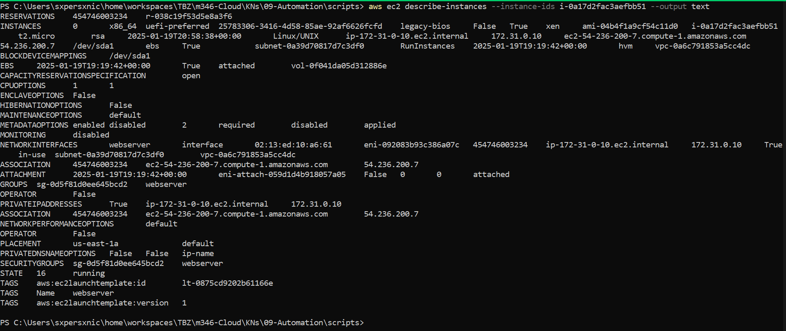
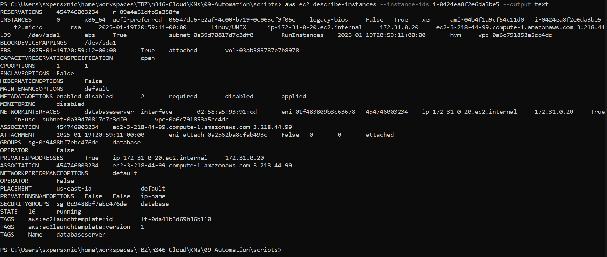
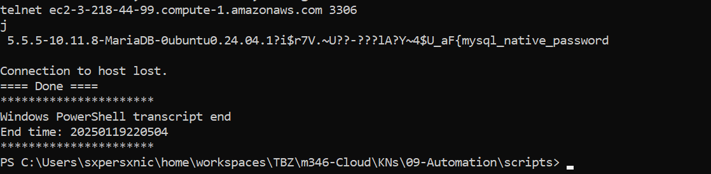
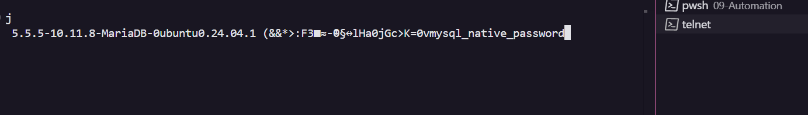

# KN09

## A. Automatisierung mit CLI



- [Script](./scripts/aws-ec2.ps1)
- [Log](./logs/aws-automation.log)





- **KN05 Automation:**
  - [Script](./scripts/kn05-automation.ps1)
  - [Log](./logs/kn05-automation.log)

## B. Terraform

- [Terraform](./terraform)
- [Terraform Config](./terraform/main.tf)
- Terraform telnet:
  
- Commands:

  - ```sh
      terraform init # Initialises the directory
    ```

  - ```sh
      terraform fmt # Formats configuration
    ```

  - ```sh
      terraform validate # Validates configuration
    ```

  - ```sh
      terraform apply # Creates infrastructure
    ```
