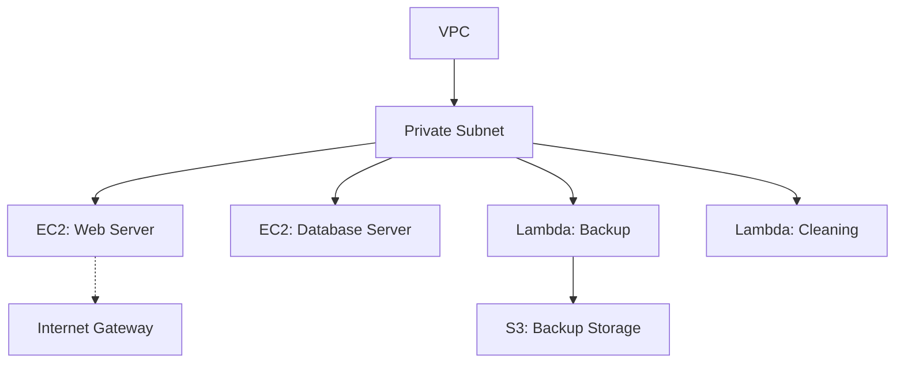

# Network Plan #

## AWS ##

```mermaid
graph TD

    A[VPC] --> B[Private Subnet]
    B --> C[EC2: Web Server]
    B --> D[EC2: Database Server]
    B --> E[Lambda: Backup]
    B --> F[Lambda: Cleaning]
    C -.-> G[Internet Gateway]
    E --> H[S3: Backup Storage]

```

## Azure ##

```mermaid
graph TD

```
