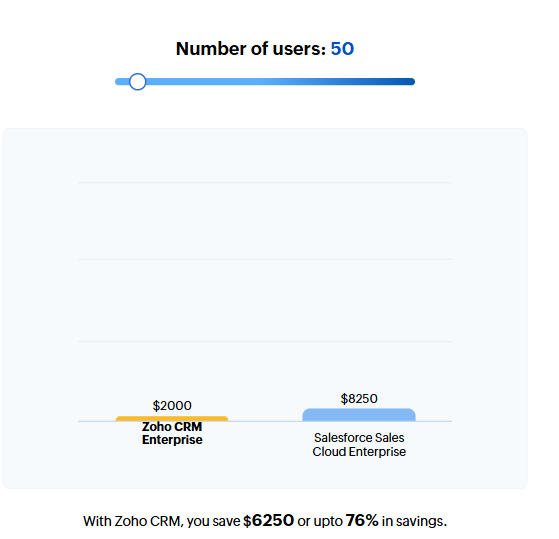

# KN10

## Ausgangssituation

Ihre Firma hat in frühen Jahren eine eigene CRM-Software entwickelt
und nutzt die nach wie vor.
Da sie aber in die Jahre gekommen ist, überlegt sich Ihre Firma in die Cloud zu migrieren.
Sie sollen dabei die Abklärungen treffen und Kostenrechnung erstellen.
Mögliche Optionen sind die folgenden Modelle *Rehosting*, *Replatforming*, *Repurchasing*.

Bisher wurde die Applikation *On Premise* betrieben mit folgender Spezifikation:

## A. Kostenrechnung IAAS - Rehosting

- [AWS](./AWS/README.md)
- [Azure](./Azure/README.md)

## B. Kostenrechnung PAAS - Replatforming

- **Webserver:**
  - **Type:** Heroku Dyno
  - **Plan:** Standard
  - **CPUs:** 1x - 4x
  - **RAM:** 1GB
  - **SSD:** -
  - **Monthly:** ~ 25$ - 50$

- **Datenbankserver:**
  - **Type:** Heroku Postgres
  - **Plan:** Standard
  - **CPUs:** -
  - **RAM:** 4GB - 768GB
  - **SSD:** 64 GB - 4 TB
  - **Monthly:** ~ 50$

- **Backup:**
  - **Type:** Add-on
  - **Provider:** Cloudcube
  - **Plan:** Medium Business
  - **Storage:** 1TB
  - **Hourly:** ~ 1.528$
  - **Monthly:** max. 1100$

**Total:**

- Webserver: 50$
- Datenbank: 50$
- Backup: 20h x 1.528$ = 30.56$

50$ + 50$ + 30.56$ = **130.56$/Month**

### Abweichung on Premise

Das Replatforming model weicht relativ stark zu der on Premise Lösung ab,
da es nur wenige Optionen gibt. Die ausgewählten Pläne treffen am besten auf
die bisherige Infrastruktur zu. Dazu ist es im Vergleich zu der IAAS Lösung 80% billiger
und spart zu gleich die Wartungsarbeit ein.

## C. Kostenrechnung SAAS - Repurchasing

### Zoho CRM vs. SalesForce Sales Cloud

## D. Interpretation der Resultate

Bei der Entscheidung für die richtige Lösung
kommt es natürlich auf die Bedürfnisse an.
Geht es rein um den Preis,
ist die PAAS Lösung (Replatforming) mit Heroku die beste Option.
Liegt die Priorität auf möglichst wenig Wartung,
ist das Zoho CRM also die SAAS Lösung die passende Entscheidung.
Ist es jedoch wichtig, dass man die Kontrolle über die Resourcen beibehält,
ist die IAAS Lösung empfohlen. Für welchen IAAS Anbieter man sich entscheidet,
kommt auf sekundäre Bedürfnisse an.
