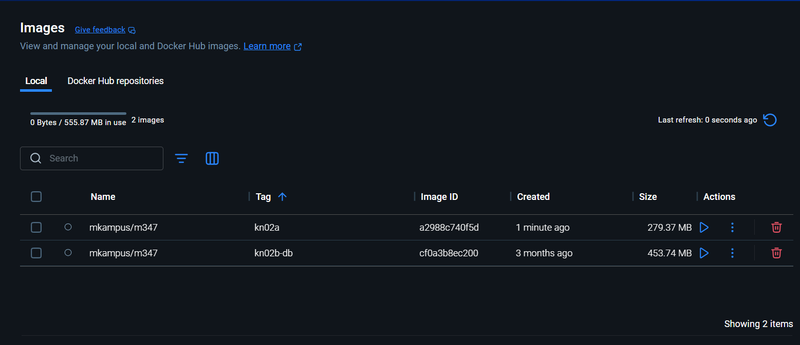
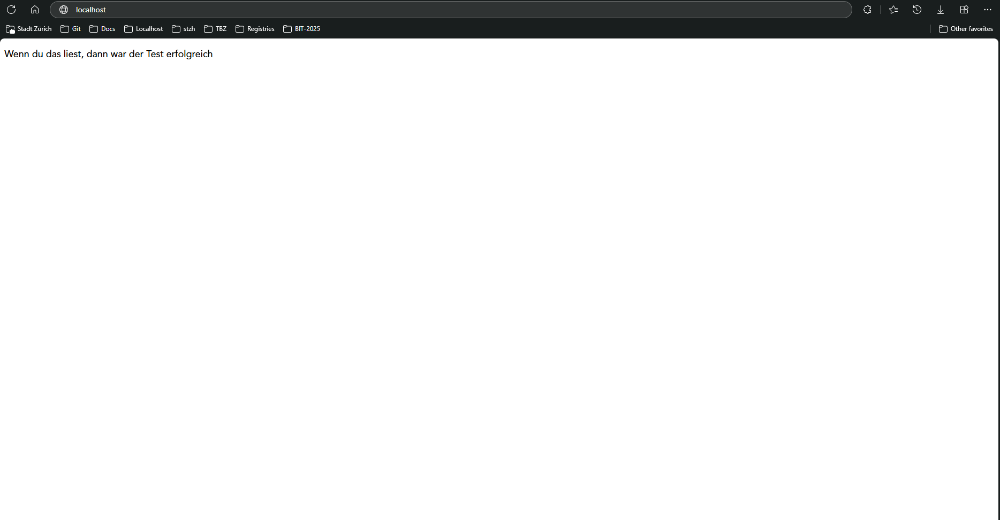
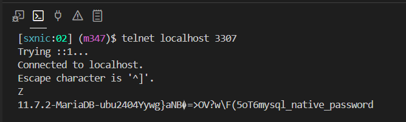
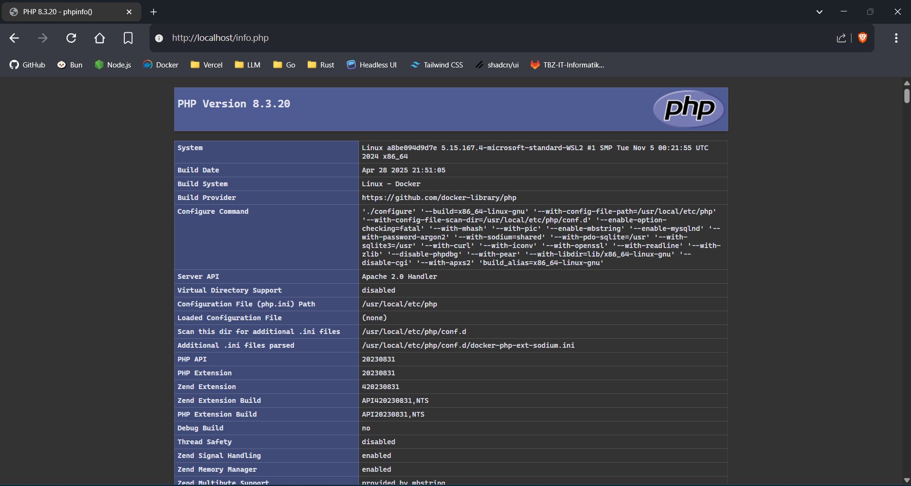
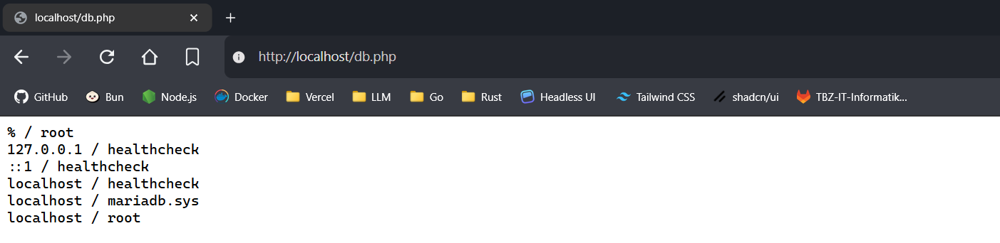

# KN02: Dockerfile

---

## A. Dockerfile I

- [Dockerfile](./.docker/Dockerfile)
- **Build:**

    ```sh
    docker build -f .docker/Dockerfile -t <username>/m347:kn02a .
    ```

- **Push:**

    ```sh
    docker push <username>/m347:kn02a
    ```

- **Start:**

    ```sh
    docker run -d --name kn02-nginx -p 80:80 <username>/m347:kn02a
    ```

- **Screenshot: Docker Desktop showing image kn02a**
  
- **Screenshot: Website running in container**
  

## B. Dockerfile II

### Approach I: Separate DB and Web Containers

- **Database (DB):**

  - **Screenshot: Telnet to DB**
    
  - [DB Dockerfile](./.docker/db.Dockerfile)
  - **Build & Run:**

    ```sh
    docker build -f .docker/db.Dockerfile -t <username>/m347:kn02b-db .
    docker run -d --name kn02b-db -p 3306:3306 <username>/m347:kn02b-db
    ```

- **Web:**

  - **Screenshot: info.php**
    
  - **Screenshot: db.php**
    
  - [db.php](./php/db.php)
  - **Build & Run:**

    ```sh
    docker build -f .docker/web.Dockerfile -t <username>/m347:kn02b-web .
    docker run -d --name kn02b-web --link kn02b-db:kn02b-db -p 80:80 <username>/m347:kn02b-web
    ```

### Approach II: Using Docker Compose

> I prefer to work with Docker Compose, since it's faster to write, easier to execute, and makes it easier to maintain—especially when working with networks and/or volumes.

- [docker-compose.yml](./docker-compose.yml)
- **Start all services:**

  ```sh
  docker compose up
  ```
