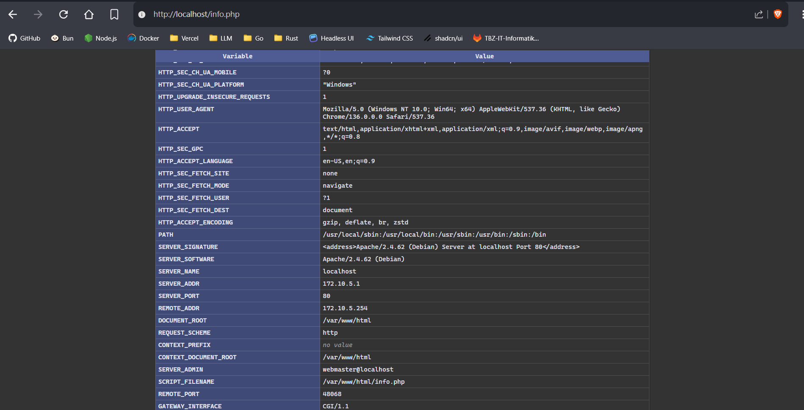

# KN04: Docker Compose

## A. Docker Compose: Lokal

### Teil a

- Screenshot of [info.php](http://localhost/info.php)

	> 

- Screenshot of [db.php](http://localhost/db.php)

	> 

- Docker-Compose File: [docker-compose-a.yml](./docker-compose-a.yml)

- Dockerfile für Webserver: [web.Dockerfile](./.docker/web.Dockerfile)

- Schritte von `docker compose up`:
 	- **1. Netzwerk erstellen:** Falls das in der `docker-compose-a.yml` definierte Netzwerk noch nicht existiert, wird es erstellt.
 	- **2. Images bauen:** Für Services mit einem `build`-Abschnitt wird das Image gemäss dem angegebenen Dockerfile gebaut.
 	- **3. Container erstellen:** Container für alle definierten Services werden erstellt.
 	- **4. Container starten:** Die erstellten Container werden gestartet.
 	- **5. Logs anzeigen:** Die Logs der gestarteten Container werden im Terminal angezeigt. (Nur wenn ohne `-d`/`--detach` ausgeführt)

### Teil b

- info.php:

	> 

- db.php:

	> 

- Docker-Compose File: [docker-compose-b.yml](./docker-compose-b.yml)

- Erklärung des Fehlers:

	> Das Problem ist, dass im verwendeten Image für den Webserver, wurde die db.php Datei bereits kopiert. Demnach ist der Servername für die Datenbank falsch konfiguriert. Das Problem könnte man entweder mit Environment Variables lösen, so dass der Servername im Compose file gesetzt wird, oder man könnte einen neuen Layer des Images erstellen, indem man ein Dockerfile erstellt und im `FROM` Abschnitt das vorherig genutzte Image referenziert.

## B. Docker Compose: Cloud

- info.php:

	> [info.php](../../x-res/04/info-php-c.png)

- db.php:

	> [db.php](../../x-res/04/db-php-c.png)

- Cloud-Init: [docker-cloud-init.yml](./.docker/docker-cloud-init.yml)

- **Screenshot:** info.php

	> 

- **Screenshot:** db.php

	> 
