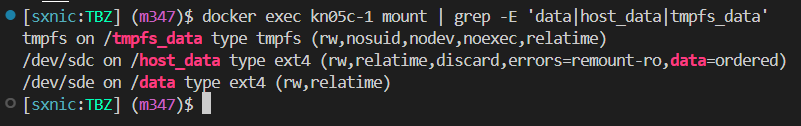
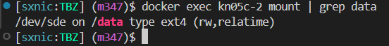

# KN05: Arbeit mit Speicher

## A. Bind mounts

- Commands: `docker run -d -it --name kn05a --mount type=bind,source="$(pwd)"/target,target=/app nginx:latest`

- Screencast: [Video](../../x-res/05/a.mp4)

## B. Volumes

- Commands: [Script](./.docker/with-shared-volume.sh)

- Screencast: [Video](../../x-res/05/b.mp4)

## C. Speicher mit Docker Compose

- Speicher Container 1:

  

- Speicher Container 2:

  

- Docker compose file: [docker-compose.yml](./docker-compose.yml)
