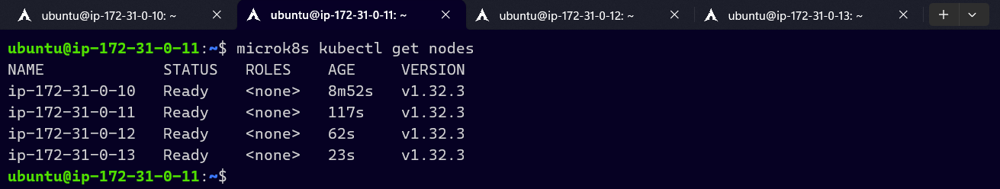
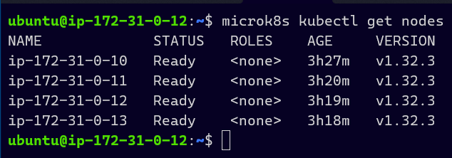
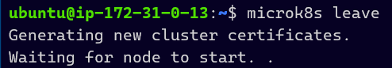
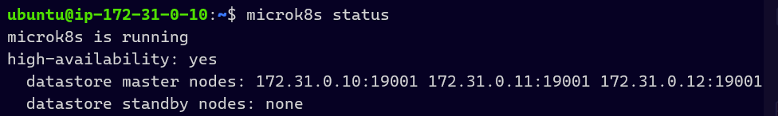
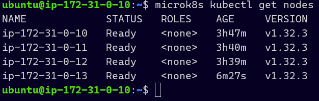
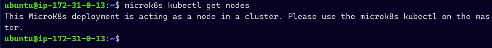

# KN06: Kubernetes I

> **Overview:**
>	- [A - Installation](#a---installation)
>	- [B - Understanding of Clusters](#b---understanding-of-clusters)

## A - Installation

### Nodes

## B - Understanding of Clusters

### `microk8s` vs. `microk8s kubectl`

While `microk8s` manages the MicroK8s-Cluster, `microk8s kubectl` is used for interaction with the Kubernetes-API-Server.

### `microk8s kubectl get nodes`

### Explanation

The first lines of `microk8s status` indicate wther MicroK8s is running and wether it is a **High Availability (HA)** Cluster. *HA:yes* means that multiple Master-Nodes work in the Cluster, to guarantee reliability. It also shows us which nodes are on *standby* and which are *master* nodes.

### Node Removal

### Worker Node

#### Explanation

The Node was added as *Worker*. This means it is **not** part of the etcd-Cluster and **does not take any control** (no scheduling, no API-Server etc.). This gets visible in `microk8s status`, because only the **Master** get listed as HA-Control-Plane-Nodes.

### `microk8s kubectl get nodes` - Master vs. Worker

The Worker node is not a node of the master at *172.31.0.10* while the other nodes are still master nodes.
