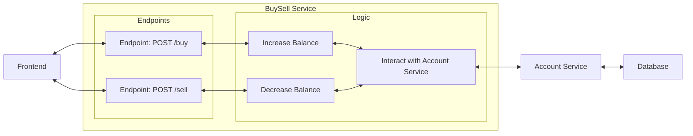

# BuySell Service

## Description

The BuySell service enables users to buy and sell cryptocurrencies. It communicates with the `account` service to modify user's balance.

## Architecture

This microservice is built in Go and forms part of a distributed microservice system. It interacts with the `account` service over HTTP and leverages its API to update balances accordingly.



## Endpoints

### `/buy`

- **Method:** <span style="color:#ffbb00">`POST`</span>
- **Request Body:** <pre>
<span style="color:#ffbb00">{</span>
  <span style="color:#c43537;margin-left:1rem">"id"</span>: <span style="color:#4659b5">1</span>,
  <span style="color:#c43537;margin-left:1rem">"amount"</span>: <span style="color:#4659b5">10</span>
<span style="color:#ffbb00">}</span>
</pre>

- **Request Header:** <pre>
<span style="color:#ffbb00">{</span>
  <span style="color:#c43537;margin-left:1rem">"Content-Type"</span>: <span style="color:#7fb546">"text/json"</span>
<span style="color:#ffbb00">}</span>
</pre>

- **Description:** This Endpoint buys Cryptos for the user and writes it to the database.
- **Status Codes:**
  - **`200`:** ***OK*** - Crypto was sent to receiver successfully.
  - **`400`:** ***Bad Request*** - Invalid request body or parameters.
  - **`401`:** ***Unauthorized*** - User is not authenticated | No User ID.
  - **`404`:** ***Not Found*** - Receiver not found.
  - **`500`:** ***Internal Server Error*** - An error occurred on the server while processing the request.

## Configuration

### Environment Variables

|Variable|Description|Default Value|
|---|---|---|
|`ACCOUNT_SERVICE_URL`|URL of the AccountService|`http://localhost:8080`|

## Run Locally

```sh
go run main.go
```

## Docker

- Dockerfile: [here](./Dockerfile)

### Build and Run

```sh
docker build -t buy-sell .
docker run -d \ 
  --name buy-sell \
  -e ACCOUNT_SERVICE_URL=http://<account-service-url>:8080 \
  -p 8081:8080 \
  buy-sell
```

# BuySell Service

## Endpoints

| Endpoint | Method | Request Body | Request Headers | Response Body | Response | Description |
| -------- | ------ | ------------ | --------------- | ------------- | -------- | ----------- |
| `/buy`  | <span style="color:orange">POST</span> | `{ id: int, amount: int }` | Content-Type: text/json | { } | boolean | This Endpoint buys Cryptos for the user and writes it to the database |
| `/sell`  | <span style="color:orange">POST</span> | `{ id: int, amount: int }` | Content-Type: text/json | { } | boolean | This Endpoint sells Cryptos for the user and updates the salary in the database. In case more are spent than owned, the salary is simply set to 0 |
