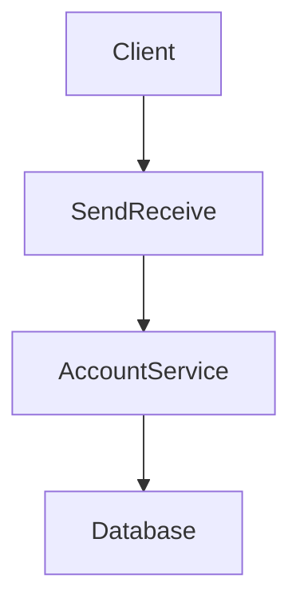

# SendReceive Service

## Description

The SendReceive service is responsible for handling the sending and receiving of cryptocurrencies between users. It interacts with the database to update user balances and transaction records.

## Architecture

The service is built using Go and follows a microservices architecture. It communicates with other services through HTTP requests and uses a MariaDB database for data storage.



## Endpoints

### `/send`

- **Method:** <span style="color:#ffbb00">`POST`</span>
- **Request Body:** <pre>
<span style="color:#ffbb00">{</span>
  <span style="color:#c43537;margin-left:1rem">"id"</span>: <span style="color:#4659b5">1</span>,
  <span style="color:#c43537;margin-left:1rem">"receiverId"</span>: <span style="color:#4659b5">2</span>,
  <span style="color:#c43537;margin-left:1rem">"amount"</span>: <span style="color:#4659b5">10</span>
<span style="color:#ffbb00">}</span>
</pre>

- **Request Header:** <pre>
<span style="color:#ffbb00">{</span>
  <span style="color:#c43537;margin-left:1rem">"Content-Type"</span>: <span style="color:#7fb546">"application/json"</span>
<span style="color:#ffbb00">}</span>
</pre>

- **Description:** This Endpoint buys Cryptos for the user and writes it to the database.
- **Status Codes:**
  - **`200`:** ***OK*** - Crypto was sent to receiver successfully.
  - **`400`:** ***Bad Request*** - Invalid request body or parameters.
  - **`401`:** ***Unauthorized*** - User is not authenticated | No User ID.
  - **`404`:** ***Not Found*** - Receiver not found.
  - **`500`:** ***Internal Server Error*** - An error occurred on the server while processing the request.

## Configuration

### Environment Variables

|Variable|Description|Default Value|
|---|---|---|
|`ACCOUNT_SERVICE_URL`|URL of the AccountService|`http://localhost:8080`|
|`DB_HOST`|Database host|`localhost`|
|`DB_PORT`|Database port|`3306`|
|`DB_USER`|Database user|`root`|
|`DB_PASSWORD`|Database password|`tbzPass123`|
|`DB_NAME`|Database name|`kn08`|

## Run Locally

```sh
go run main.go
```

## Docker

### Dockerfile

```dockerfile
FROM golang:1.20-alpine
WORKDIR /app
COPY go.mod go.sum ./
COPY . .
RUN go mod download
RUN go build -o send-receive main.go
EXPOSE 8080
CMD ["./send-receive"]
```

### Build and Run

```sh
docker build -t send-receive .
docker run -d \ 
  --name send-receive \
  -e ACCOUNT_SERVICE_URL=http://<account-service-url>:8080 \
  -p 8081:8080 \
  send-receive
```
