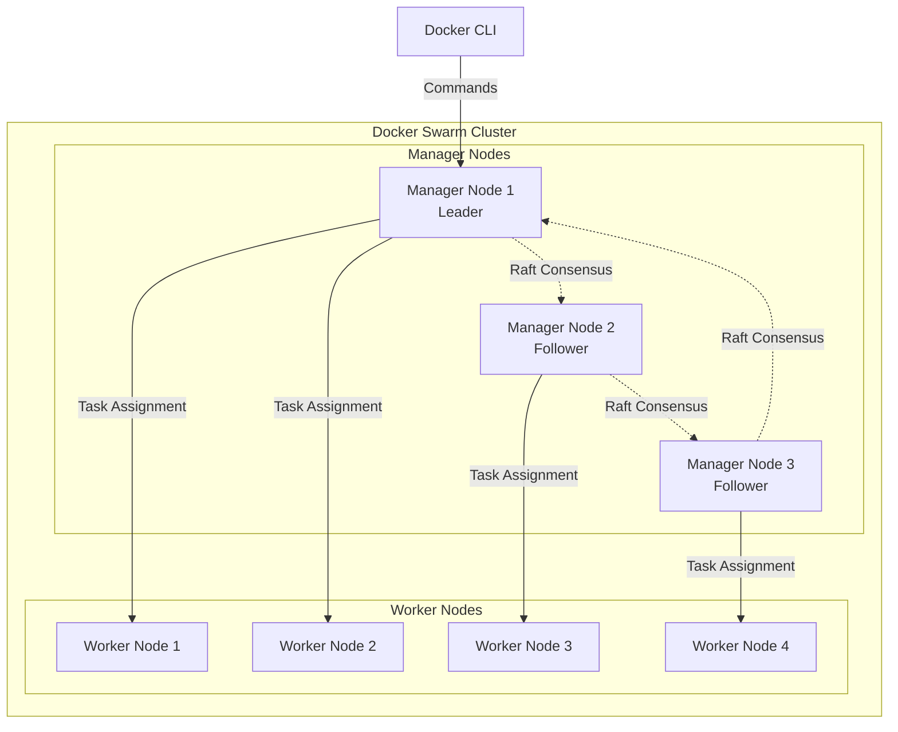
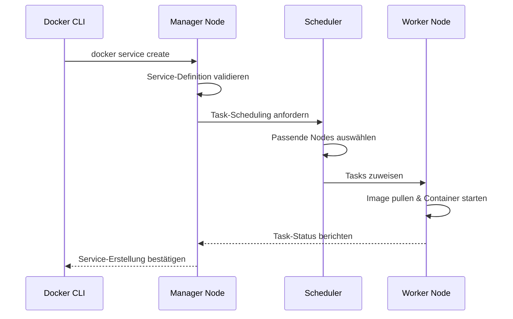
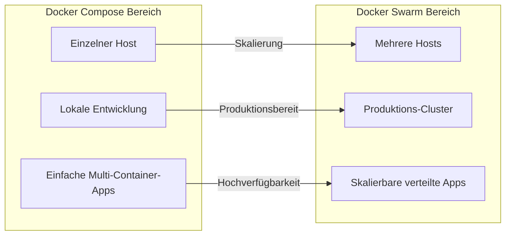
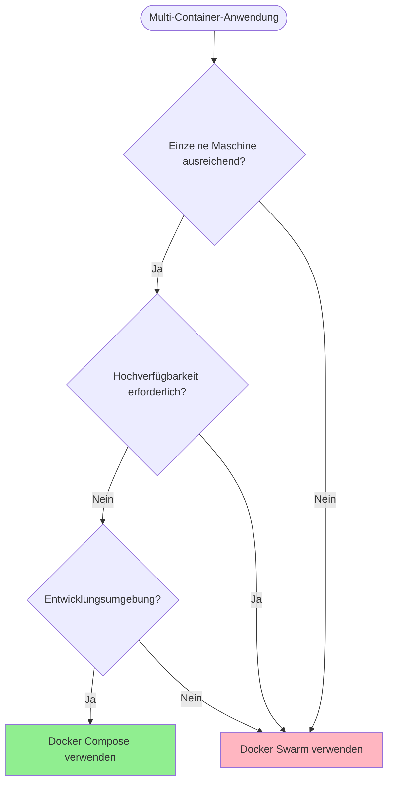
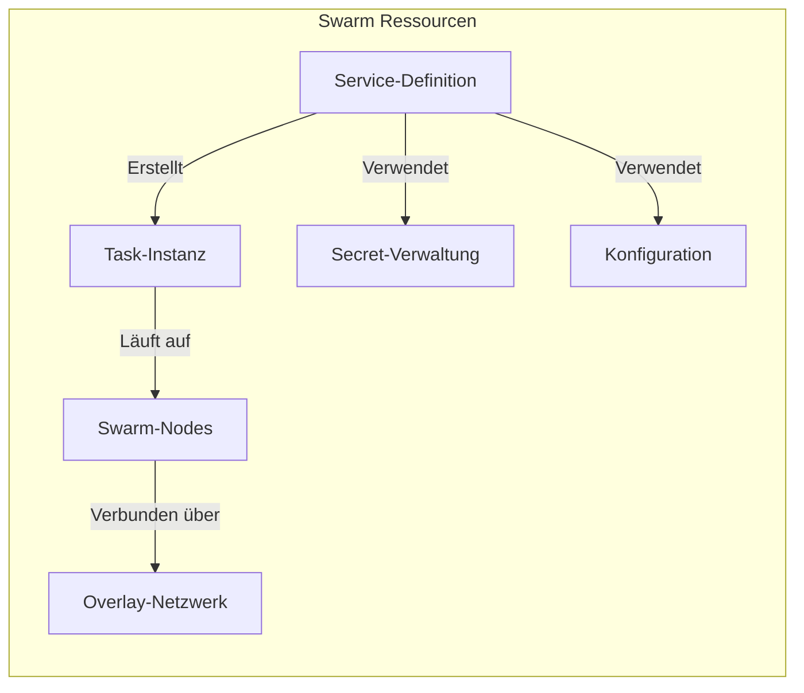
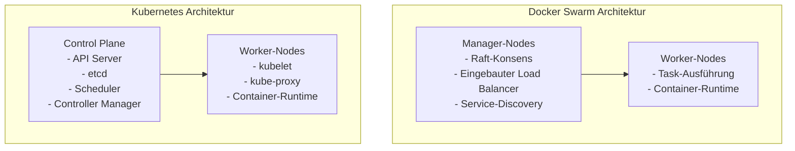
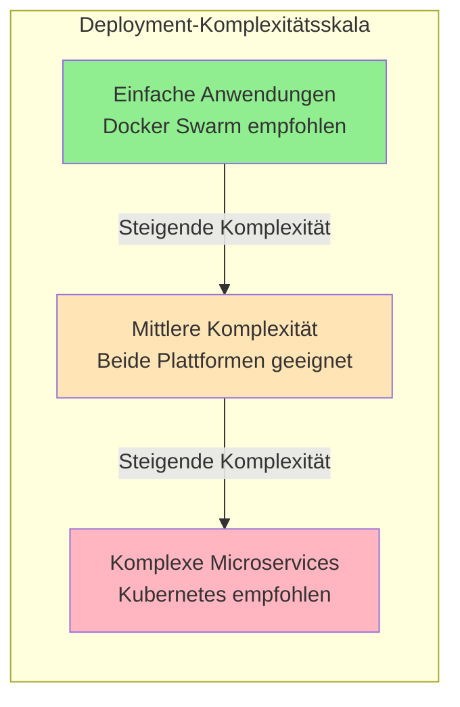
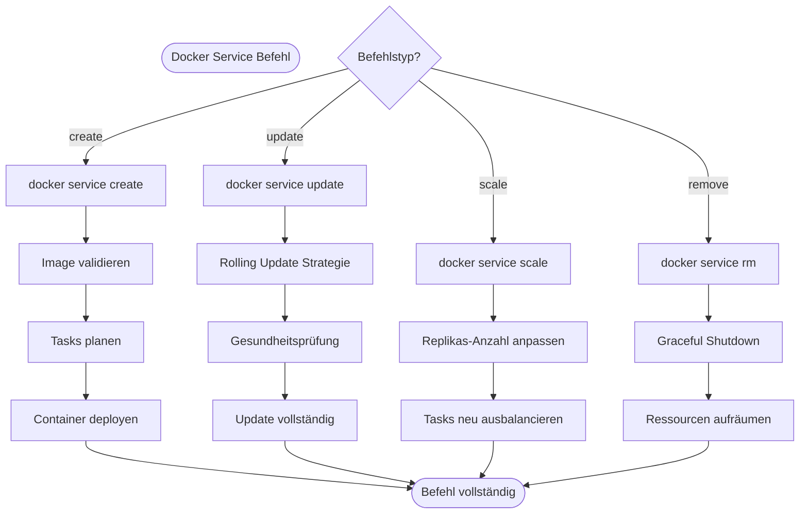

# Docker Swarm

## Überblick

Docker Swarm ist Dockers native Clustering- und Orchestrierungslösung, die es ermöglicht, einen Cluster von Docker-Engines als ein einziges virtuelles System zu verwalten. Es bietet Hochverfügbarkeit, Lastausgleich und Service-Discovery-Funktionen für containerisierte Anwendungen. Docker Swarm transformiert individuelle Docker-Hosts in einen einheitlichen Cluster und ermöglicht es Administratoren, Services nahtlos über mehrere Nodes hinweg zu deployen und zu verwalten.

Die Architektur folgt einem Manager-Worker-Modell, bei dem Manager-Nodes die Cluster-Verwaltungsaufgaben übernehmen und Worker-Nodes die containerisierten Workloads ausführen. Dieser verteilte Ansatz gewährleistet Fehlertoleranz und Skalierbarkeit für Produktionsumgebungen.

Stellen Sie sich Docker Swarm als Upgrade vor - von der Verwaltung einzelner Container auf einer Maschine zur Orchestrierung von Containern über mehrere Maschinen hinweg, als wären sie ein leistungsstarkes System. Während Docker Compose Ihnen hilft, Multi-Container-Anwendungen auf einem einzigen Host zu definieren, erweitert Docker Swarm diese Fähigkeit auf mehrere Hosts mit eingebautem Clustering, Lastausgleich und Hochverfügbarkeit.

### Inhalt

-   [Erste Schritte](#erste-schritte)
-   [Docker Swarm vs. Docker Compose](#docker-swarm-vs-docker-compose)
-   [Docker Swarm Ressourcen](#docker-swarm-ressourcen)
-   [Docker Swarm vs. Kubernetes](#docker-swarm-vs-kubernetes)
-   [Docker Swarm Befehle](#docker-swarm-befehle)
-   [Quellen](#quellen)

## Erste Schritte

Um einen Docker Swarm-Cluster einzurichten, folgen Sie dem [offiziellen Tutorial](https://docs.docker.com/engine/swarm/swarm-tutorial) von Docker.

### Verständnis

Als Docker-Benutzer sind Sie bereits mit der Ausführung von Containern auf einem einzigen Host vertraut. Docker Swarm stellt die nächste Evolutionsstufe in Ihrer Containerisierungsreise dar. Anstatt Container manuell über mehrere Server zu verwalten, ermöglicht Swarm es Ihnen, mehrere Docker-Hosts als einen einzigen, leistungsstarken Cluster zu behandeln.

Betrachten Sie diese Progression:

1. **Einzelner Container**: `docker run nginx`
2. **Multi-Container-Anwendung**: `docker-compose up` (einzelner Host)
3. **Multi-Host-Orchestrierung**: Docker Swarm (mehrere Hosts)

### Voraussetzungen

Bevor Sie einen Docker Swarm-Cluster initialisieren, stellen Sie sicher, dass die folgenden Anforderungen erfüllt sind:

-   Docker Engine Version 1.12 oder höher auf allen Nodes installiert
-   Netzwerkkonnektivität zwischen allen Nodes auf den Ports 2377 (Cluster-Verwaltung), 7946 (Nodes-Kommunikation) und 4789 (Overlay-Netzwerk-Traffic)
-   Ausreichende Systemressourcen für sowohl Docker-Daemon als auch containerisierte Anwendungen

**Port-Erklärung:**

-   **Port 2377**: Verwendet für Cluster-Verwaltungskommunikation zwischen Manager-Nodes
-   **Port 7946**: Verwendet für Kommunikation zwischen Nodes (Container-Netzwerk-Discovery)
-   **Port 4789**: Verwendet für Overlay-Netzwerk-Traffic zwischen Containern

### Grundlegende Cluster-Architektur



### Verständnis der Architektur

**Manager-Nodes**: Betrachten Sie diese als die "Gehirne" Ihres Clusters. Sie treffen Entscheidungen darüber, wo Container platziert werden, bearbeiten API-Anfragen und pflegen den Cluster-Status. Der Leader wird durch den Raft-Konsens-Algorithmus gewählt, wodurch Hochverfügbarkeit gewährleistet wird.

**Worker-Nodes**: Diese sind die "Muskeln" Ihres Clusters. Sie empfangen Anweisungen von Managern und führen die eigentlichen Container aus. Worker-Nodes berichten an Manager über die Gesundheit und den Status ihrer Container zurück.

**Wichtige Architektur-Konzepte:**

-   **Raft-Konsens**: Stellt sicher, dass alle Manager-Nodes über den Cluster-Status einig sind und Split-Brain-Szenarien verhindert
-   **Leader-Wahl**: Ein Manager fungiert als Leader, andere sind Follower, die bereit sind, die Führung zu übernehmen, wenn nötig
-   **Task-Verteilung**: Manager verteilen Workloads intelligent auf verfügbare Worker-Nodes

### Service-Deployment-Ablauf



## Docker Swarm vs. Docker Compose

Das Verständnis der Beziehung zwischen Docker Compose und Docker Swarm ist entscheidend für die Wahl des richtigen Tools für Ihren spezifischen Anwendungsfall. Beide Tools arbeiten mit Multi-Container-Anwendungen, dienen aber unterschiedlichen Zwecken und Größenordnungen.

### Konzeptioneller Vergleich



### Wichtige Unterschiede erklärt

**Docker Compose:**

-   **Zweck**: Definition und Ausführung von Multi-Container-Anwendungen auf einem einzigen Docker-Host
-   **Bereich**: Entwicklungsumgebungen, Tests, Einzelmaschinen-Deployments
-   **Dateiformat**: docker-compose.yml mit Services, Netzwerken und Volumes
-   **Skalierung**: Begrenzt auf Ressourcen einer einzigen Maschine
-   **Orchestrierung**: Grundlegende Container-Lifecycle-Verwaltung
-   **Hochverfügbarkeit**: Keine - Single Point of Failure

**Docker Swarm:**

-   **Zweck**: Orchestrierung von Containern über mehrere Docker-Hosts hinweg
-   **Bereich**: Produktionsumgebungen, verteilte Anwendungen, Clustering
-   **Dateiformat**: Kann docker-compose.yml-Dateien mit `docker stack deploy` verwenden
-   **Skalierung**: Horizontale Skalierung über mehrere Maschinen
-   **Orchestrierung**: Erweiterte Planung, Lastausgleich, Service-Discovery
-   **Hochverfügbarkeit**: Eingebaut durch Manager-Nodes-Redundanz

### Migrationspfad: Compose zu Swarm

Die Schönheit von Docker Swarm liegt darin, dass es Ihre bestehenden docker-compose.yml-Dateien mit minimalen Änderungen verwenden kann:

**Docker Compose Befehl:**

```bash
docker-compose up -d
```

**Docker Swarm Äquivalent:**

```bash
docker stack deploy -c docker-compose.yml myapp
```

### Wann welches Tool verwenden



**Verwenden Sie Docker Compose wenn:**

-   Lokale Anwendungsentwicklung
-   Anwendungen auf einem einzigen Server laufen
-   Prototyping und Tests
-   Einfache Produktionsdeployments ohne Hochverfügbarkeitsanforderungen

**Verwenden Sie Docker Swarm wenn:**

-   Produktionsumgebungen mit Hochverfügbarkeitsanforderungen
-   Anwendungen, die über eine einzige Maschine hinaus skalieren müssen
-   Mehrere Teammitglieder benötigen Zugriff auf denselben Anwendungscluster
-   Lastausgleich und Service-Discovery sind Anforderungen

### Feature-Vergleichstabelle

| Feature                        | Docker Compose             | Docker Swarm       |
| ------------------------------ | -------------------------- | ------------------ |
| **Deployment-Bereich**         | Einzelner Host             | Mehrere Hosts      |
| **Hochverfügbarkeit**          | Nein                       | Ja                 |
| **Lastausgleich**              | Extern (nginx, etc.)       | Eingebaut          |
| **Service-Discovery**          | Container-Namen/Aliase     | Eingebautes DNS    |
| **Rolling Updates**            | Manueller Neustart         | Automatisiert      |
| **Skalierung**                 | Einzelmaschinen-Limits     | Cluster-weit       |
| **Secrets-Verwaltung**         | Umgebungsvariablen/Dateien | Eingebaute Secrets |
| **Konfigurations-Komplexität** | Einfach                    | Moderat            |
| **Lernkurve**                  | Niedrig                    | Mittel             |

## Docker Swarm Ressourcen

Docker Swarm nutzt mehrere Schlüsselressourcen, um containerisierte Anwendungen effektiv zu verwalten:

### Services

Services repräsentieren den gewünschten Zustand von Anwendungen, die im Swarm laufen. Sie definieren, wie Container deployed werden sollen, einschließlich der Anzahl der Replikas, Ressourcenbeschränkungen und Update-Strategien. Services abstrahieren die zugrunde liegende Infrastruktur-Komplexität und bieten deklarative Anwendungsverwaltung.

### Tasks

Tasks sind atomare Arbeitseinheiten, die Nodes im Swarm zugewiesen werden. Jeder Task entspricht einem laufenden Container und enthält alle notwendigen Informationen für die Container-Ausführung, einschließlich Image-Spezifikation, Ressourcenanforderungen und Netzwerkkonfiguration.

### Nodes

Nodes sind einzelne Docker-Engines, die am Swarm-Cluster teilnehmen. Manager-Nodes übernehmen Cluster-Orchestrierungsverantwortungen, während Worker-Nodes zugewiesene Tasks ausführen. Die Unterscheidung zwischen Nodestypen ermöglicht die Trennung von Control-Plane- und Data-Plane-Operationen.

### Networks

Docker Swarm erstellt Overlay-Netzwerke, die sich über mehrere Hosts erstrecken und sichere Kommunikation zwischen Services ermöglichen, unabhängig von ihrer physischen Lage. Diese software-definierten Netzwerke bieten eingebaute Lastausgleichs- und Service-Discovery-Mechanismen.

### Secrets und Configs

Swarm bietet sichere Mechanismen zur Verwaltung sensibler Informationen und Konfigurationsdaten. Secrets speichern sensible Daten wie Passwörter und Zertifikate, während Configs nicht-sensible Konfigurationsdateien handhaben. Beide Ressourcen sind im Ruhezustand und während der Übertragung verschlüsselt.



## Docker Swarm vs. Kubernetes

Sowohl Docker Swarm als auch Kubernetes dienen als Container-Orchestrierungsplattformen, unterscheiden sich jedoch erheblich in Komplexität, Feature-Sets und operativen Ansätzen.

### Architektur-Vergleich



### Feature-Vergleich

**Docker Swarm Vorteile:**

-   Vereinfachter Setup- und Konfigurationsprozess
-   Native Integration mit Docker-Ökosystem
-   Geringerer Ressourcenverbrauch und operative Komplexität
-   Eingebaute Service-Discovery und Lastausgleich
-   Unkomplizierte Rolling Updates und Rollbacks

**Kubernetes Vorteile:**

-   Umfangreiches Ökosystem und Drittanbieter-Integrationen
-   Erweiterte Scheduling-Fähigkeiten und Ressourcenverwaltung
-   Umfassende Monitoring- und Logging-Lösungen
-   Robuste Auto-Scaling-Mechanismen
-   Deklarative Konfigurationsverwaltung durch YAML-Manifeste

**Anwendungsfall-Empfehlungen:**

-   Docker Swarm: Geeignet für kleine bis mittlere Deployments, Entwicklungsumgebungen und Organisationen, die Einfachheit priorisieren
-   Kubernetes: Bevorzugt für große Produktionsumgebungen, komplexe Microservices-Architekturen und Szenarien, die erweiterte Orchestrierungsfeatures erfordern

### Deployment-Komplexität



## Docker Swarm Befehle

Docker Swarm-Operationen werden über die Docker CLI mit spezifischen Befehlssätzen für Cluster-Initialisierung, Service-Verwaltung und Monitoring verwaltet.

### Cluster-Verwaltungsbefehle

**Swarm initialisieren:**

```bash
docker swarm init --advertise-addr <MANAGER-IP>
```

**Worker-Nodes beitreten:**

```bash
docker swarm join --token <WORKER-TOKEN> <MANAGER-IP>:2377
```

**Manager-Nodes beitreten:**

```bash
docker swarm join --token <MANAGER-TOKEN> <MANAGER-IP>:2377
```

**Swarm verlassen:**

```bash
docker swarm leave --force  # Manager-Nodes
docker swarm leave          # Worker-Nodes
```

### Service-Verwaltungsbefehle

**Service erstellen:**

```bash
docker service create --name <service-name> --replicas <anzahl> <image>
docker service create --name web --replicas 3 --publish 8080:80 nginx
```

**Services auflisten:**

```bash
docker service ls
docker service ps <service-name>  # Tasks für spezifischen Service auflisten
```

**Service aktualisieren:**

```bash
docker service update --replicas <neue-anzahl> <service-name>
docker service update --image <neues-image> <service-name>
```

**Service entfernen:**

```bash
docker service rm <service-name>
```

### Nodes-Verwaltungsbefehle

**Nodes auflisten:**

```bash
docker node ls
docker node inspect <node-id>
```

**Nodes befördern/degradieren:**

```bash
docker node promote <node-id>
docker node demote <node-id>
```

**Nodes-Verfügbarkeit aktualisieren:**

```bash
docker node update --availability drain <node-id>   # Nodes entleeren
docker node update --availability active <node-id>  # Nodes aktivieren
```

### Netzwerk- und Secret-Verwaltung

**Overlay-Netzwerk erstellen:**

```bash
docker network create --driver overlay <netzwerk-name>
```

**Secret erstellen:**

```bash
echo "secret-data" | docker secret create <secret-name> -
docker service create --secret <secret-name> <image>
```

**Config erstellen:**

```bash
docker config create <config-name> <config-file>
docker service create --config <config-name> <image>
```

### Service-Befehl-Workflow



Diese Befehle bieten umfassende Kontrolle über Docker Swarm-Cluster-Operationen und ermöglichen es Administratoren, containerisierte Anwendungen effizient über verteilte Umgebungen zu verwalten.

> **TIPP:** Im Tutorial müssen Sie mehrere Nodes erstellen, verwenden Sie die [Cloud Init-Datei](cloud-init.yml) um sie zu erstellen.

## Quellen

-   [Docker Swarm Dokumentation](https://docs.docker.com/engine/swarm/)
-   [Docker Swarm Tutorial](https://docs.docker.com/engine/swarm/swarm-tutorial/)

