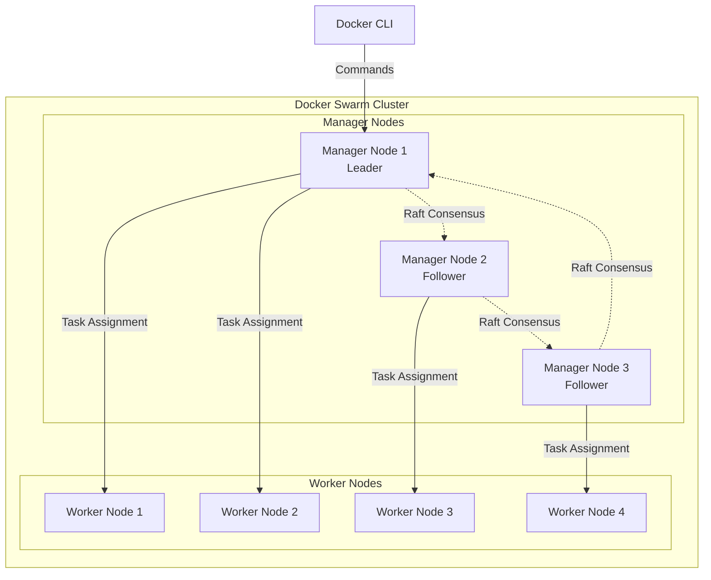
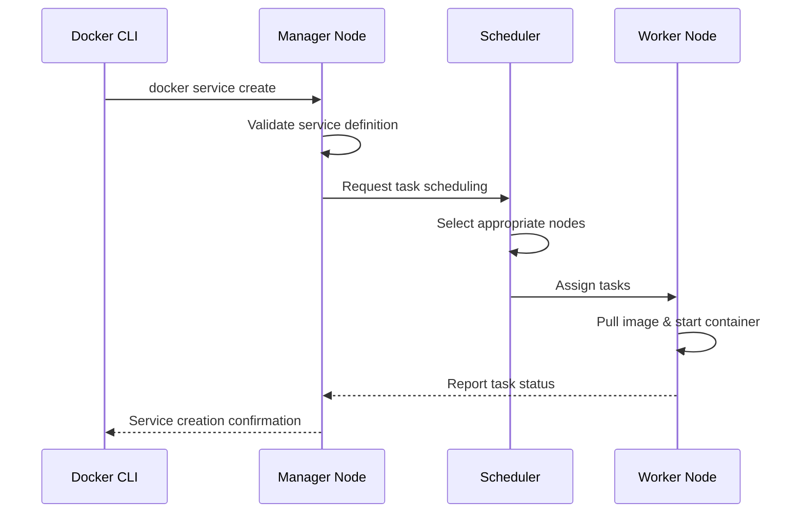
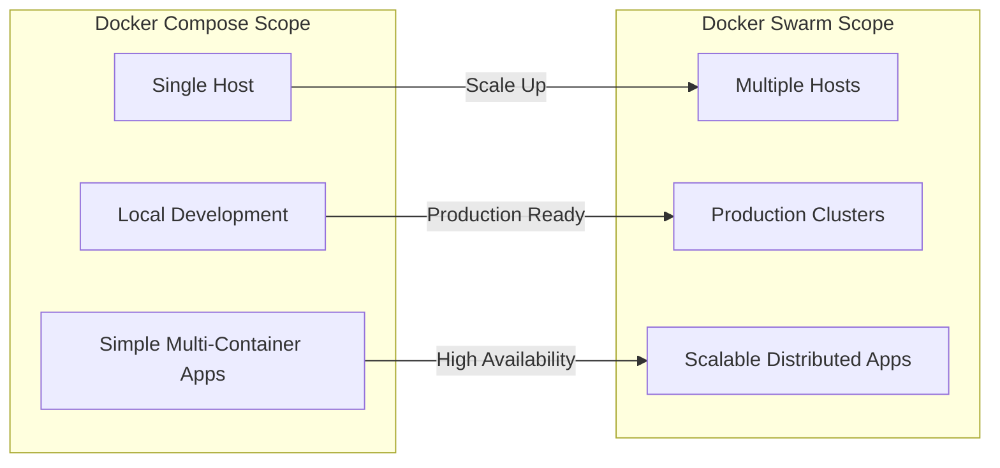
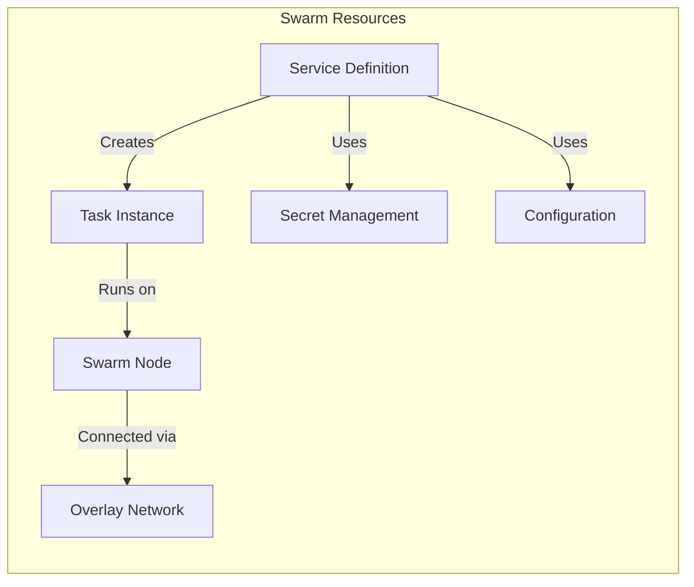
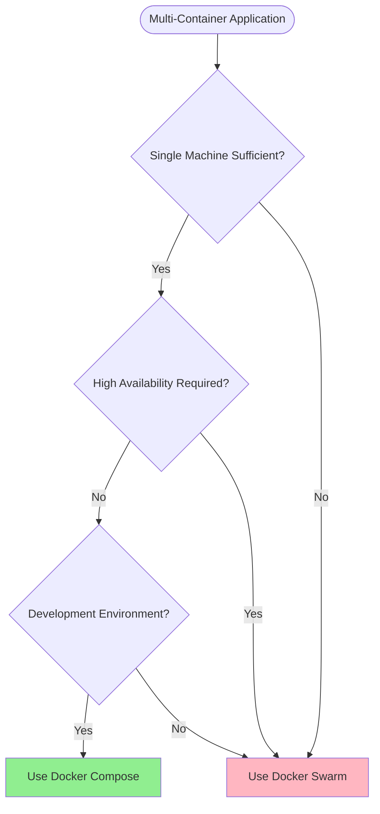
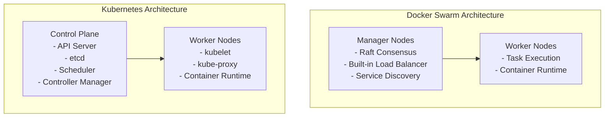
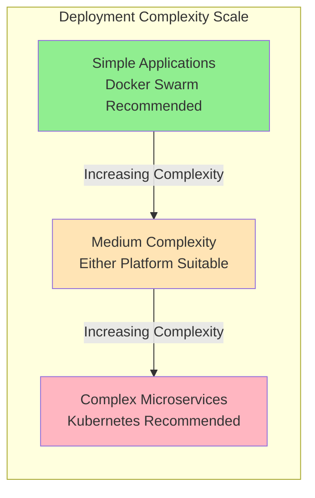
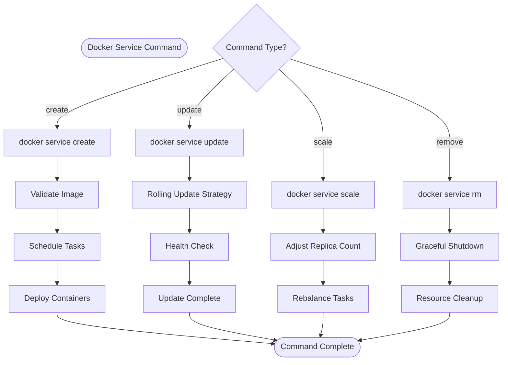

# Docker Swarm

## Overview

Docker Swarm is Docker's native clustering and orchestration solution that enables the management of a cluster of Docker engines as a single virtual system. It provides high availability, load balancing, and service discovery capabilities for containerized applications. Docker Swarm transforms individual Docker hosts into a unified cluster, allowing administrators to deploy and manage services seamlessly across multiple nodes.

The architecture follows a manager-worker model where manager nodes handle cluster management tasks and worker nodes execute containerized workloads. This distributed approach ensures fault tolerance and scalability for production environments.

Think of Docker Swarm as an upgrade - from managing individual containers on one machine to orchestrating containers across multiple machines as if they were one powerful system. While Docker Compose helps you define multi-container applications on a single host, Docker Swarm extends this capability to multiple hosts with built-in clustering, load balancing, and high availability.

### Content

- [Getting Started](#getting-started)
- [Docker Swarm vs. Docker Compose](#docker-swarm-vs-docker-compose)
- [Docker Swarm Resources](#docker-swarm-resources)
- [Docker Swarm vs. Kubernetes](#docker-swarm-vs-kubernetes)
- [Docker Swarm Commands](#docker-swarm-commands)
- [Sources](#sources)

## Getting Started

To setup a Docker Swarm cluster, follow the [official tutorial](https://docs.docker.com/engine/swarm/swarm-tutorial) by Docker.

### Understanding

As Docker users, you're already familiar with running containers on a single host. Docker Swarm represents the next evolution in your containerization journey. Instead of manually managing containers across multiple servers, Swarm allows you to treat multiple Docker hosts as a single, powerful cluster.

Consider this progression:

1. **Single Container**: `docker run nginx`
2. **Multi-Container Application**: `docker-compose up` (single host)
3. **Multi-Host Orchestration**: Docker Swarm (multiple hosts)

### Prerequisites

Before initializing a Docker Swarm cluster, ensure the following requirements are met:

- Docker Engine version 1.12 or higher installed on all nodes
- Network connectivity between all nodes on ports 2377 (cluster management), 7946 (node communication), and 4789 (overlay network traffic)
- Sufficient system resources allocated for both Docker daemon and containerized applications

**Port Explanation:**

- **Port 2377**: Used for cluster management communications between manager nodes
- **Port 7946**: Used for communication among nodes (container network discovery)
- **Port 4789**: Used for overlay network traffic between containers

### Basic Cluster Architecture



### Understanding the Architecture

**Manager Nodes**: Think of these as the "brains" of your cluster. They make decisions about where to place containers, handle API requests, and maintain the cluster state. The leader is elected through the Raft consensus algorithm, ensuring high availability.

**Worker Nodes**: These are the "muscles" of your cluster. They receive instructions from managers and run the actual containers. Worker nodes report back to managers about the health and status of their containers.

**Key Architectural Concepts:**

- **Raft Consensus**: Ensures all manager nodes agree on cluster state, preventing split-brain scenarios
- **Leader Election**: One manager acts as the leader, others are followers ready to take over if needed
- **Task Distribution**: Managers intelligently distribute workloads across available worker nodes

### Service Deployment Flow



## Docker Swarm vs. Docker Compose

Understanding the relationship between Docker Compose and Docker Swarm is crucial for choosing the right tool for your specific use case. Both tools work with multi-container applications but serve different purposes and scales.

### Conceptual Comparison



### Key Differences Explained

**Docker Compose:**

- **Purpose**: Define and run multi-container applications on a single Docker host
- **Scope**: Development environments, testing, single-machine deployments
- **File Format**: docker-compose.yml with services, networks, and volumes
- **Scaling**: Limited to resources of a single machine
- **Orchestration**: Basic container lifecycle management
- **High Availability**: None - single point of failure

**Docker Swarm:**

- **Purpose**: Orchestrate containers across multiple Docker hosts
- **Scope**: Production environments, distributed applications, clustering
- **File Format**: Can use docker-compose.yml files with `docker stack deploy`
- **Scaling**: Horizontal scaling across multiple machines
- **Orchestration**: Advanced scheduling, load balancing, service discovery
- **High Availability**: Built-in through manager node redundancy

### Migration Path: Compose to Swarm

The beauty of Docker Swarm lies in its ability to use your existing docker-compose.yml files with minimal modifications:

**Docker Compose Command:**

```bash
docker-compose up -d
```

**Docker Swarm Equivalent:**

```bash
docker stack deploy -c docker-compose.yml myapp
```

### When to Use Each Tool


**Use Docker Compose when:**

- Local application development
- Applications running on a single server
- Prototyping and testing
- Simple production deployments without high availability requirements

**Use Docker Swarm when:**

- Production environments requiring high availability
- Applications that need to scale beyond a single machine
- Multiple team members need access to the same application cluster
- Load balancing and service discovery are requirements

### Feature Comparison Table

| Feature | Docker Compose | Docker Swarm |
|---------|----------------|--------------|
| **Deployment Scope** | Single host | Multiple hosts |
| **High Availability** | No | Yes |
| **Load Balancing** | External (nginx, etc.) | Built-in |
| **Service Discovery** | Container names/aliases | Built-in DNS |
| **Rolling Updates** | Manual restart | Automated |
| **Scaling** | Single machine limits | Cluster-wide |
| **Secrets Management** | Environment variables/files | Built-in secrets |
| **Configuration Complexity** | Simple | Moderate |
| **Learning Curve** | Low | Medium |

### Services

Services represent the desired state of applications running in the swarm. They define how containers should be deployed, including the number of replicas, resource constraints, and update strategies. Services abstract the underlying infrastructure complexity and provide declarative application management.

### Tasks

Tasks are atomic units of work assigned to nodes within the swarm. Each task corresponds to a running container and includes all necessary information for container execution, including image specification, resource requirements, and networking configuration.

### Nodes

Nodes are individual Docker engines participating in the swarm cluster. Manager nodes handle cluster orchestration responsibilities, while worker nodes execute assigned tasks. The distinction between node types enables separation of control plane and data plane operations.

### Networks

Docker Swarm creates overlay networks that span multiple hosts, enabling secure communication between services regardless of their physical location. These software-defined networks provide built-in load balancing and service discovery mechanisms.

### Secrets and Configs

Swarm provides secure mechanisms for managing sensitive information and configuration data. Secrets store sensitive data such as passwords and certificates, while configs handle non-sensitive configuration files. Both resources are encrypted at rest and in transit.



## Docker Swarm Commands

Docker Swarm operations are managed through the Docker CLI using specific command sets. As your instructor, I'll explain each command with practical examples and real-world context.

### Cluster Management Commands

These commands control the fundamental cluster operations - think of them as the foundation commands you'll use to build and maintain your swarm.

#### Initializing a Swarm Cluster

**Command:** `docker swarm init`

```bash
# Basic initialization
docker swarm init

# Initialize with specific IP address (recommended for multi-interface systems)
docker swarm init --advertise-addr 192.168.1.100

# Initialize with custom data path port
docker swarm init --advertise-addr 192.168.1.100 --data-path-port 7777
```

**What happens when you run this command:**
1. The current Docker host becomes the first manager node
2. A new swarm cluster is created with this node as the leader
3. Join tokens are generated for both workers and managers
4. The node starts listening on port 2377 for cluster management traffic

**Parameters Explained:**
- `--advertise-addr`: Specifies the IP address other nodes should use to connect to this manager. Critical in multi-network environments
- `--data-path-port`: Changes the port used for data path traffic between nodes (default: 4789)

**Real-world tip**: Always use `--advertise-addr` in production to avoid connectivity issues when nodes have multiple network interfaces.

#### Adding Nodes to the Cluster

**Getting Join Tokens:**
```bash
# Get worker join token
docker swarm join-token worker

# Get manager join token
docker swarm join-token manager

# Rotate tokens for security (invalidates old tokens)
docker swarm join-token --rotate worker
```

**Joining as Worker Node:**
```bash
# Run this command on the machine you want to add as a worker
docker swarm join --token <token> \
    192.168.1.100:2377
```

**Joining as Manager Node:**
```bash
# Run this command on the machine you want to add as a manager
docker swarm join --token <token> \
    192.168.1.100:2377
```

**Understanding Join Process:**
1. The joining node contacts the manager at the specified IP and port
2. Authentication occurs using the join token
3. The manager adds the node to the cluster
4. The new node downloads the current cluster state
5. The node becomes available for task assignment (workers) or management duties (managers)

#### Leaving the Swarm

**From Worker Node:**
```bash
# Gracefully leave the swarm
docker swarm leave
```

**From Manager Node:**
```bash
# Force leave (required for manager nodes)
docker swarm leave --force

# Alternative: First demote, then leave
docker node demote <node-id>
docker swarm leave
```

**What happens during leave:**
- Worker nodes: Stop receiving new tasks, existing tasks continue until completion
- Manager nodes: Triggers leader election if the leaving node was the leader
- All associated resources (networks, secrets) become inaccessible to the leaving node

### Service Management Commands

Services are the core of application deployment in Swarm. These commands help you define, deploy, and manage your applications.

#### Creating Services

**Basic Service Creation:**
```bash
# Simple service with one replica
docker service create --name web nginx:alpine

# Service with multiple replicas
docker service create --name web --replicas 3 nginx:alpine

# Service with published ports (accessible from outside the cluster)
docker service create --name web --replicas 3 --publish 8080:80 nginx:alpine
```

**Advanced Service Creation:**
```bash
# Service with resource constraints
docker service create \
  --name web \
  --replicas 3 \
  --limit-cpu 0.5 \
  --limit-memory 512M \
  --reserve-cpu 0.25 \
  --reserve-memory 256M \
  nginx:alpine

# Service with placement constraints
docker service create \
  --name database \
  --replicas 1 \
  --constraint 'node.role==manager' \
  --constraint 'node.labels.storage==ssd' \
  postgres:13

# Service with environment variables
docker service create \
  --name webapp \
  --replicas 2 \
  --env POSTGRES_DB=myapp \
  --env POSTGRES_USER=appuser \
  myapp:latest
```

**Service Creation Parameters Explained:**
- `--name`: Human-readable service name for management
- `--replicas`: Number of identical containers to run
- `--publish`: Port mapping (host:container) for external access
- `--limit-*`: Maximum resources a container can use
- `--reserve-*`: Resources guaranteed to be available
- `--constraint`: Rules for node selection
- `--env`: Environment variables passed to containers

#### Listing and Inspecting Services

**List Services:**
```bash
# Show all services
docker service ls

# Show services with additional details
docker service ls --format "table {{.Name}}\t{{.Mode}}\t{{.Replicas}}\t{{.Image}}"
```

**Inspect Service Details:**
```bash
# View detailed service configuration
docker service inspect web

# View service configuration in human-readable format
docker service inspect --pretty web

# List tasks (container instances) for a service
docker service ps web

# Show tasks including historical/failed tasks
docker service ps --no-trunc web
```

**Understanding Service Output:**
- `docker service ls` shows current vs. desired replica count
- `docker service ps` shows individual task status and node placement
- `docker service inspect` reveals the complete service specification

#### Updating Services

**Scaling Services:**
```bash
# Scale up to 5 replicas
docker service scale web=5

# Scale multiple services simultaneously
docker service scale web=5 api=3 db=1
```

**Updating Service Images:**
```bash
# Rolling update to new image version
docker service update --image nginx:1.21 web

# Update with specific rollout configuration
docker service update \
  --image nginx:1.21 \
  --update-parallelism 2 \
  --update-delay 30s \
  --update-failure-action rollback \
  web
```

**Advanced Service Updates:**
```bash
# Update environment variables
docker service update --env-add NEW_VAR=value web

# Update resource limits
docker service update --limit-memory 1G web

# Update port publishing
docker service update --publish-add 9090:90 web

# Update placement constraints
docker service update --constraint-add 'node.labels.type==compute' web
```

**Update Strategy Parameters:**
- `--update-parallelism`: Number of containers updated simultaneously
- `--update-delay`: Wait time between batches of updates
- `--update-failure-action`: What to do if update fails (pause, continue, rollback)
- `--rollback`: Revert to previous service configuration

#### Service Rollback and Removal

**Rolling Back Services:**
```bash
# Rollback to previous configuration
docker service rollback web

# Rollback with custom settings
docker service update --rollback \
  --rollback-parallelism 1 \
  --rollback-delay 10s \
  web
```

**Removing Services:**
```bash
# Remove a single service
docker service rm web

# Remove multiple services
docker service rm web api database

# Force remove (skip graceful shutdown)
docker service rm --force web
```

### Node Management Commands

Node management commands help you control cluster membership and node behavior.

#### Listing and Inspecting Nodes

**List Nodes:**
```bash
# Show all nodes in cluster
docker node ls

# Show nodes with custom formatting
docker node ls --format "table {{.Hostname}}\t{{.Status}}\t{{.Availability}}\t{{.ManagerStatus}}"
```

**Inspect Node Details:**
```bash
# View detailed node information
docker node inspect node-1

# View node info in human-readable format
docker node inspect --pretty node-1
```

**Node Status Indicators:**
- **Status**: Ready (healthy), Down (unreachable), Unknown (status unclear)
- **Availability**: Active (accepts tasks), Pause (no new tasks), Drain (no tasks)
- **Manager Status**: Leader, Reachable, Unreachable (for manager nodes only)

#### Promoting and Demoting Nodes

**Node Role Changes:**
```bash
# Promote worker to manager
docker node promote worker-1

# Demote manager to worker
docker node demote manager-2

# Promote multiple nodes
docker node promote worker-1 worker-2 worker-3
```

**Why promote/demote nodes:**
- **Promote**: Add management capacity, improve fault tolerance
- **Demote**: Reduce management overhead, prepare for node removal

#### Managing Node Availability

**Drain Nodes (Graceful Maintenance):**
```bash
# Drain node for maintenance (stops scheduling new tasks)
docker node update --availability drain worker-1

# Pause node (stops new tasks, keeps existing ones)
docker node update --availability pause worker-1

# Reactivate node
docker node update --availability active worker-1
```

**Node Draining Process:**
1. New tasks stop being assigned to the drained node
2. Existing tasks are gracefully moved to other available nodes
3. Node remains in cluster but doesn't run application containers
4. Ideal for performing maintenance without service disruption

#### Node Labels and Constraints

**Adding Labels to Nodes:**
```bash
# Add custom labels for scheduling decisions
docker node update --label-add storage=ssd node-1
docker node update --label-add environment=production node-1
docker node update --label-add zone=us-west-1a node-1

# Remove labels
docker node update --label-rm storage node-1
```

**Using Labels with Services:**
```bash
# Deploy service only to SSD nodes
docker service create \
  --name fast-db \
  --constraint 'node.labels.storage==ssd' \
  postgres:13

# Deploy to specific availability zone
docker service create \
  --name regional-service \
  --constraint 'node.labels.zone==us-west-1a' \
  myapp:latest
```

### Network Management Commands

Swarm networks enable service-to-service communication across the cluster.

#### Creating and Managing Networks

**Create Overlay Network:**
```bash
# Basic overlay network
docker network create --driver overlay my-network

# Encrypted overlay network
docker network create --driver overlay --opt encrypted my-secure-network

# Network with custom subnet
docker network create \
  --driver overlay \
  --subnet 10.0.1.0/24 \
  --gateway 10.0.1.1 \
  my-custom-network
```

**Attach Services to Networks:**
```bash
# Create service on specific network
docker service create \
  --name web \
  --network my-network \
  nginx:alpine

# Connect existing service to additional network
docker service update --network-add my-secure-network web

# Disconnect service from network
docker service update --network-rm my-network web
```

**Network Types in Swarm:**
- **bridge**: Default single-host networking (like regular Docker)
- **overlay**: Multi-host networking for swarm services
- **host**: Service uses host's network directly
- **none**: No networking

### Secret and Config Management

Secure management of sensitive and configuration data.

#### Managing Secrets

**Create Secrets:**
```bash
# Create secret from standard input
echo "mysecretpassword" | docker secret create db_password -

# Create secret from file
docker secret create ssl_cert ./certificate.pem

# Create secret with labels
docker secret create api_key ./api.key --label environment=production
```

**Use Secrets in Services:**
```bash
# Mount secret as file in container
docker service create \
  --name webapp \
  --secret db_password \
  --env POSTGRES_PASSWORD_FILE=/run/secrets/db_password \
  myapp:latest

# Mount secret with custom filename and permissions
docker service create \
  --name webapp \
  --secret source=db_password,target=db_pass,mode=400 \
  myapp:latest
```

**Secret Management:**
```bash
# List secrets
docker secret ls

# View secret details (content is never shown)
docker secret inspect db_password

# Remove secret (only if not in use)
docker secret rm db_password
```

#### Managing Configs

**Create Configs:**
```bash
# Create config from file
docker config create nginx_config ./nginx.conf

# Create config from standard input
docker config create app_config - <<EOF
debug=true
port=8080
database_url=postgres://db:5432/myapp
EOF
```

**Use Configs in Services:**
```bash
# Mount config as file
docker service create \
  --name web \
  --config source=nginx_config,target=/etc/nginx/nginx.conf \
  nginx:alpine

# Mount multiple configs
docker service create \
  --name app \
  --config src=# Docker Swarm

## Overview

Docker Swarm is Docker's native clustering and orchestration solution that enables the management of a cluster of Docker engines as a single virtual system. It provides high availability, load balancing, and service discovery capabilities for containerized applications. Docker Swarm transforms individual Docker hosts into a unified cluster, allowing administrators to deploy and manage services across multiple nodes seamlessly.

The architecture follows a manager-worker model where manager nodes handle cluster management tasks and worker nodes execute containerized workloads. This distributed approach ensures fault tolerance and scalability for production environments.

Think of Docker Swarm as upgrading from managing individual containers on a single machine to orchestrating containers across multiple machines as if they were one powerful system. While Docker Compose helps you define multi-container applications on a single host, Docker Swarm extends this capability across multiple hosts with built-in clustering, load balancing, and high availability.

- [Getting Started](#getting-started)
- [Docker Swarm vs. Docker Compose](#docker-swarm-vs-docker-compose)
- [Docker Swarm Resources](#docker-swarm-resources)
- [Docker Swarm vs. Kubernetes](#docker-swarm-vs-kubernetes)
- [Docker Swarm Commands](#docker-swarm-commands)

## Getting Started

To setup a Docker Swarm cluster, follow the [official tutorial](https://docs.docker.com/engine/swarm/swarm-tutorial) by Docker.

### Understanding the Learning Journey

As Docker users, you're already familiar with running containers on a single host. Docker Swarm represents the next evolution in your containerization journey. Instead of manually managing containers across multiple servers, Swarm allows you to treat multiple Docker hosts as a single, powerful cluster.

Consider this progression:
1. **Single Container**: `docker run nginx`
2. **Multi-Container Application**: `docker-compose up` (single host)
3. **Multi-Host Orchestration**: Docker Swarm (multiple hosts)

### Prerequisites

Before initializing a Docker Swarm cluster, ensure the following requirements are met:

- Docker Engine version 1.12 or higher installed on all nodes
- Network connectivity between all nodes on ports 2377 (cluster management), 7946 (node communication), and 4789 (overlay network traffic)
- Sufficient system resources allocated for both Docker daemon and containerized applications

**Port Explanation:**
- **Port 2377**: Used for cluster management communications between manager nodes
- **Port 7946**: Used for communication among nodes (container network discovery)
- **Port 4789**: Used for overlay network traffic between containers

### Basic Cluster Architecture


### Understanding the Architecture

**Manager Nodes**: Think of these as the "brains" of your cluster. They make decisions about where to place containers, handle API requests, and maintain the cluster state. The leader is elected through Raft consensus algorithm, ensuring high availability.

**Worker Nodes**: These are the "muscles" of your cluster. They receive instructions from managers and run the actual containers. Worker nodes report back to managers about the health and status of their containers.

**Key Architectural Concepts:**
- **Raft Consensus**: Ensures all manager nodes agree on cluster state, preventing split-brain scenarios
- **Leader Election**: One manager acts as the leader, others are followers ready to take over if needed
- **Task Distribution**: Managers intelligently distribute workloads across available worker nodes

### Service Deployment Flow


## Docker Swarm vs. Docker Compose

Understanding the relationship between Docker Compose and Docker Swarm is crucial for choosing the right tool for your specific use case. Both tools work with multi-container applications but serve different purposes and scales.

### Conceptual Comparison


### Key Differences Explained

**Docker Compose:**
- **Purpose**: Define and run multi-container applications on a single Docker host
- **Scope**: Development environments, testing, single-machine deployments
- **File Format**: docker-compose.yml with services, networks, and volumes
- **Scaling**: Limited to resources of a single machine
- **Orchestration**: Basic container lifecycle management
- **High Availability**: None - single point of failure

**Docker Swarm:**
- **Purpose**: Orchestrate containers across multiple Docker hosts
- **Scope**: Production environments, distributed applications, clustering
- **File Format**: Can use docker-compose.yml files with `docker stack deploy`
- **Scaling**: Horizontal scaling across multiple machines
- **Orchestration**: Advanced scheduling, load balancing, service discovery
- **High Availability**: Built-in through manager node redundancy

### Migration Path: Compose to Swarm

The beauty of Docker Swarm is that it can use your existing docker-compose.yml files with minimal modifications:

**Docker Compose Command:**
```bash
docker-compose up -d
```

**Docker Swarm Equivalent:**
```bash
docker stack deploy -c docker-compose.yml myapp
```

### When to Use Each Tool



**Use Docker Compose when:**
- Developing applications locally
- Running applications on a single server
- Prototyping and testing
- Simple production deployments without high availability requirements

**Use Docker Swarm when:**
- Production environments requiring high availability
- Applications that need to scale beyond a single machine
- Multiple team members need to access the same application cluster
- Load balancing and service discovery are requirements

### Feature Comparison Table

| Feature | Docker Compose | Docker Swarm |
|---------|----------------|--------------|
| **Deployment Scope** | Single host | Multiple hosts |
| **High Availability** | No | Yes |
| **Load Balancing** | External (nginx, etc.) | Built-in |
| **Service Discovery** | Container names/aliases | Built-in DNS |
| **Rolling Updates** | Manual restart | Automated |
| **Scaling** | Single machine limits | Cluster-wide |
| **Secrets Management** | Environment variables/files | Built-in secrets |
| **Configuration Complexity** | Simple | Moderate |
| **Learning Curve** | Low | Medium |

Docker Swarm utilizes several key resources to manage containerized applications effectively:

### Services

Services represent the desired state of applications running in the swarm. They define how containers should be deployed, including the number of replicas, resource constraints, and update strategies. Services abstract the underlying infrastructure complexity and provide declarative application management.

### Tasks

Tasks are atomic units of work assigned to nodes within the swarm. Each task corresponds to a running container and includes all necessary information for container execution, including image specification, resource requirements, and networking configuration.

### Nodes

Nodes are individual Docker engines participating in the swarm cluster. Manager nodes handle cluster orchestration responsibilities, while worker nodes execute assigned tasks. The distinction between node types enables separation of control plane and data plane operations.

### Networks

Docker Swarm creates overlay networks that span multiple hosts, enabling secure communication between services regardless of their physical location. These software-defined networks provide built-in load balancing and service discovery mechanisms.

### Secrets and Configs

Swarm provides secure mechanisms for managing sensitive information and configuration data. Secrets store sensitive data such as passwords and certificates, while configs handle non-sensitive configuration files. Both resources are encrypted at rest and in transit.


## Docker Swarm vs. Kubernetes

Both Docker Swarm and Kubernetes serve as container orchestration platforms, yet they differ significantly in complexity, feature sets, and operational approaches.

### Architecture Comparison



### Feature Comparison

**Docker Swarm Advantages:**
- Simplified setup and configuration process
- Native integration with Docker ecosystem
- Lower resource overhead and operational complexity
- Built-in service discovery and load balancing
- Straightforward rolling updates and rollbacks

**Kubernetes Advantages:**
- Extensive ecosystem and third-party integrations
- Advanced scheduling capabilities and resource management
- Comprehensive monitoring and logging solutions
- Robust auto-scaling mechanisms
- Declarative configuration management through YAML manifests

**Use Case Recommendations:**
- Docker Swarm: Suitable for small to medium-scale deployments, development environments, and organizations prioritizing simplicity
- Kubernetes: Preferred for large-scale production environments, complex microservices architectures, and scenarios requiring advanced orchestration features

### Deployment Complexity



## Docker Swarm Commands

Docker Swarm operations are managed through the Docker CLI using specific command sets for cluster initialization, service management, and monitoring.

### Cluster Management Commands

**Initialize Swarm:**
```bash
docker swarm init --advertise-addr <MANAGER-IP>
```

**Join Worker Node:**
```bash
docker swarm join --token <WORKER-TOKEN> <MANAGER-IP>:2377
```

**Join Manager Node:**
```bash
docker swarm join --token <MANAGER-TOKEN> <MANAGER-IP>:2377
```

**Leave Swarm:**
```bash
docker swarm leave --force  # Manager nodes
docker swarm leave          # Worker nodes
```

### Service Management Commands

**Create Service:**
```bash
docker service create --name <service-name> --replicas <count> <image>
docker service create --name web --replicas 3 --publish 8080:80 nginx
```

**List Services:**
```bash
docker service ls
docker service ps <service-name>  # List tasks for specific service
```

**Update Service:**
```bash
docker service update --replicas <new-count> <service-name>
docker service update --image <new-image> <service-name>
```

**Remove Service:**
```bash
docker service rm <service-name>
```

### Node Management Commands

**List Nodes:**
```bash
docker node ls
docker node inspect <node-id>
```

**Promote/Demote Nodes:**
```bash
docker node promote <node-id>
docker node demote <node-id>
```

**Update Node Availability:**
```bash
docker node update --availability drain <node-id>   # Drain node
docker node update --availability active <node-id>  # Activate node
```

### Network and Secret Management

**Create Overlay Network:**
```bash
docker network create --driver overlay <network-name>
```

**Create Secret:**
```bash
echo "secret-data" | docker secret create <secret-name> -
docker service create --secret <secret-name> <image>
```

**Create Config:**
```bash
docker config create <config-name> <config-file>
docker service create --config <config-name> <image>
```

### Service Command Workflow



These commands provide comprehensive control over Docker Swarm cluster operations, enabling administrators to manage containerized applications efficiently across distributed environments.

## Getting Started

To setup a Docker Swarm cluster, follow the [official tutorial](https://docs.docker.com/engine/swarm/swarm-tutorial) by Docker.

> **TIP:** In the tutorial you will need to create multiple nodes, use the [Cloud Init file](cloud-init.yml) to create them.

### Prerequisites

Before initializing a Docker Swarm cluster, ensure the following requirements are met:

- Docker Engine version 1.12 or higher installed on all nodes
- Network connectivity between all nodes on ports 2377 (cluster management), 7946 (node communication), and 4789 (overlay network traffic)
- Sufficient system resources allocated for both Docker daemon and containerized applications.

## Sources

- [Docker Swarm Documentation](https://docs.docker.com/engine/swarm/)
- [Docker Swarm Tutorial](https://docs.docker.com/engine/swarm/swarm-tutorial/)
