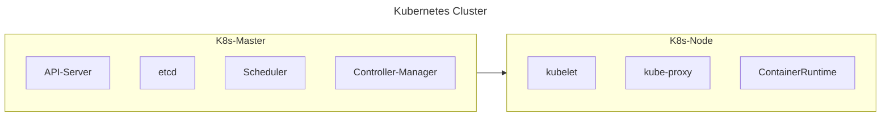
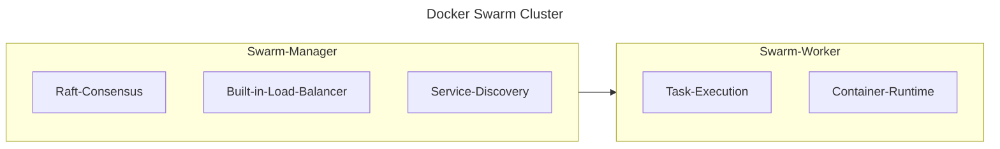
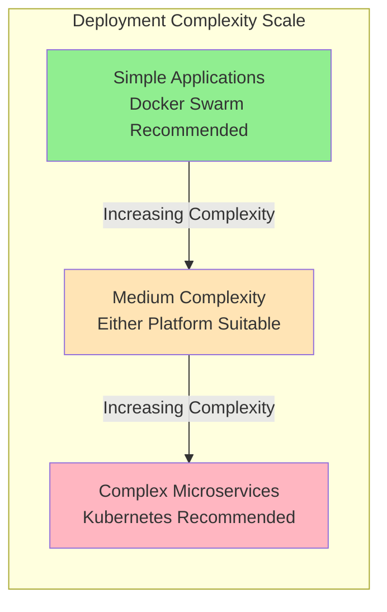
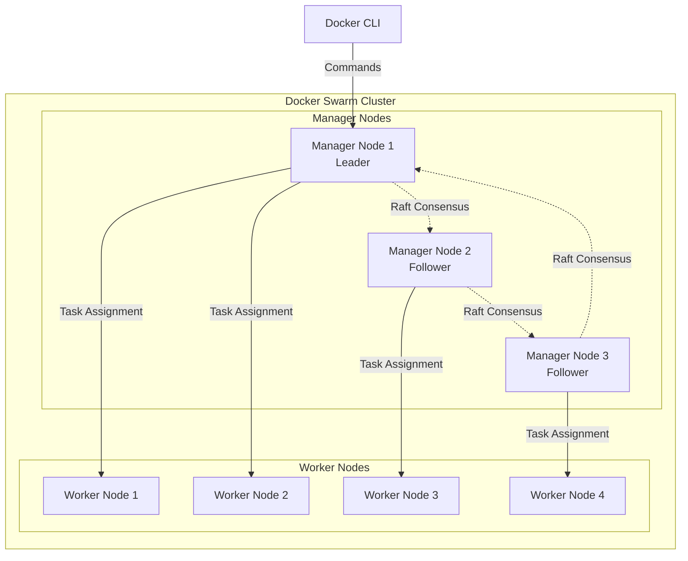
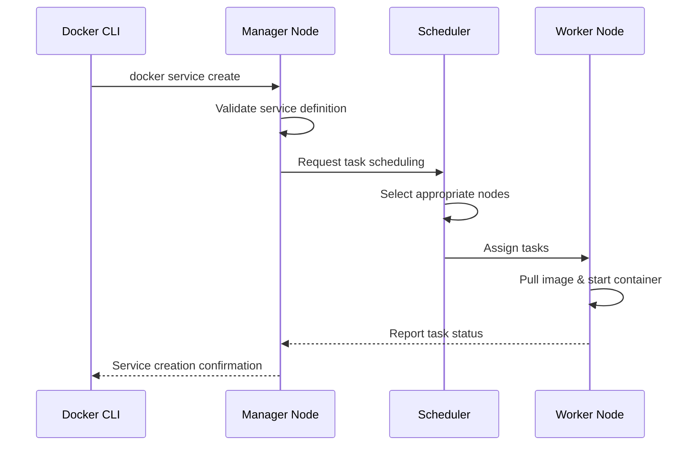
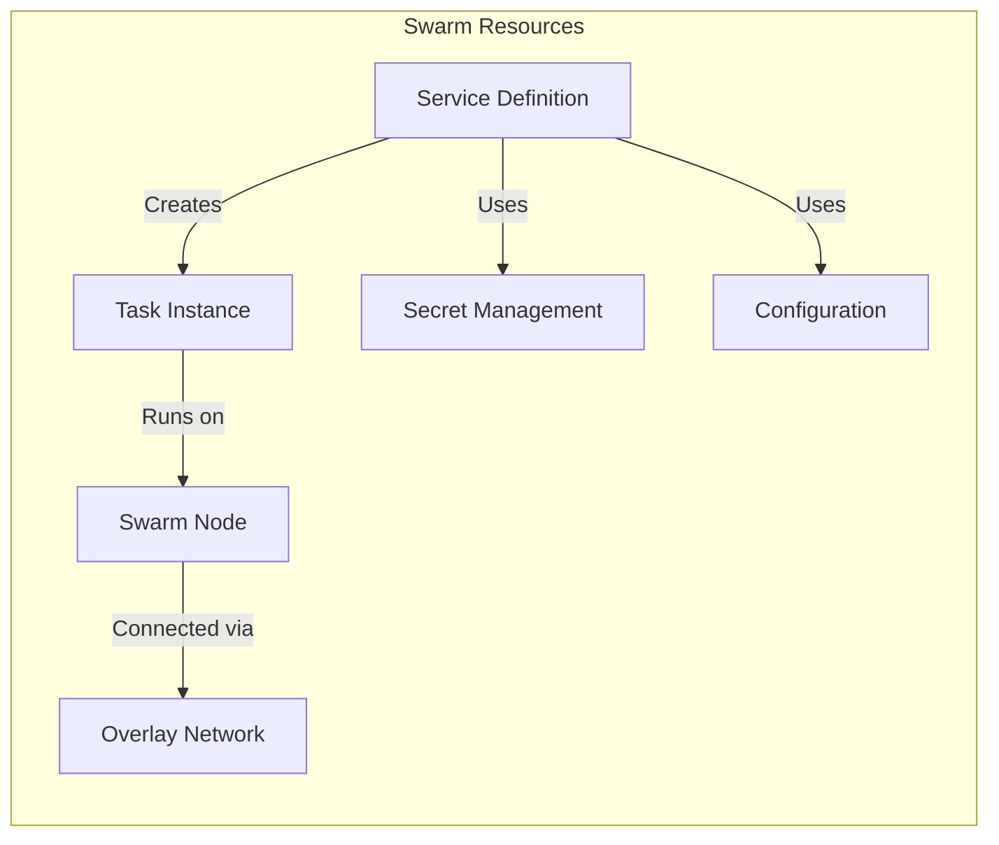
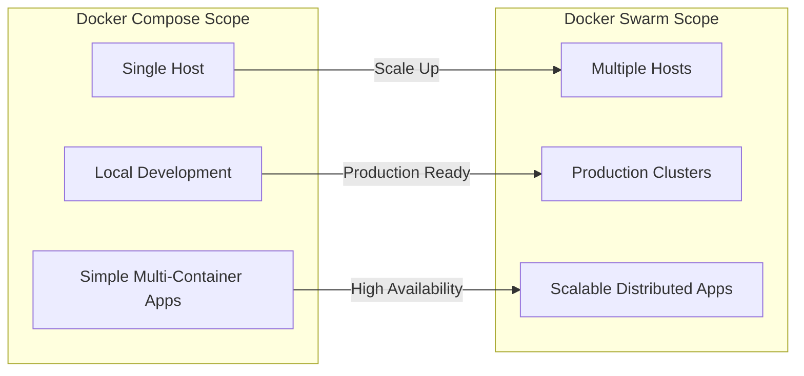

# Docker Swarm

## Overview

Docker Swarm represents Docker's native clustering and orchestration solution, designed to manage a cluster of Docker engines as a unified virtual system. This platform provides essential enterprise capabilities including high availability, automated load balancing, and comprehensive service discovery for containerized applications. Docker Swarm effectively transforms individual Docker hosts into a cohesive cluster, enabling administrators to deploy and manage distributed services across multiple nodes with operational efficiency.

The platform implements a manager-worker architectural model wherein manager nodes assume responsibility for cluster management operations, while worker nodes execute containerized workloads. This distributed architecture ensures both fault tolerance and horizontal scalability, making it suitable for production environments requiring reliability and performance.

### Content

- [Docker Swarm vs. Kubernetes](#docker-swarm-vs-kubernetes)
- [Architecture](#architecture)
- [Docker Swarm Resources](#docker-swarm-resources)
- [Docker Swarm Commands](#docker-swarm-commands)
- [Docker Swarm vs. Docker Compose](#docker-swarm-vs-docker-compose)
- [Getting Started](#getting-started)
- [Sources](#sources)

## Docker Swarm vs. Kubernetes

Docker Swarm and Kubernetes both function as container orchestration platforms; however, they exhibit significant differences in architectural complexity, feature comprehensiveness, and operational methodologies. Understanding these distinctions is essential for making informed technology decisions in enterprise environments.

### Architecture Comparison

#### Kubernetes Architecture



#### Docker Swarm Architecture



### Feature Comparison

**Docker Swarm Advantages:**

- Streamlined setup and configuration procedures
- Native integration within the Docker ecosystem
- Reduced resource overhead and operational complexity
- Integrated service discovery and load balancing capabilities
- Simplified rolling updates and rollback mechanisms

**Kubernetes Advantages:**

- Comprehensive ecosystem with extensive third-party integrations
- Advanced scheduling capabilities and sophisticated resource management
- Robust monitoring and logging infrastructure
- Sophisticated auto-scaling mechanisms
- Declarative configuration management through YAML manifests

**Use Case Recommendations:**

- **Docker Swarm**: Optimal for small to medium-scale deployments, development environments, and organizations prioritizing operational simplicity
- **Kubernetes**: Recommended for large-scale production environments, complex microservices architectures, and scenarios demanding advanced orchestration capabilities

### Deployment Complexity



## Architecture

The Docker Swarm architecture implements a distributed system design that ensures high availability and efficient workload distribution across multiple nodes.

### Basic Cluster Architecture



### Service Deployment Flow



## Docker Swarm Resources

Docker Swarm employs several fundamental resources to effectively manage containerized applications within a distributed environment. Understanding these resources is crucial for successful cluster administration.

### Services

Services define the desired state of applications operating within the swarm cluster. They specify deployment parameters including replica count, resource constraints, and update strategies. Services provide an abstraction layer that conceals infrastructure complexity while enabling declarative application management.

### Tasks

Tasks represent atomic units of work distributed to nodes throughout the swarm. Each task corresponds to a running container instance and encapsulates all essential execution information, including image specifications, resource requirements, and network configurations.

### Nodes

Nodes constitute individual Docker engines participating in the swarm cluster. Manager nodes assume cluster orchestration responsibilities, while worker nodes execute assigned tasks. This architectural separation enables clear distinction between control plane and data plane operations.

### Networks

Docker Swarm establishes overlay networks that span multiple hosts, facilitating secure inter-service communication regardless of physical node location. These software-defined networks incorporate built-in load balancing and service discovery mechanisms.

### Secrets and Configs

Swarm implements secure mechanisms for managing sensitive information and configuration data. Secrets handle sensitive data such as passwords and certificates, while configs manage non-sensitive configuration files. Both resource types maintain encryption at rest and during transit.



## Docker Swarm Commands

Docker Swarm operations are administered through the Docker CLI using specialized command sets. This section provides comprehensive coverage of essential commands for cluster management, service deployment, and operational maintenance.

### Cluster Management Commands

These commands provide fundamental cluster operation capabilities, serving as the foundation for building and maintaining swarm infrastructure.

#### Initializing a Swarm Cluster

**Primary Command:** `docker swarm init`

```sh
# Basic initialization
docker swarm init

# Initialize with specific IP address (recommended for multi-interface systems)
docker swarm init --advertise-addr 192.168.1.100

# Initialize with custom data path port
docker swarm init --advertise-addr 192.168.1.100 --data-path-port 7777
```

**Command Execution Process:**

1. The current Docker host assumes the role of first manager node
2. A new swarm cluster is established with this node as the leader
3. Join tokens are generated for both worker and manager nodes
4. The node begins listening on port 2377 for cluster management communications

**Parameter Specifications:**

- `--advertise-addr`: Designates the IP address for inter-node communication. Essential in multi-network environments
- `--data-path-port`: Modifies the port used for data path traffic between nodes (default: 4789)

**Best Practice**: Always specify `--advertise-addr` in production environments to prevent connectivity issues when nodes possess multiple network interfaces.

#### Adding Nodes to the Cluster

**Obtaining Join Tokens:**

```sh
# Retrieve worker join token
docker swarm join-token worker

# Retrieve manager join token
docker swarm join-token manager

# Rotate tokens for security purposes (invalidates existing tokens)
docker swarm join-token --rotate worker
```

**Worker Node Addition:**

```sh
# Execute on the target machine for worker node addition
docker swarm join --token <token> \
    192.168.1.100:2377
```

**Manager Node Addition:**

```sh
# Execute on the target machine for manager node addition
docker swarm join --token <token> \
    192.168.1.100:2377
```

**Node Addition Process:**

1. The joining node establishes contact with the manager at the specified IP and port
2. Authentication occurs utilizing the join token
3. The manager incorporates the node into the cluster
4. The new node downloads the current cluster state
5. The node becomes available for task assignment (workers) or management responsibilities (managers)

#### Removing Nodes from the Swarm

**Worker Node Removal:**

```sh
# Graceful swarm departure
docker swarm leave
```

**Manager Node Removal:**

```sh
# Forced departure (required for manager nodes)
docker swarm leave --force

# Alternative approach: Demotion followed by departure
docker node demote <node-id>
docker swarm leave
```

**Node Removal Process:**

- **Worker nodes**: Cease receiving new task assignments; existing tasks continue until completion
- **Manager nodes**: Initiates leader election process if the departing node was the current leader
- All associated resources (networks, secrets) become inaccessible to the departing node

### Service Management Commands

Services constitute the primary component of application deployment within Docker Swarm. These commands facilitate service definition, deployment, and ongoing management.

#### Creating Services

**Basic Service Creation:**

```sh
# Single replica service
docker service create --name web nginx:alpine

# Multi-replica service
docker service create --name web --replicas 3 nginx:alpine

# Service with published ports (external cluster access)
docker service create --name web --replicas 3 --publish 8080:80 nginx:alpine
```

**Advanced Service Creation:**

```sh
# Service with resource constraints
docker service create \
  --name web \
  --replicas 3 \
  --limit-cpu 0.5 \
  --limit-memory 512M \
  --reserve-cpu 0.25 \
  --reserve-memory 256M \
  nginx:alpine

# Service with placement constraints
docker service create \
  --name database \
  --replicas 1 \
  --constraint 'node.role==manager' \
  --constraint 'node.labels.storage==ssd' \
  postgres:13

# Service with environment variables
docker service create \
  --name webapp \
  --replicas 2 \
  --env POSTGRES_DB=myapp \
  --env POSTGRES_USER=appuser \
  myapp:latest
```

**Service Creation Parameter Specifications:**

- `--name`: Descriptive service identifier for administrative purposes
- `--replicas`: Quantity of identical container instances to deploy
- `--publish`: Port mapping configuration (host:container) for external accessibility
- `--limit-*`: Maximum resource allocation per container
- `--reserve-*`: Guaranteed resource allocation per container
- `--constraint`: Node selection criteria and rules
- `--env`: Environment variables propagated to container instances

#### Service Inspection and Listing

**Service Enumeration:**

```sh
# Display all services
docker service ls

# Display services with enhanced detail formatting
docker service ls --format "table {{.Name}}\t{{.Mode}}\t{{.Replicas}}\t{{.Image}}"
```

**Detailed Service Inspection:**

```sh
# View comprehensive service configuration
docker service inspect web

# View service configuration in readable format
docker service inspect --pretty web

# List tasks (container instances) for specific service
docker service ps web

# Display tasks including historical and failed instances
docker service ps --no-trunc web
```

**Service Output Interpretation:**

- `docker service ls` displays current versus desired replica counts
- `docker service ps` shows individual task status and node placement
- `docker service inspect` reveals complete service specification details

#### Service Updates and Scaling

**Service Scaling Operations:**

```sh
# Scale service to 5 replicas
docker service scale web=5

# Scale multiple services concurrently
docker service scale web=5 api=3 db=1
```

**Service Image Updates:**

```sh
# Rolling update to new image version
docker service update --image nginx:1.21 web

# Update with specific rollout configuration
docker service update \
  --image nginx:1.21 \
  --update-parallelism 2 \
  --update-delay 30s \
  --update-failure-action rollback \
  web
```

**Advanced Service Updates:**

```sh
# Update environment variables
docker service update --env-add NEW_VAR=value web

# Update resource limits
docker service update --limit-memory 1G web

# Update port publishing
docker service update --publish-add 9090:90 web

# Update placement constraints
docker service update --constraint-add 'node.labels.type==compute' web
```

**Update Strategy Parameter Specifications:**

- `--update-parallelism`: Number of containers updated concurrently
- `--update-delay`: Interval between update batches
- `--update-failure-action`: Response to update failures (pause, continue, rollback)
- `--rollback`: Revert to previous service configuration

#### Service Rollback and Removal

**Service Rollback Operations:**

```sh
# Rollback to previous configuration
docker service rollback web

# Rollback with custom parameters
docker service update --rollback \
  --rollback-parallelism 1 \
  --rollback-delay 10s \
  web
```

**Service Removal Operations:**

```sh
# Remove individual service
docker service rm web

# Remove multiple services
docker service rm web api database

# Force removal (bypass graceful shutdown)
docker service rm --force web
```

### Node Management Commands

Node management commands provide control over cluster membership and node operational behavior.

#### Node Inspection and Listing

**Node Enumeration:**

```sh
# Display all cluster nodes
docker node ls

# Display nodes with custom formatting
docker node ls --format "table {{.Hostname}}\t{{.Status}}\t{{.Availability}}\t{{.ManagerStatus}}"
```

**Detailed Node Inspection:**

```sh
# View comprehensive node information
docker node inspect node-1

# View node information in readable format
docker node inspect --pretty node-1
```

**Node Status Classifications:**

- **Status**: Ready (healthy), Down (unreachable), Unknown (status unclear)
- **Availability**: Active (accepts tasks), Pause (no new tasks), Drain (no tasks)
- **Manager Status**: Leader, Reachable, Unreachable (for manager nodes only)

#### Promoting and Demoting Nodes

**Node Role Changes:**

```sh
# Promote worker to manager
docker node promote worker-1

# Demote manager to worker
docker node demote manager-2

# Promote multiple nodes
docker node promote worker-1 worker-2 worker-3
```

**Why promote/demote nodes:**

- **Promote**: Add management capacity, improve fault tolerance
- **Demote**: Reduce management overhead, prepare for node removal

#### Managing Node Availability

**Drain Nodes (Graceful Maintenance):**

```sh
# Drain node for maintenance (stops scheduling new tasks)
docker node update --availability drain worker-1

# Pause node (stops new tasks, keeps existing ones)
docker node update --availability pause worker-1

# Reactivate node
docker node update --availability active worker-1
```

**Node Draining Process:**

1. New tasks stop being assigned to the drained node
2. Existing tasks are gracefully moved to other available nodes
3. Node remains in cluster but doesn't run application containers
4. Ideal for performing maintenance without service disruption

#### Node Labels and Constraints

**Adding Labels to Nodes:**

```sh
# Add custom labels for scheduling decisions
docker node update --label-add storage=ssd node-1
docker node update --label-add environment=production node-1
docker node update --label-add zone=us-west-1a node-1

# Remove labels
docker node update --label-rm storage node-1
```

**Using Labels with Services:**

```sh
# Deploy service only to SSD nodes
docker service create \
  --name fast-db \
  --constraint 'node.labels.storage==ssd' \
  postgres:13

# Deploy to specific availability zone
docker service create \
  --name regional-service \
  --constraint 'node.labels.zone==us-west-1a' \
  myapp:latest
```

### Network Management Commands

Swarm networks enable service-to-service communication across the cluster.

#### Creating and Managing Networks

**Create Overlay Network:**

```sh
# Basic overlay network
docker network create --driver overlay my-network

# Encrypted overlay network
docker network create --driver overlay --opt encrypted my-secure-network

# Network with custom subnet
docker network create \
  --driver overlay \
  --subnet 10.0.1.0/24 \
  --gateway 10.0.1.1 \
  my-custom-network
```

**Attach Services to Networks:**

```sh
# Create service on specific network
docker service create \
  --name web \
  --network my-network \
  nginx:alpine

# Connect existing service to additional network
docker service update --network-add my-secure-network web

# Disconnect service from network
docker service update --network-rm my-network web
```

**Network Types in Swarm:**

- **bridge**: Default single-host networking (like regular Docker)
- **overlay**: Multi-host networking for swarm services
- **host**: Service uses host's network directly
- **none**: No networking

### Secret and Config Management

Secure management of sensitive and configuration data.

#### Managing Secrets

**Create Secrets:**

```sh
# Create secret from standard input
echo "mysecretpassword" | docker secret create db_password -

# Create secret from file
docker secret create ssl_cert ./certificate.pem

# Create secret with labels
docker secret create api_key ./api.key --label environment=production
```

**Use Secrets in Services:**

```sh
# Mount secret as file in container
docker service create \
  --name webapp \
  --secret db_password \
  --env POSTGRES_PASSWORD_FILE=/run/secrets/db_password \
  myapp:latest

# Mount secret with custom filename and permissions
docker service create \
  --name webapp \
  --secret source=db_password,target=db_pass,mode=400 \
  myapp:latest
```

**Secret Management:**

```sh
# List secrets
docker secret ls

# View secret details (content is never shown)
docker secret inspect db_password

# Remove secret (only if not in use)
docker secret rm db_password
```

#### Managing Configs

**Create Configs:**

```sh
# Create config from file
docker config create nginx_config ./nginx.conf

# Create config from standard input
docker config create app_config - <<EOF
debug=true
port=8080
database_url=postgres://db:5432/myapp
EOF
```

**Use Configs in Services:**

```sh
# Mount config as file
docker service create \
  --name web \
  --config source=nginx_config,target=/etc/nginx/nginx.conf \
  nginx:alpine

# Mount multiple configs
docker service create \
  --name app \
  --config source=app_config,target=/app/config.yml \
  --config source=nginx_config,target=/etc/nginx/nginx.conf \
  myapp:latest
```

## Docker Swarm vs. Docker Compose

Understanding the relationship between Docker Compose and Docker Swarm is essential for selecting the appropriate tool for specific use cases. Both tools facilitate multi-container applications but serve different purposes and operational scales.

### Conceptual Comparison



### Key Differences Explained

**Docker Compose:**

- **Purpose**: Define and run multi-container applications on a single Docker host
- **Scope**: Development environments, testing, single-machine deployments
- **File Format**: docker-compose.yml with services, networks, and volumes
- **Scaling**: Limited to resources of a single machine
- **Orchestration**: Basic container lifecycle management
- **High Availability**: None - single point of failure

**Docker Swarm:**

- **Purpose**: Orchestrate containers across multiple Docker hosts
- **Scope**: Production environments, distributed applications, clustering
- **File Format**: Can use docker-compose.yml files with `docker stack deploy`
- **Scaling**: Horizontal scaling across multiple machines
- **Orchestration**: Advanced scheduling, load balancing, service discovery
- **High Availability**: Built-in through manager node redundancy

### Migration Path: Compose to Swarm

The beauty of Docker Swarm is that it can use your existing docker-compose.yml files with minimal modifications:

**Docker Compose Command:**

```sh
docker-compose up -d
```

**Docker Swarm Equivalent:**

```sh
docker stack deploy -c docker-compose.yml myapp
```

### When to Use Each Tool


**Use Docker Compose when:**

- Developing applications locally
- Running applications on a single server
- Prototyping and testing
- Simple production deployments without high availability requirements

**Use Docker Swarm when:**

- Production environments requiring high availability
- Applications that need to scale beyond a single machine
- Multiple team members need to access the same application cluster
- Load balancing and service discovery are requirements

### Feature Comparison Table

| Feature                      | Docker Compose              | Docker Swarm     |
| ---------------------------- | --------------------------- | ---------------- |
| **Deployment Scope**         | Single host                 | Multiple hosts   |
| **High Availability**        | No                          | Yes              |
| **Load Balancing**           | External (nginx, etc.)      | Built-in         |
| **Service Discovery**        | Container names/aliases     | Built-in DNS     |
| **Rolling Updates**          | Manual restart              | Automated        |
| **Scaling**                  | Single machine limits       | Cluster-wide     |
| **Secrets Management**       | Environment variables/files | Built-in secrets |
| **Configuration Complexity** | Simple                      | Moderate         |
| **Learning Curve**           | Low                         | Medium           |

## Getting Started

To setup a Docker Swarm cluster, follow the [official tutorial](https://docs.docker.com/engine/swarm/swarm-tutorial) by Docker.

> **TIP:** In the tutorial you will need to create multiple nodes, use the [Cloud Init file](cloud-init.yml) to create them.

### Prerequisites

Before initializing a Docker Swarm cluster, ensure the following requirements are met:

- Docker Engine version 1.12 or higher installed on all nodes
- Network connectivity between all nodes on ports 2377 (cluster management), 7946 (node communication), and 4789 (overlay network traffic)
- Sufficient system resources allocated for both Docker daemon and containerized applications.

## Sources

- [Docker Swarm Documentation](https://docs.docker.com/engine/swarm/)
- [Docker Swarm Tutorial](https://docs.docker.com/engine/swarm/swarm-tutorial/)
