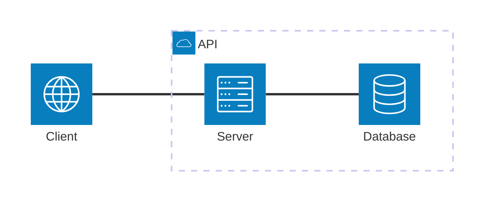

# Miniprojekt - ToDo Liste

## Einleitung

Für dieses Projekt werden wir eine ToDo Liste erstellen. Diese soll CRUD Operations für Tasks/ToDo's durchführen können. Um diese Anforderungen zu realisieren werden wir TDD anwenden.
Als Abnahmekriterien für unsren MVP haben wir folgenden User Stories definiert:

- US 1: "Als Nutzer kann ich einen Task erfassen."
- US 2: "Als Nutzer kann ich einen Task ansehen."
- US 3: "Als Nutzer kann ich einen Task bearbeiten."
- US 4: "Als Nutzer kann ich einen Task löschen."

## Testkonzept

Getestet wird die serverseitige ToDo-API mit Fokus auf die vier definierten User Stories (Create, Read, Update, Delete).
Die Business-Logik wird mittels Unit Tests getestet, wobei Datenbankzugriffe konsequent gemockt werden, um isolierte und schnelle Tests zu ermöglichen.

Zusätzlich werden Component/API-Tests eingesetzt, um das Verhalten der HTTP-Endpunkte (Statuscodes, Requests, Responses und Fehlerfälle) zu verifizieren.
Die Entwicklung erfolgt nach dem TDD-Ansatz (Red–Green–Refactor), primär für Kernlogik und API-Verhalten.

Tests werden lokal und automatisiert in der CI ausgeführt, inklusive Test- und Code-Coverage-Reports, um Qualität und Abdeckung nachvollziehbar darzustellen.

### Softwarearchitektur

### Scope

#### Wird getestet

- Integration-Test für die API-Endpunkte (CRUD Operationen)
- Unit-Tests für die Business-Logik der ToDo-Verwaltung

#### Wird nicht getestet

- UI-Tests (keine GUI vorhanden)
- Performance-Tests
- Sicherheitstests (keine Authentifizierung/Autorisierung implementiert)

### Testumgebung

- Programmiersprache: Java 21
- Test-Frameworks: JUnit, Mockito, RestAssured
- Build-Tool: Gradle
- CI/CD: GitHub Actions
